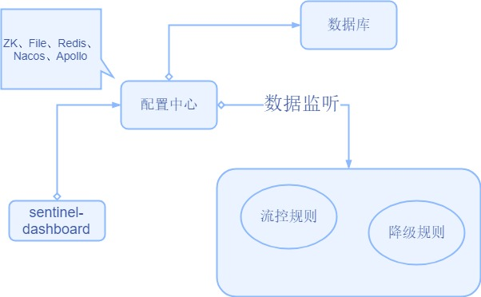
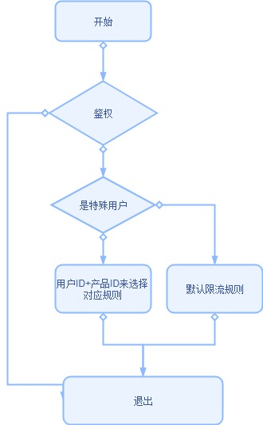

[常用限流降级组件对比](https://github.com/alibaba/Sentinel/wiki/常用限流降级组件对比)

## 流控

对定义的资源名进行流控。

### Resource

resource是sentinel中最重要的一个概念，sentinel通过资源来保护具体的业务代码或其他后方服务。sentinel把复杂的逻辑给屏蔽掉了，用户只需要为受保护的代码或服务定义一个资源，然后定义规则就可以了，剩下的通通交给sentinel来处理了。并且资源和规则是解耦的，规则甚至可以在运行时动态修改。定义完资源后，就可以通过在程序中埋点来保护你自己的服务了，埋点的方式有两种：

- try-catch 方式（通过 SphU.entry(...)），当 catch 到BlockException时执行异常处理(或fallback)
- if-else 方式（通过 SphO.entry(...)），当返回 false 时执行异常处理(或fallback)

以上这两种方式都是通过硬编码的形式定义资源然后进行资源埋点的，对业务代码的侵入太大，从0.1.1版本开始，sentinel加入了注解的支持，可以通过注解来定义资源，具体的注解为：SentinelResource 。通过注解除了可以定义资源外，还可以指定 blockHandler 和 fallback 方法。

在sentinel中具体表示资源的类是：ResourceWrapper ，他是一个抽象的包装类，包装了资源的 **Name** 和**EntryType**。他有两个实现类，分别是：StringResourceWrapper 和 MethodResourceWrapper

顾名思义，StringResourceWrapper 是通过对一串字符串进行包装，是一个通用的资源包装类，MethodResourceWrapper 是对方法调用的包装。

### 定义规则

定义完资源后，就可以来定义限流的规则了，但是我们需要对流控规则做个详细的了解，以便更好的进行限流的操作，流控的规则对应的是 FlowRule。

一条FlowRule有以下几个重要的属性组成：

- resource: 规则的资源名
- grade: 限流阈值类型，qps 或线程数
- count: 限流的阈值
- limitApp: 被限制的应用，授权时候为逗号分隔的应用集合，限流时为单个应用
  - default : 不区分调用者，来自任何调用者的请求都将进行限流统计。
  - {some_origin_name} ： 针对特定的调用者，只有一个来自这个调用者的请求才会进行流量控制。
  - other ： 除了{some_origin_name}以外的其余调用方的流量进行流量控制
- strategy: 基于调用关系的流量控制
  - STRATEGY_DIRECT：直接的调用关系
  - STRATEGY_RELATE：调用相关联
  - STRATEGY_CHAIN：根据调用链来判断
- controlBehavior：流控策略
  - CONTROL_BEHAVIOR_DEFAULT
    - 直接拒绝，默认的流量控制方式，当QPS超过任意规则的阈值后，新的请求就会被立即拒绝，拒绝方式为抛出FlowException。
  - CONTROL_BEHAVIOR_WARM_UP
    - 排队等待，又称为冷启动。通过”冷启动”，让通过的流量缓慢增加，在一定时间内逐渐增加到阈值上限，给冷系统一个预热的时间，避免冷系统被压垮的情况。
  - CONTROL_BEHAVIOR_RATE_LIMITER
    - 慢启动，又称为匀速器模式。这种方式严格控制了请求通过的间隔时间，也即是让请以均匀的速度通过，对应的是漏桶算法。主要用于处理间隔性突发的流量。

#### 熔断降级

> 1、通过并发线程数进行限制
> 和资源池隔离的方法不同，Sentinel 通过限制资源并发线程的数量，来减少不稳定资源对其它资源的影响。这样不但没有线程切换的损耗，也不需要您预先分配线程池的大小。当某个资源出现不稳定的情况下，例如响应时间变长，对资源的直接影响就是会造成线程数的逐步堆积。当线程数在特定资源上堆积到一定的数量之后，对该资源的新请求就会被拒绝。堆积的线程完成任务后才开始继续接收请求。
>
> 2、通过响应时间对资源进行降级
> 除了对并发线程数进行控制以外，Sentinel 还可以通过响应时间来快速降级不稳定的资源。当依赖的资源出现响应时间过长后，所有对该资源的访问都会被直接拒绝，直到过了指定的时间窗口之后才重新恢复。

#### 热点参数限流

#### 自适应限流

#### 黑白名单控制


## 方案设计

<div align="center">  </div>

<div align="center">  </div>


具体实现：

```java
		String resourceName = "default_rule";
        try {
            
            requestParams = validator.get();
            // 鉴权通过
            
            long devId = Long.parseLong(requestParams.getExtralParamsMap().get("devId").toString());
            if (flowControlService.isSpecialUser(devId)) {
                resourceName = "userId-" + devId + "/" + "productId-" + Constants.Product.OCR_TRANS.getValue();
            }
            entry = SphU.entry(resourceName, EntryType.IN);
            // do something
        }  catch (BlockException e) {
            
        }  finally {
            if (entry != null) {
                entry.exit();
            }
        }
```

