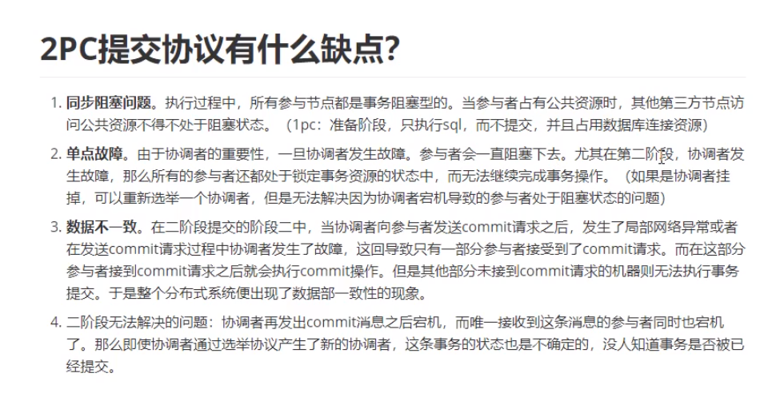

## CAP

- 一致性(Consistency) ：客户端知道一系列的操作都会同时发生(生效)

- 可用性(Availability) ：每个操作都必须以可预期的响应结束
-  分区容错性(Partitiontolerance) ：即使出现单个组件无法可用,操作依然可以完成

## XA

XA是一个两阶段提交协议，该协议分为以下两个阶段：

第一阶段：事务协调器要求每个涉及到事务的数据库预提交(precommit)此操作，并反映是否可以提交.

第二阶段：事务协调器要求每个数据库提交数据。

如果有任何一个数据库否决此次提交，所有都回滚。

## BASE

- Basically Available（基本可用）：基本可用是指分布式系统在出现故障的时候，允许损失部分可用性，即保证核心可用。
- Soft state（软状态）：软状态是指允许系统存在中间状态，而该中间状态不会影响系统整体可用性。
- Eventually consistent（最终一致性）

## 两阶段提交

优点：尽量保证了数据的强一致，适合对数据强一致要求很高的关键领域。（其实也不能100%保证强一致）

缺点：实现复杂，牺牲了可用性，对性能影响较大，不适合高并发高性能场景

## 补偿事务TCC

针对每个操作，都要注册一个与其对应的确认和补偿（撤销）操作。

分为三个阶段：

- Try阶段主要是对业务系统做检测及资源预留
- Confirm阶段主要是对业务做确认提交，Try阶段执行成功并开始执行 Confirm阶段时，默认 Confirm阶段是不会出错的。即：只要Try成功，Confirm一定成功。
- Cancel 阶段主要是在业务执行错误，需要回滚的状态下执行的业务取消，预留资源释放。

优点：跟2PC比起来，实现以及流程相对简单了一些，但数据的一致性比2PC也要差一些

缺点：缺点还是比较明显的，在2,3步中都有可能失败。TCC属于应用层的一种补偿方式，所以需要程序员在实现的时候多写很多补偿的代码，在一些场景中，一些业务流程可能用TCC不太好定义及处理。

## TCC空回滚是解决什么问题的？

## 2PC提交协议有什么缺点

## 如何解决TCC中悬挂问题

