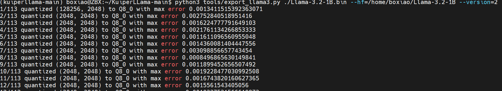
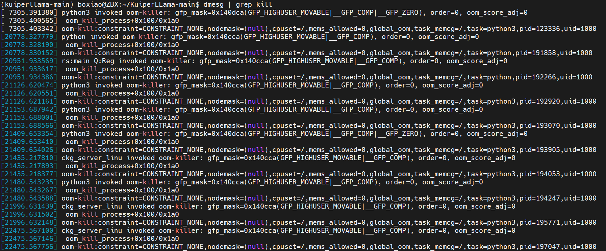
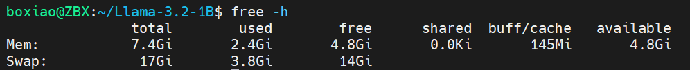
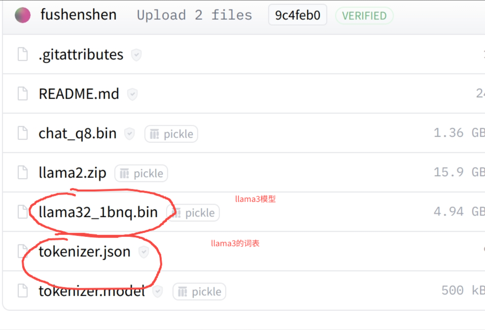

# 环境安装

```shell
#  编译器安装
sudo apt install gcc
sudo apt install g++

#  第三方数学库Armadillo， 下载地址如下：https://arma.sourceforge.net/download.html
sudo apt updatesudo apt install libopenblas-dev liblapack-dev libarpack2-dev libsuperlu-dev
mkdir build
cd build
cmake -DCMAKE_BUILD_TYPE=Release ..
make -j8
sudo make install

#  单元测试库gtest, Google Test库默认安装的头文件路径为/use/local/include，库文件路径为/use/local/lib
git clone https://github.com/google/googletest.git
mkdir build
cd build
cmake -DCMAKE_BUILD_TYPE=Release ..
make -j8
sudo make install

#  日志库glog
git clone https://github.com/google/glog
cmake -DCMAKE_BUILD_TYPE=Release -DWITH_GFLAGS=OFF -DWITH_GTEST=OFF ..
make -j8
sudo make install

#  分词库SentencePiece
git clone https://github.com/google/sentencepiece
mkdir build
cd build
cmake -DCMAKE_BUILD_TYPE=Release ..
make -j8

# 下载并安装 CUDA Toolkit
wget https://developer.download.nvidia.com/compute/cuda/12.8.0/local_installers/cuda-repo-wsl-ubuntu-12-8-local_12.8.0-1_amd64.deb
sudo dpkg -i cuda-repo-wsl-ubuntu-12-8-local_12.8.0-1_amd64.deb
sudo apt-get update
sudo apt-get -y install cuda-toolkit-12-8
nano ~/.bashrc
export CUDA_HOME=/usr/local/cuda-12.8
export PATH=$CUDA_HOME/bin:$PATH
export LD_LIBRARY_PATH=$CUDA_HOME/lib64:$LD_LIBRARY_PATH
source ~/.bashrc
nvcc --version
nvidia-smi
```

还有

- Abseil https://github.com/abseil/abseil-cpp
- re2 https://github.com/google/re2
- Json  https://github.com/nlohmann/json

```
mkdir -p build && cd build
cmake .. -DBUILD_SHARED_LIBS=ON
make -j$(nproc)
sudo make install

```

```
// 确保 Abseil 编译并安装了共享库
find /usr/local/lib -name "libabsl_log_internal_check_op.so*"
// 运行前设置 LD_LIBRARY_PATH，让系统能找到 .so 文件
export LD_LIBRARY_PATH=/usr/local/lib:$LD_LIBRARY_PATH
```


# 项目构建

```
/usr/bin/cmake \
  -DCMAKE_BUILD_TYPE=Debug \
  -G 'CodeBlocks - Unix Makefiles' \
  -S /home/boxiao/KuiperLLama-main \
  -B /home/boxiao/KuiperLLama-main/cmake-build-debug \
  -DCMAKE_C_COMPILER=/usr/bin/gcc-11 \
  -DCMAKE_CXX_COMPILER=/usr/bin/g++-11

```

# Run TEST

```
./test_llm --gtest_filter=test_rmsnorm_cu_rmsnorm_nostream_Test.*
./test_llm --gtest_list_tests

```

# 模型安装

模型也可以去页面下载 https://hf-mirror.com/meta-llama/Llama-3.2-1B/tree/main

```
pip3 install huggingface_hub -i https://pypi.tuna.tsinghua.edu.cn/simple
echo 'export PATH=$PATH:~/.local/bin' >> ~/.bashrc  # 或 ~/.zshrc
source ~/.bashrc  # 或 source ~/.zshrc
export HF_ENDPOINT=https://hf-mirror.com
pip3 install huggingface-cli
huggingface-cli download --resume-download meta-llama/Llama-3.2-1B --local-dir meta-llama/Llama-3.2-1B --local-dir-use-symlinks False
```

# 模型导出

```
python3 tools/export_llama3.py ./Llama-3.2-1B.bin --hf=/path/to/Llama-3.2-1B --version=2
```

  version 2 Export the model weights in Q8_0 into .bin file

- quantize all weights to symmetric int8, in range [-127, 127]
- all other tensors (the rmsnorm params) are kept and exported in fp32
- quantization is done in groups of group_size to reduce the effects of any outliers

输出：



```
1/113 quantized (128256, 2048) to Q8_0 with max error 0.0013411515392363071
2/113 quantized (2048, 2048) to Q8_0 with max error 0.002752840518951416
3/113 quantized (2048, 2048) to Q8_0 with max error 0.0016224777791649103
4/113 quantized (2048, 2048) to Q8_0 with max error 0.0021761134266853333
...
17/113 quantized (2048, 2048) to Q8_0 with max error 0.001262035220861435
18/113 quantized (512, 2048) to Q8_0 with max error 0.0025663599371910095
19/113 quantized (512, 2048) to Q8_0 with max error 0.001212533563375473
20/113 quantized (512, 2048) to Q8_0 with max error 0.0020530875772237778
...
30/113 quantized (512, 2048) to Q8_0 with max error 0.002960805781185627
31/113 quantized (512, 2048) to Q8_0 with max error 0.0020992234349250793
...
50/113 quantized (2048, 2048) to Q8_0 with max error 0.0012543443590402603
51/113 quantized (2048, 2048) to Q8_0 with max error 0.0020499639213085175
52/113 quantized (2048, 2048) to Q8_0 with max error 0.0013706479221582413
53/113 quantized (2048, 2048) to Q8_0 with max error 0.0009765625
...
65/113 quantized (2048, 2048) to Q8_0 with max error 0.0028489455580711365
66/113 quantized (8192, 2048) to Q8_0 with max error 0.0023956298828125
...
81/113 quantized (8192, 2048) to Q8_0 with max error 0.003767848014831543
82/113 quantized (2048, 8192) to Q8_0 with max error 0.0023730420507490635
83/113 quantized (2048, 8192) to Q8_0 with max error 0.002738412469625473
...
96/113 quantized (2048, 8192) to Q8_0 with max error 0.0017435848712921143
97/113 quantized (2048, 8192) to Q8_0 with max error 0.0033276155591011047
98/113 quantized (8192, 2048) to Q8_0 with max error 0.0011834572069346905
99/113 quantized (8192, 2048) to Q8_0 with max error 0.004308983683586121
...
113/113 quantized (8192, 2048) to Q8_0 with max error 0.004850134253501892
max quantization group error across all weights: 0.004850134253501892
wrote ./Llama-3.2-1B.bin
```

### 内存不足，触发OOM

```
// dmesg | grep -i kill
[ 7305.391380] python3 invoked oom-killer: gfp_mask=0x140dca(GFP_HIGHUSER_MOVABLE|__GFP_COMP|__GFP_ZERO), order=0, oom_score_adj=0
[ 7305.400565]  oom_kill_process+0x100/0x1a0
[ 7305.403342] oom-kill:constraint=CONSTRAINT_NONE,nodemask=(null),cpuset=/,mems_allowed=0,global_oom,task_memcg=/,task=python3,pid=123336,uid=1000
[ 7305.404365] Out of memory: Killed process 123336 (python3) total-vm:13859456kB, anon-rss:7174336kB, file-rss:260kB, shmem-rss:0kB, UID:1000 pgtables:19488kB oom_score_adj:0
[20778.327779] python invoked oom-killer: gfp_mask=0x140cca(GFP_HIGHUSER_MOVABLE|__GFP_COMP), order=0, oom_score_adj=0
[20778.328190]  oom_kill_process+0x100/0x1a0
[20778.330152] oom-kill:constraint=CONSTRAINT_NONE,nodemask=(null),cpuset=/,mems_allowed=0,global_oom,task_memcg=/,task=python,pid=191858,uid=1000
[20778.330234] Out of memory: Killed process 191858 (python) total-vm:12090364kB, anon-rss:4478096kB, file-rss:0kB, shmem-rss:0kB, UID:1000 pgtables:15156kB oom_score_adj:0
[20951.933569] rs:main Q:Reg invoked oom-killer: gfp_mask=0x140cca(GFP_HIGHUSER_MOVABLE|__GFP_COMP), order=0, oom_score_adj=0
[20951.933617]  oom_kill_process+0x100/0x1a0
[20951.934386] oom-kill:constraint=CONSTRAINT_NONE,nodemask=(null),cpuset=/,mems_allowed=0,global_oom,task_memcg=/,task=python,pid=192266,uid=1000
[20951.934494] Out of memory: Killed process 192266 (python) total-vm:12258024kB, anon-rss:4698572kB, file-rss:128kB, shmem-rss:0kB, UID:1000 pgtables:15196kB oom_score_adj:0
[21126.620474] python3 invoked oom-killer: gfp_mask=0x140cca(GFP_HIGHUSER_MOVABLE|__GFP_COMP), order=0, oom_score_adj=0
```

**系统内存不足（OOM, Out of Memory）** 导致 Python 进程被 **OOM Killer** 强制杀掉了。

```
Out of memory: Killed process 123336 (python3) total-vm:13859456kB, anon-rss:7174336kB
```



### 短期方案-增加Swap空间

```
sudo fallocate -l 16G /swapfile
sudo chmod 600 /swapfile
sudo mkswap /swapfile
sudo swapon /swapfile
```



## VSCode配置

```
{
    "configurations": [
        {
            "name": "(gdb) Launch",
            "type": "cppdbg",
            "request": "launch",
            "program": "/home/boxiao/lc/build/llama_infer",
            "args": [],
            "stopAtEntry": false,
            "cwd": "${fileDirname}",
            "environment": [],
            "externalConsole": false,
            "MIMode": "gdb",
            "setupCommands": [
                {
                    "description": "Enable pretty-printing for gdb",
                    "text": "-enable-pretty-printing",
                    "ignoreFailures": true
                },
                {
                    "description": "Set Disassembly Flavor to Intel",
                    "text": "-gdb-set disassembly-flavor intel",
                    "ignoreFailures": true
                }
            ]
        }
    ]
}
```

**settings.json中对单元测试的设置**

```
{
	"testMate.cpp.test.executables":"/home/boxiao/kuiperbook-main/build/*/*",
	"testMate.cpp.test.workingDirectory": "${absDirpath}"
}
```

## 附件

1. 下载LLama3对应的模型和tokenizer，随后再通过命令行进行传递。

https://huggingface.co/fushenshen/lession_model/tree/main



