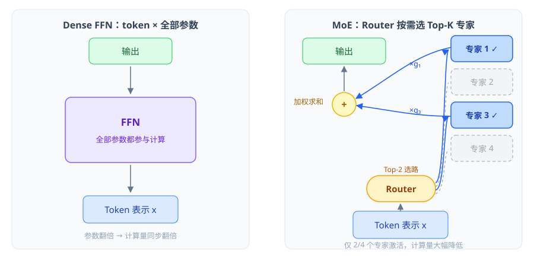
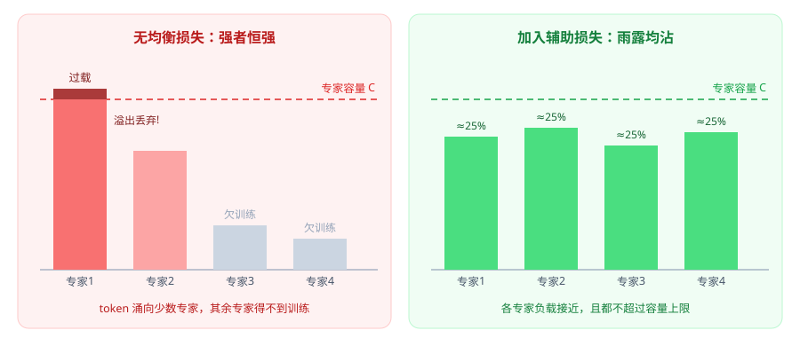
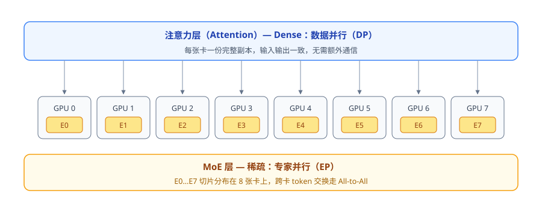
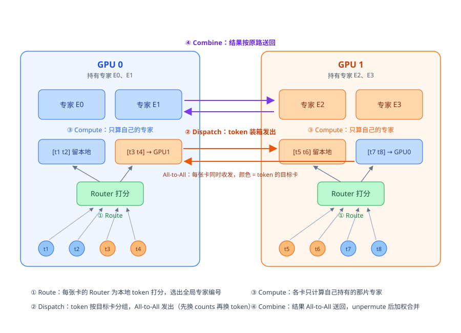

## MoE（Mixture of Experts）

MoE 是一种**稀疏激活**的模型架构：把 Transformer 中的 FFN 层替换为多个并行的"专家"（Expert）网络，每个 token 只由一个门控网络（Router/Gate）选出 Top-K 个专家来处理。它实现了**参数量与计算量的解耦**——模型总参数可以做得非常大（如 DeepSeek-V3 671B），但每个 token 实际参与计算的参数很少（激活约 37B），从而在有限算力下获得大参数模型的容量。

### **一、为什么需要 MoE？**

1. **Dense 模型的瓶颈**：Dense 模型（如 GPT-3、LLaMA）中每个 token 都要经过全部参数，参数量翻倍 → 计算量和显存同步翻倍， scaling 受算力限制。
2. **稀疏激活的思想**：研究表明大模型中并非所有参数对每个 token 都同等重要。MoE 让不同专家学习不同的"技能"（语法、代码、数学、领域知识等），按需激活。
3. **核心收益**：同样的训练 FLOPs 下，MoE 模型收敛更快、效果更好；或者说达到同样效果，训练成本更低（Switch Transformer 论文显示可提速 4~7 倍）。

### **二、核心结构**



> 左边 Dense FFN 所有 token 都要过全部参数；右边 MoE 由 Router 打分选出 Top-K 个专家，只有被选中的专家参与计算，其余专家（灰色虚线）完全休眠，输出按门控权重加权求和。

#### 1. **MoE 层替换 FFN**

标准 Transformer Block：

```
x = x + Attention(x)
x = x + FFN(x)
```

MoE 模型中把 FFN 换成 MoE 层：

```
x = x + Attention(x)
x = x + MoE(x)   # N 个专家 FFN + 1 个门控网络
```

- **专家（Expert）**：通常是结构相同、参数各自独立的 FFN（SwiGLU 等），专家数量 N 常见为 8（Mixtral）到 256（DeepSeek-V3）。
- **注意力层保持 Dense**：MoE 一般只替换 FFN 部分。

#### 2. **门控网络（Router / Gate）**

Router 是一个线性层 + softmax，为每个 token 计算它"应该去哪个专家"的得分：
$$
g(x) = \text{Softmax}(\text{TopK}(x \cdot W_g, K))
$$
输出 $y$ 为被选中专家的加权和：
$$
y = \sum_{i \in \text{TopK}} g_i(x) \cdot \text{Expert}_i(x)
$$

- **Top-1 Routing**（Switch Transformer）：每个 token 只走 1 个专家，计算最省，但训练稳定性差一些。
- **Top-2 / Top-K Routing**（GShard、Mixtral 8x7B 为 Top-2，DeepSeek-V3 为 Top-8 中的 Top... 实际是 256 选 8）：多专家互补，效果更稳，计算量略增。
- K 值越大越接近 Dense，稀疏收益越小；主流取 K=2~8。

#### 3. **共享专家（Shared Expert）**

DeepSeek-MoE 提出：把一部分专家设为**所有 token 必经**的共享专家（学习通用知识），其余为路由专家（学习专业知识）。这样路由专家之间不必重复学习公共模式，可以用**更细粒度的小专家**（数量多、单个更小）组合出更灵活的知识表达。

### **三、训练中的关键问题与技巧**

#### 1. **负载不均衡（Load Imbalance）**

Router 训练初期容易"偏心"：少数专家被频繁选中，其他专家得不到训练，形成恶性循环（强者恒强）。解决方式：

- **辅助负载均衡损失（Auxiliary Load Balancing Loss）**：在损失函数中加入一项，惩罚专家间被选概率的分布不均：

  $$L_{aux} = \alpha \cdot N \cdot \sum_{i=1}^{N} f_i \cdot P_i$$

  其中 $f_i$ 是专家 i 实际被选中的 token 比例，$P_i$ 是平均门控概率。$\alpha$ 一般取 0.01 左右。

- **Router Z-Loss**（ST-MoE）：对 router logits 施加 $L_z = \frac{1}{B}\sum(\log \sum e^{x_j})^2$，抑制 logits 绝对值过大，提升数值稳定性。



> 左图：没有均衡损失时，Router 早期"偏心"，token 涌向少数专家（红色过载，超出容量部分被丢弃），其余专家欠训练；右图：加入辅助损失后各专家负载被拉平，都不触碰容量上限。

#### 2. **专家容量（Expert Capacity）**

由于一个 batch 内每个专家收到的 token 数无法预知，工程上给每个专家设一个容量上限：
$$
C = \text{capacity factor} \times \frac{\text{tokens per batch}}{N}
$$

- 超出容量的 token 被**丢弃（dropped）**或**溢出（overflow）**处理（残差直通）。
- DeepSeek-V3 等新方案用 **noaux_tc / 无辅助损失的 bias 调节法**：训练时根据负载动态调整每个专家的选择偏置 $b_i$（只影响路由不影响输出），摆脱了对辅助损失的依赖。

#### 3. **训练不稳定**

- 稀疏路由使梯度路径变化剧烈，对 bf16/fp32 精度更敏感 → 常对 router 部分用 fp32 计算。
- 学习率需要比 Dense 更小、warmup 更长。

### **四、MoE 与并行策略**

MoE 天然适合**专家并行（Expert Parallelism, EP）**：

1. 不同专家的权重放在不同 GPU 上。
2. token 经过 Router 后，通过 **All-to-All 通信**被发送到对应专家所在的设备，计算完再 All-to-All 送回。
3. 常与数据并行（非专家参数）、张量并行组合，如 DeepSeek-V3 的部署：注意力用 TP/DP，专家层用 EP。



> 上层注意力是 Dense 的，每张卡放一份完整副本（DP）；下层 MoE 层的专家 E0…E7 被切片分布到 8 张卡上（EP），跨卡 token 交换通过 All-to-All 完成。

此外还有 **Expert Offloading**（专家放 CPU/磁盘，按需换入换出，如 Mixtral-offloading），适合显存不足的推理场景——但通信/搬运开销大。

### **五、代表模型演进**

| 模型 | 年份 | 关键点 |
| --- | --- | --- |
| Sparsely-Gated MoE (Shazeer) | 2017 | LSTM 时代，30K+ 专家，噪声 Top-K 门控 |
| GShard | 2020 | 首次将 MoE 用于 Transformer，Top-2 路由 |
| Switch Transformer | 2021 | Top-1 路由，训练效率大幅提升 |
| ST-MoE | 2022 | Z-Loss 等稳定性技巧 |
| Mixtral 8x7B | 2023 | 8 选 2，开源 MoE 标杆，激活 13B/总 47B |
| DeepSeek-MoE | 2024 | 细粒度专家 + 共享专家 |
| DeepSeek-V3 | 2024 | 256 专家选 8 + 1 共享，无辅助损失负载均衡，激活 37B/总 671B |

### **六、优缺点总结**

**优点**：

- 参数量与计算量解耦，同算力下效果更好、同效果下训练更快。
- 专家分工带来更好的可扩展性， Scaling Law 依然有效。

**缺点 / 挑战**：

- **显存占用高**：全部专家都要常驻显存（计算省了但存储没省）。
- **训练难**：负载均衡、路由不稳定、对超参敏感。
- **推理 batch 效率问题**：小 batch 时专家利用率低，MoE 推理吞吐优势需要较大 batch 才能体现。
- **微调困难**：小数据微调易过拟合，常需冻结 router 或只微调部分专家。

### **七、代码示意**

#### 1. **Expert 与 Router：拆开写**

```python
import torch
import torch.nn as nn
import torch.nn.functional as F

class Expert(nn.Module):
    """一个专家 = 一个参数独立的小 FFN。结构相同、权重互不共享"""
    def __init__(self, d_model, d_ff):
        super().__init__()
        self.w1 = nn.Linear(d_model, d_ff, bias=False)
        self.w2 = nn.Linear(d_ff, d_model, bias=False)
        self.act = nn.SiLU()

    def forward(self, x):                     # x: [n, d_model]
        return self.w2(self.act(self.w1(x)))


class Router(nn.Module):
    """门控网络：打分 → Top-K 选路 → 顺带计算辅助负载均衡损失"""
    def __init__(self, d_model, num_experts, top_k=2, aux_alpha=0.01):
        super().__init__()
        self.top_k = top_k
        self.aux_alpha = aux_alpha            # α 一般取 0.01
        self.gate = nn.Linear(d_model, num_experts, bias=False)

    def forward(self, x):                     # x: [T, d_model]
        logits = self.gate(x)                               # [T, N]
        gate_probs = F.softmax(logits, dim=-1)              # 完整概率，用于 aux loss
        topk_val, topk_idx = torch.topk(logits, self.top_k, dim=-1)
        topk_val = F.softmax(topk_val, dim=-1)              # 只在被选中的 K 个内归一化

        # Switch Transformer 式辅助损失: L_aux = N · Σ f_i·P_i
        # f_i: 专家 i 实际被选中的比例（不可导，衡量真实负载）
        # P_i: 平均门控概率（可导，提供梯度）
        N, T = self.gate.out_features, x.size(0)
        f = torch.zeros(N, device=x.device)
        f.scatter_add_(0, topk_idx.reshape(-1),
                       torch.ones(topk_idx.numel(), device=x.device))
        f = f / (T * self.top_k)
        P = gate_probs.mean(dim=0)
        aux = self.aux_alpha * N * (f * P).sum()

        return topk_val, topk_idx, aux
```

#### 2. **单机版 MoE 层**（所有专家在同一张卡上）

```python
class MoELayer(nn.Module):
    def __init__(self, d_model, d_ff, num_experts=8, top_k=2):
        super().__init__()
        self.top_k = top_k
        self.router = Router(d_model, num_experts, top_k)
        self.experts = nn.ModuleList(
            [Expert(d_model, d_ff) for _ in range(num_experts)])

    def forward(self, x):                     # x: [b, s, d]
        b, s, d = x.shape
        T = b * s
        x_flat = x.reshape(T, d)

        topk_val, topk_idx, aux = self.router(x_flat)
        flat_eid = topk_idx.reshape(-1)                    # [T*K] 目标专家编号
        flat_tok = x_flat.repeat_interleave(self.top_k, dim=0)
        flat_w = topk_val.reshape(-1, 1)                   # [T*K, 1] 门控权重

        # 按专家编号 permute，把同一专家的 token 拼在一起批量算
        # （grouped GEMM 的朴素版，真实实现用融合 CUDA kernel）
        perm = flat_eid.argsort()
        sorted_tok, sorted_eid = flat_tok[perm], flat_eid[perm]
        sorted_out = torch.empty_like(sorted_tok)
        for e, expert in enumerate(self.experts):
            mask = sorted_eid == e
            if mask.any():
                sorted_out[mask] = expert(sorted_tok[mask])

        # unpermute 并按门控权重加权合并
        weighted = torch.empty_like(sorted_out)
        weighted[perm] = sorted_out * flat_w
        out = torch.zeros(T, d, dtype=x.dtype, device=x.device)
        out.index_add_(0, torch.arange(T * self.top_k, device=x.device) // self.top_k,
                       weighted)
        return out.reshape(b, s, d), aux


# ===== 训练时使用 =====
moe_out, aux_loss = moe_layer(x)
loss = ce_loss(model_out, labels) + aux_loss   # 主损失 + α·L_aux
loss.backward()
```

#### 3. **多节点：专家并行（EP）+ All-to-All**

单机版的前提是**全部专家都塞得进一张卡**；但 Mixtral（47B）、DeepSeek-V3（671B）的专家总参数远超单卡显存，必须把专家切片放到多机多卡上——每张卡只持有 `N / world_size` 个专家。这时 Router 算出 token 该去哪个"全局专家"后，需要用 **All-to-All 集合通信**把 token 快递到专家所在的卡，分四步：

1. **Route**：每张卡对本地 token 打分，得到 Top-K 个**全局**专家编号；
2. **Dispatch（分发）**：token 按"目标卡"分组，先 all_to_all 交换各卡 token 数，再把 token 本体 all_to_all 发出去；
3. **Compute（计算）**：各卡只算自己持有的那片专家（grouped GEMM）；
4. **Combine（合并）**：结果按原路 all_to_all 送回，unpermute 后加权求和——往返顺序完全对称，因此权重可以在本地保留。



> 以两卡、每卡两个专家、K=1 为例：GPU0 的 t1/t2 路由到本地专家（蓝色），t3/t4 路由到 GPU1 的专家（橙色）；GPU1 反向对称（t5/t6 本地，t7/t8 发往 GPU0）。Dispatch 阶段两张卡同时收发（②的橙色双向箭头），Compute 各算各的专家，Combine 再把结果按原路送回（④的紫色箭头）。

```python
import torch.distributed as dist

class ExpertParallelMoE(nn.Module):
    """专家并行 MoE：N 个专家均摊到 world_size 张卡，每卡只放 N/ws 个"""
    def __init__(self, d_model, d_ff, num_experts, top_k=2):
        super().__init__()
        ws = dist.get_world_size()
        assert num_experts % ws == 0
        self.top_k = top_k
        self.experts_per_rank = num_experts // ws
        self.router = Router(d_model, num_experts, top_k)   # 各卡持有同一份 Router
        self.local_experts = nn.ModuleList(                 # 本卡只持有自己那一片专家
            [Expert(d_model, d_ff) for _ in range(self.experts_per_rank)])

    def _all_to_all(self, tensor, send_counts, C):
        """按每卡 count 切分、pad 到等长 C 后 all_to_all（简化版；真实系统用变长 all_to_all）"""
        ws = dist.get_world_size()
        buf = torch.zeros(ws * C, *tensor.shape[1:],
                          dtype=tensor.dtype, device=tensor.device)
        off = 0
        for j in range(ws):
            c = send_counts[j].item()
            buf[j * C : j * C + c] = tensor[off : off + c]  # 第 j 块 = 发给卡 j 的数据
            off += c
        out = torch.empty_like(buf)
        dist.all_to_all_single(out, buf)   # out 第 j 块 = 卡 j 发给我的数据
        return out

    def forward(self, x):                     # x: [b, s, d]
        rank, ws = dist.get_rank(), dist.get_world_size()
        b, s, d = x.shape
        T = b * s
        x_flat = x.reshape(T, d)

        # ① Route：本地打分，得到全局专家编号
        topk_val, topk_idx, aux = self.router(x_flat)
        flat_eid = topk_idx.reshape(-1)
        flat_tok = x_flat.repeat_interleave(self.top_k, dim=0)
        flat_w = topk_val.reshape(-1, 1)
        perm = flat_eid.argsort()                          # 按专家编号排序
        send_eid, send_tok = flat_eid[perm], flat_tok[perm]

        # ② Dispatch：先交换每卡 token 数，再交换 token 与专家编号
        send_counts = torch.bincount(send_eid // self.experts_per_rank, minlength=ws)
        recv_counts = torch.empty_like(send_counts)
        dist.all_to_all_single(recv_counts, send_counts)
        C = int(torch.max(send_counts.max(), recv_counts.max()))   # pad 到等长
        recv_tok = self._all_to_all(send_tok, send_counts, C)
        recv_eid = self._all_to_all(send_eid, send_counts, C)

        # ③ Compute：只算本卡持有的专家（grouped GEMM）
        valid_tok = torch.cat([recv_tok[j*C : j*C + recv_counts[j]] for j in range(ws)])
        valid_eid = torch.cat([recv_eid[j*C : j*C + recv_counts[j]] for j in range(ws)])
        local_out = torch.zeros_like(valid_tok)
        base = rank * self.experts_per_rank
        for li, expert in enumerate(self.local_experts):
            mask = valid_eid == (base + li)
            if mask.any():
                local_out[mask] = expert(valid_tok[mask])

        # ④ Combine：结果原路送回（分块与 Dispatch 完全对称），unpermute 后加权合并
        out_buf = torch.zeros(ws * C, d, dtype=x.dtype, device=x.device)
        off = 0
        for j in range(ws):                                # 第 j 块送回卡 j
            c = recv_counts[j].item()
            out_buf[j*C : j*C + c] = local_out[off : off + c]
            off += c
        back = torch.empty_like(out_buf)
        dist.all_to_all_single(back, out_buf)

        outs = torch.empty_like(send_tok)                  # back 第 j 块 = 我发往卡 j 的输出
        off = 0
        for j in range(ws):
            c = send_counts[j].item()
            outs[off : off + c] = back[j*C : j*C + c]
            off += c

        weighted = torch.empty_like(outs)                  # 与单机版相同的 unpermute + 加权
        weighted[perm] = outs * flat_w
        out = torch.zeros(T, d, dtype=x.dtype, device=x.device)
        out.index_add_(0, torch.arange(T * self.top_k, device=x.device) // self.top_k,
                       weighted)
        return out.reshape(b, s, d), aux
```

#### 4. **逐段拆解 ExpertParallelMoE**

**(1) 初始化：专家是怎么"切片"的**

- `experts_per_rank = num_experts // world_size`：如 64 个专家 × 8 卡 → 每卡持有 8 个。
- rank `r` 持有的全局专家编号区间是 `[r*8, (r+1)*8)`；后面 `base = rank * experts_per_rank` 就是把这层映射还原出来。
- `Router` 每张卡都有一份且**权重必须一致**（相当于数据并行的一部分，梯度由 DP all-reduce 同步）；`local_experts` 各卡各不相同，这正是"参数切分"省显存的来源。

**(2) `_all_to_all`：为什么先 pad 到等长**

`dist.all_to_all_single(out, buf)` 的语义：把 `buf` **均分**成 world_size 块，第 j 块发给 rank j；同时 `out` 的第 j 块接收 rank j 发来的数据。它要求**每块等长**，但每张卡实际要发的 token 数（`send_counts`）天然不等 → 先按每卡 count 切分，再用统一的 `C` 补零对齐。padding 部分是废数据，后面按 counts 裁掉即可（真实系统用 DeepEP 的变长 All-to-All 免掉这一步）。

`send_counts[j]` 的计算：`send_eid // experts_per_rank` 把**全局专家编号**换算成**所属卡号**（如专家 17，每卡 8 个 → 17//8=2，在卡 2 上），再 bincount 统计每张卡收到多少个 token。

**(3) 为什么先交换 counts、再交换 token（两轮 all_to_all）**

All-to-All 发可变长数据前，双方必须先知道"对方要发给我多少"，否则没法分配接收 buffer。所以：

- 第一轮：只传 `ws` 个整数（`send_counts ↔ recv_counts`），开销可忽略；
- 第二轮：才传真正的 token 大 tensor（`[ws*C, d]`）。

token 和专家编号 eid 分两次发是为了示意清晰，实际会把它们拼成一个大 tensor 一次发完。

**(4) forward 的 shape 流水账**

| 步骤 | 张量 | 形状 | 说明 |
| --- | --- | --- | --- |
| 展平 | `x_flat` | `[T, d]` | T = b×s |
| Router 输出 | `topk_val` / `topk_idx` | `[T, K]` | 全局专家编号 |
| 摊平复制 | `flat_tok` / `flat_eid` / `flat_w` | `[T*K, d]` / `[T*K]` / `[T*K, 1]` | token 复制 K 份 |
| 按专家排序 | `perm` / `send_tok` | `[T*K]` / `[T*K, d]` | 同专家 token 连成一段 |
| Dispatch 后 | `recv_tok` / `recv_eid` | `[ws*C, d]` | 每块 C 行，含 padding |
| 裁 padding | `valid_tok` / `valid_eid` | `[Σrecv_counts, d]` | 按源卡逐块裁剪 |
| 本地计算 | `local_out` | `[Σrecv_counts, d]` | mask 选中对应专家 |
| Combine 后 | `outs` | `[T*K, d]` | 顺序与发送时完全一致 |

**(5) unpermute + 加权合并为什么是对的**

- `perm = flat_eid.argsort()` 记录了"排序后的第 i 行原来在第几行"；`weighted[perm] = outs * flat_w` 是 scatter 写回，把每个结果放回它原本的 `(token i, 第 k 个专家槽位)` 位置。
- 一个 token 被 `repeat_interleave` 复制了 K 份，摊平后行号 `t` 对应原 token `t // K`；`index_add_(0, arange(T*K) // K, weighted)` 一步完成"K 个专家输出 × 各自门控权重 → 累加到原 token 行"。
- **门控权重 flat_w 为什么不用跟着 token 一起发**：Dispatch 和 Combine 用的是同一套分块（先按目标卡、回来按源卡），顺序完全对称，第 t 个发出去的 token 的结果必然第 t 个回来——权重留在本地即可，省一次通信。

**(6) aux loss 为什么各卡自己算就行**

Router 权重各卡一致，每张卡只对"本地数据分片"的 token 打分，所以辅助损失天然沿数据并行维度各算各的、梯度各自回传，无需额外通信；若担心统计波动，可以对 aux loss 做一次 all_reduce 取平均。

```bash
# 启动：每张卡一个进程，持有同一份 Router + 不同切片的专家
torchrun --nproc_per_node=8 train.py

# train.py 中：
dist.init_process_group("nccl")
moe = ExpertParallelMoE(d_model=4096, d_ff=14336,
                        num_experts=64, top_k=8).cuda()
```

> 真实的分布式训练/推理系统还会做进一步优化：**变长 All-to-All**（如 DeepSeek 开源的 DeepEP，免去 pad 浪费的带宽）、**通信-计算 overlap**（dispatch 其他卡的 token 时先算本地已有的）、**grouped GEMM**（DeepGEMM）、FP8 量化传输等。DeepSeek-V3 更进一步：**不加辅助损失**，而是根据负载动态调节每个专家的路由偏置 $b_i$（只影响 Top-K 选择、不影响输出值），均衡效果更好且不污染主梯度。

## 参考

- Shazeer et al. *Outrageously Large Neural Networks: The Sparsely-Gated Mixture-of-Experts Layer* (2017)
- Lepikhin et al. *GShard: Scaling Giant Models with Conditional Computation* (2020)
- Fedus et al. *Switch Transformers: Scaling to Trillion Parameter Models* (2021)
- Zoph et al. *ST-MoE: Designing Stable and Transferable Sparse Expert Models* (2022)
- Jiang et al. *Mixtral of Experts* (2023)
- DeepSeek-AI. *DeepSeekMoE* (2024) / *DeepSeek-V3 Technical Report* (2024)
