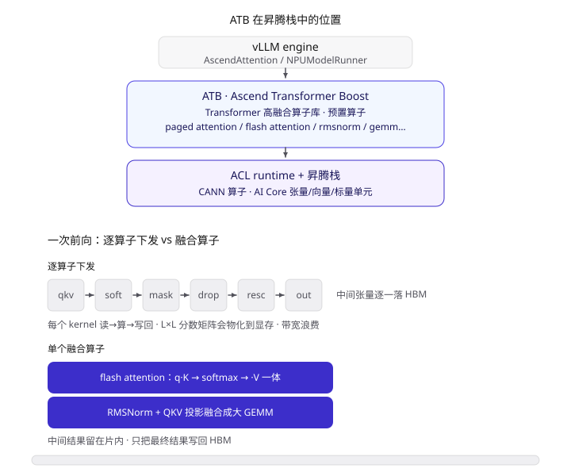
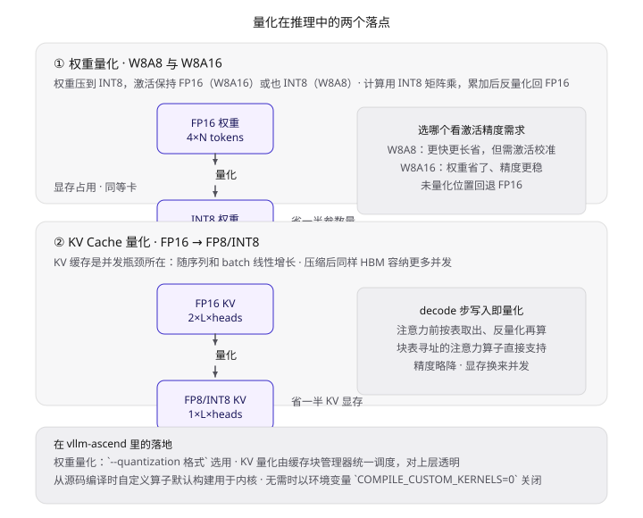
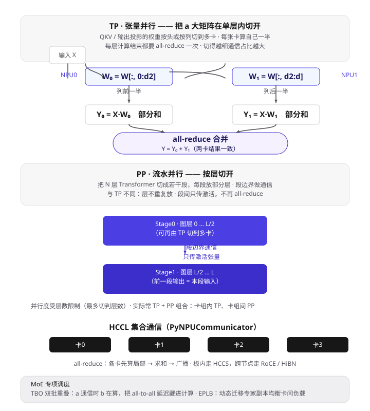
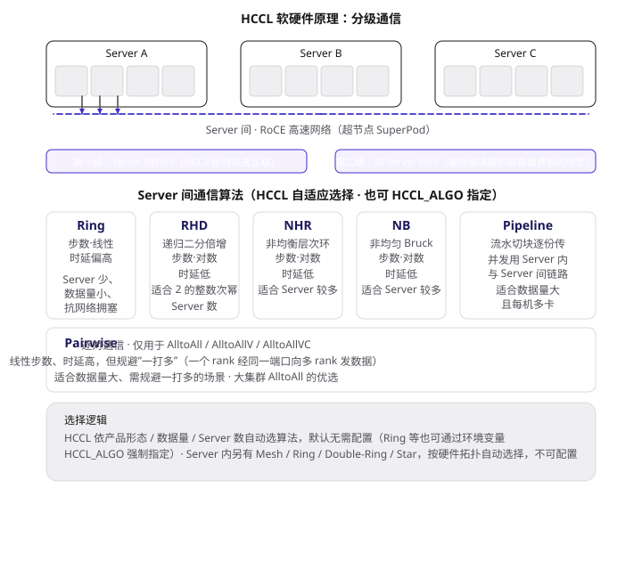
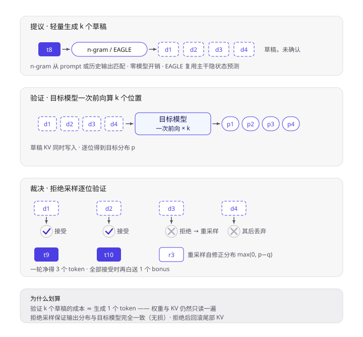

## vLLM-Ascend 是什么

vLLM-Ascend 是 vLLM 社区与华为昇腾团队联合维护的开源硬件插件，作用是把 vLLM 这套原生面向 CUDA 的推理引擎接到昇腾 NPU 上。它不 fork vLLM，也不改 vLLM 一行源码，只通过插件接口注入昇腾实现。用户侧装两个包即可运行：

```bash
pip install vllm vllm-ascend
```

启动时 vLLM 扫描插件入口，检测到 torch_npu 可用后激活 ascend 平台，日志里能看到：

```
INFO plugin ascend loaded.
INFO Platform plugin ascend is activated
```

此后 Transformer 类、MoE、Embedding、多模态模型都能跑在昇腾 NPU 上，调度、内存管理、采样全部复用 vLLM 主干。

## 一、整体分层：谁负责什么

| 层 | 职责 | 关键组件 |
| --- | --- | --- |
| 应用层 | OpenAI 兼容 API、离线推理 | API Server |
| vLLM 引擎核心 | 调度、内存管理、采样（设备无关） | Scheduler、PagedAttention |
| vllm-ascend 插件 | 设备接入的"翻译层" | Platform、Worker、ModelRunner、Attention 后端 |
| 昇腾软件栈 | NPU 算子与通信 | torch_npu、CANN（ATB）、HCCL |
| 昇腾硬件 | 算力与显存 | Atlas 800 · 昇腾 910B NPU |


> 自上而下：应用 → 引擎 → 插件 → 昇腾软件栈 → 硬件。紫色层即 vllm-ascend，本篇主角。

vLLM 只认设备无关接口，NPU 只认 CANN/torch_npu，插件层负责两者之间的翻译，三层可以独立升级互不侵入。

为什么做成插件而不是直接在 vLLM 主干里加后端？早期 vLLM 的各硬件后端各自持有 Executor、Worker、Runner、Attention 组件，非通用代码散落在主干里，加一个新后端要做侵入式修改，维护成本随后端数量增长。2024 年底社区通过 [Hardware Pluggable RFC](https://github.com/vllm-project/vllm/issues/11162)，把 `Platform` 模块做成插件入口，并重构了 `Executor`、`Worker`、`ModelRunner`、`AttentionBackend`、`Communicator` 五大组件的接口（[vLLM 官方博客](https://vllm-project.github.io/2025/05/12/hardware-plugin.html)）。vllm-ascend 是这套机制的首个落地验证项目，同批还有 IBM Spyre。

## 二、vLLM 引擎核心：为什么快

### 2.1 PagedAttention 分页 KV 缓存

LLM 是自回归模型，每生成一个 token，注意力层都要读取整个前缀的 K/V 向量，所以必须缓存，否则每步都要重算全部历史。KV 缓存的体积按下面的公式累加：

```
KV bytes / token = 2 × layers × kv_heads × head_dim × dtype_size
```

以 LLaMA-2-7B fp16 为例（32 层、32 个 KV 头、head_dim 128、无 GQA）：每个 token 约 512 KB，一条 4096 token 的序列就要 2 GB。几十条并发序列一累计，几十 GB 的 HBM 就没了，怎么管理这块显存直接决定吞吐上限。

传统做法给每条序列按 max_len 预留一整块连续显存，三个问题随之而来：序列提前结束，预留部分全部浪费（内部碎片）；不同序列的相同前缀（比如同一个 system prompt）无法共享显存；显存很快被"占坑"耗尽，并发数上不去。


> 上：传统方式按 max_len 整段预留，虚线部分全部浪费；下：分页方式逻辑连续、物理离散，按需申请与归还块。

PagedAttention 把操作系统的虚拟内存分页搬了过来：KV 缓存被切成固定大小的块（vLLM 默认每块 16 个 token），物理块放在全局块池里，每条序列持有一张 Block Table 记录逻辑块到物理块的映射。序列逻辑上看到的还是一段连续缓存，物理上却分散在块池各处，用到哪块申请哪块，序列结束块即刻归还。这带来三重收益：

1. 碎片从"每条序列一大段"缩小到"每条序列尾块内一点"；
2. 相同前缀的序列可以直接指向同一批物理块，写时复制（copy-on-write）后再分叉，这就是前缀缓存（prefix caching）的底层支撑，V1 引擎默认开启；
3. 同样显存能容纳多得多的并发序列。

在 vllm-ascend 侧，块表里的物理块就是 910B 的 HBM，注意力算子必须支持按块表寻址读写 KV——这正是 Attention 后端要替换的核心原因。

### 2.2 连续批处理（Continuous Batching）

PagedAttention 解决"装得下"，连续批处理解决"不空转"。

静态批处理整批同进同出：批内 4 条序列长短不一，最短的 R1 早就生成完了，却必须占着卡位等到最长的 R4 结束，这段时间 NPU 在做无用功。连续批处理把调度粒度从"一批"细化到"一次迭代"：每生成一个 token 就重新组批，完成的序列立刻踢出、新请求立刻插入，配合 PagedAttention（新请求申请得到块就能入批），吞吐可以翻倍以上。


> 上：静态批处理，短序列完成后只能空转等待整批结束；下：迭代级组批，相同时间窗完成 8 条请求。

### 2.3 Prefill：一次算完整个 prompt

连续批处理把请求分成两个计算特征截然相反的阶段，先看 Prefill。它要完成的事一句话概括：把一段 prompt 变成"可以开始生成的状态"——算出所有位置的 KV 存进缓存，并顺手用最后一个位置预测出第一个输出 token。

**按执行顺序拆开，一次 prefill 前向干了这些活**：

1. **组批**：Scheduler 从等待队列挑一批 prompt 拼成一次 prefill batch，总量受 token 预算约束（`max_num_batched_tokens`，如 8192），每条序列各带各的 Block Table；前缀缓存命中的请求先把共享前缀指向已有物理块，只计算新增后缀；
2. **Embedding 与位置编码**：token id 查表得到向量，按位置算 RoPE——只加在 Q、K 上，V 不带位置信息；
3. **逐层前向，每层四步**（LLaMA-7B 要把这套循环跑 32 遍）：
   - **QKV 投影**：所有位置一起做大 GEMM（三个投影通常融合成一个），每个位置各得一份 q、k、v。矩阵大而规整，是 prefill 算力消耗的大头；
   - **因果自注意力**：位置 i 的 q 与位置 0..i 的 k 做点积，softmax 后加权 v——三角掩码保证"只能往前看"。L 个位置同时进行，注意力矩阵理论上是 L×L，但 flash attention 类融合算子分块计算，从不把它物化到显存；GQA 模型下 kv 头少于 q 头，多个 q 头共享同一组 k/v；
   - **KV 写缓存**：本层的 k、v 按块表写入物理块，16 个 token 一块，写满申请新块——2.1 节那套分页机制在 prefill 侧的动作就是这里；
   - **FFN**：每个位置独立过 gate/up/down 投影，又一批大 GEMM；
4. **出口极小**：N 层跑完，只有最后一个位置的隐状态被投影成 logits、采样出第一个生成 token；其余位置的前向输出直接丢弃，价值全部沉淀在写进缓存的 KV 里。一整段的计算换来"1 个 token + 一份缓存"，这正是首 token 延迟（TTFT）的主要构成。


> 自上而下：Embedding 与 RoPE → 虚线框内逐层循环"QKV 投影 → 因果注意力（含三角掩码）→ KV 写块 → FFN" → 出口只取末位置。

为什么说 prefill 计算密集：全程由大 GEMM 和融合注意力主导，矩阵规模随 prompt 长度线性增长（注意力部分 L²），形状规整、无分支，910B 的 AI Core 可以持续满载。

### 2.4 Decode：一步一个 token 的循环

prefill 完成后，序列进入循环体：每步吃进上一步采样的 token，吐出下一个，直到 EOS 或长度上限。批里的 B 条序列各自循环，每步组成一个 batch 一起算。

**单步解码干了这些活**——与 prefill 同构，但处处缩小一号：

1. **输入**：上一步采样的 token id，每条序列各 1 个，整个输入张量是 B×1——prefill 里的 L 维坍缩成了 1；
2. **Embedding 与位置编码**：单 token 查表，RoPE 的位置号就是当前序列长度；
3. **逐层四步，全部缩小**：
   - **QKV 投影**：从大 GEMM 退化为矩阵乘向量（GEMV），单 token 的计算量小到喂不饱 AI Core；
   - **分页自注意力**：新位置的 q 与全部前缀 K/V 做注意力。K/V 不在本轮重算，而是按 Block Table 到块池里去读——本序列的物理块散落各处，算子逐块寻址；GQA 模型下只读 kv_heads 份。这是 AscendAttention 分页算子的主战场；
   - **KV 追加写**：本轮新算出的 k、v 写进序列最后一个物理块的空位，尾块写满就申请新块；
   - **FFN**：又是三个 GEMV；
4. **出口**：唯一位置的隐状态投影成 logits、采样出下一个 token——它就是下一轮的输入。


> 与 2.3 的 prefill 流水对照：投影退化为 GEMV；注意力从"算 L×L"变成"读全量前缀"；KV 从整段写入变成尾块追加。

每步计算量极小，要搬的东西却一样不少：权重全部过一遍，KV 缓存全部读一遍。每读一个字节只伴随很少的乘加，瓶颈从算力换成了 HBM 带宽，这是 decode 访存密集的真正含义。再叠加小算子问题：一步解码要下发几十个 kernel，每个都填不满，host 端调度开销占比陡增，NPU 相当一部分时间在"等指令"。

vllm-ascend 对此有三个对策。**并发 batch**：B 条序列的 decode 拼在一起算，权重读一次摊给所有序列。**ACL Graph**：把一步解码整图捕获后下沉 NPU 一次执行，host 只负责搬输入输出。**推测解码**：草稿模型一次生成多个候选 token，目标模型一次前向全部验证，把单 token 成本摊薄。

连续批处理的动作也发生在这里：每步迭代结束，完成的序列立刻踢出、新请求立刻插入，decode 的循环始终满载。

两个阶段的量级不对称是调度的根本张力：prefill 一出现就抢占整卡算力，若并发里混进一个长 prompt，它的一次 prefill 会让批里其他请求的 decode 集体停摆。chunked prefill 把长 prompt 切成小块分多次执行，把每次 prefill 的占用压到一两个迭代之内，保住批内 decode 的节奏——注意切块之后，后一块的注意力要读前一块已写入的 KV，prefill 从第二块起就带着"读缓存"的成分。


> 上：Prefill 整段并行、KV 整段写入，计算密集；中：Decode 单 token 查询全部前缀、只写 1 块，访存密集；下：Chunked Prefill 切块逐次执行。

在 vllm-ascend 里，两个阶段走不同后端：prefill 贪图算子融合度（ATB 高融合算子），decode 贪图低调度开销（ACL Graph 整图 + 按块表寻址的分页注意力算子）。2.1 节强调注意力算子必须支持块表寻址，第一个答案就在 decode 这里——每步都要按 Block Table 去读散落的前缀 KV。

### 2.5 V1 引擎架构

当前默认的 V1 引擎按进程拆分：

```
API Server（OpenAI 兼容接口）
   │
AsyncLLM（前端，异步管理请求生命周期）
   │  ZMQ 消息队列
EngineCore 进程（Scheduler + KV Cache 管理器）
   │
Executor → Worker（ModelRunner → AttentionBackend）
```

Scheduler 跑在 CPU 上做组批决策，Worker 跑在 NPU 上执行模型，两者解耦。这个结构决定了插件要做的事：只替换"下锤子的手"（Worker 侧），不动"决定怎么锤的脑子"（Scheduler 侧）。

## 三、插件挂接机制：零侵入的五个替换点

注册链路分三步，全部通过 Python entry points 完成：

```python
# setup.py 中的注册声明
setup(
    entry_points={
        'vllm.platform_plugins': ["ascend = vllm_ascend:register"]
    }
)
```

1. **注册**：vllm-ascend 在 `vllm.platform_plugins` 组下登记 `ascend` 入口；
2. **发现**：vLLM 启动时扫描该组的所有入口，逐个加载插件包；
3. **激活**：`register()` 返回一个 `Platform` 类，探测逻辑发现 torch_npu 可用、设备是 NPU 时选中它，后续所有设备相关组件都从它这里拿工厂方法。


> 顶部为安装激活流程，下方为逐行「接口 → 昇腾实现」替换：接口在 vLLM 主干，实现在插件仓库。

替换点一共五个，接口在 vLLM 主干，实现在插件仓库：

| vLLM 抽象 | vllm-ascend 实现 | 职责 |
| --- | --- | --- |
| `Platform` | NPUPlatform | 设备探测、NPU 属性、初始化 |
| `WorkerBase` | NPUWorker | 昇腾卡上的执行循环 |
| `ModelRunnerBase` | NPUModelRunner | 批数据组装、构图、量化适配 |
| `AttentionBackend` | AscendAttention | 分页注意力算子（ATB） |
| `Communicator` | PyNPUCommunicator | HCCL 集合通信（TP/PP） |

调度器、PagedAttention 逻辑、采样器全部复用主干，插件只写"不同"，不重写"相同"。这就是插件架构的价值：vLLM 升级版本，vllm-ascend 只需跟进接口变化；昇腾出新芯片，vLLM 主干一行不动。

## 四、昇腾侧关键技术

**ATB 算子**。ATB（Ascend Transformer Boost）是 CANN 生态里专门加速 Transformer 的高融合算子库，预置 flash attention、分页注意力、RMSNorm、GEMM 等算子，它位于 vLLM engine 之下、ACL runtime 之上——AscendAttention 后端按块表读写 KV 的调用，落到底层最终就是 ATB 的分页注意力算子。

理解 ATB 要抓住"融合"这两个字。以注意力为例，朴素写法是一个位置一个 kernel：`q·Kᵀ` → softmax → 掩码 → dropout → 归一化 → `·V`，每个 kernel 都把中间张量（比如 L×L 的分数矩阵）写回 HBM，下一个 kernel 再读出来。逐算子下发时，这些中间往返消耗的是宝贵的片上带宽。ATB 的融合算子把这一整串合进一个 kernel：非 softmax 部分分块驻留片上、softmax 的统计量在线更新，最终只把结果写回 HBM。RMSNorm 也可以与 QKV 投影融合成一个更大的 GEMM，减少 kernel 数与启动开销。

也就是说，在加图模式、上多卡这些更上层的优化之前，单算子层面的融合已经把 decode 里相当一部分带宽和调度浪费压掉了——图模式解决"多算子调度"，ATB 解决"单算子内的冗余搬运"，两者在不同粒度上互不冲突。[vLLM Ascend 文档](https://docs.vllm.ai/projects/ascend/en/latest/)将 ATB 列为默认的注意力后端。



> 上：ATB 位于 vLLM 与 ACL runtime 之间；下：一次前向逐算子下发与融合算子的对比，融合算子把中间张量留在片上。

**图模式（ACL Graph / torchair）**。它解决 decode 的"小算子税"：一步解码几十个 kernel，每个都小到喂不饱 AI Core，而 host 每下发一个算子都要走一遍框架→runtime→驱动的固定开销。逐个下发时，NPU 大量时间花在等下一条指令上，空泡比计算还长。

原理分两个阶段。**捕获（capture）**：首次执行某个形状的解码步时，把整条算子序列连同依赖关系、内存地址记录成一张静态图；**重放（replay）**：之后每步只需把新数据写进固定地址的输入 buffer、一次调用整图——host 从"下发 N 次"变成"下发 1 次"，调度开销从 N 份 launch 降为常数。

图是静态的，decode 的动态性靠三个约定吸收：输入输出 tensor 的地址、形状固定，变化的只是内容；batch 维度按桶捕获（1、2、4、8……预设档位），运行时向上取整到最近的桶做 padding 执行；分页 KV 的块表以 tensor 输入的形式传入——地址固定、内容每步更新，这正是图模式与 PagedAttention 能共存的关键。代价是每个桶要额外存一套图和静态 buffer，含动态分支的算子无法入图、只能退回 eager。

在 vllm-ascend 里构图由 NPUModelRunner 负责：decode 走图模式，prefill 因为长度动态、捕获不划算而保持 eager。


> 上：eager 模式逐算子下发，NPU 空泡夹在执行块之间；下：capture 记录整图、replay 一次下发连续执行；底部为静态图装下动态 decode 的三个约定。

**量化**。推理里有两块显存大户可以压：模型权重和 KV 缓存，vllm-ascend 对两者都支持低精度化。

**权重量化**走 W8A8 与 W8A16。W8A8 是权重、激活都压到 INT8，权重从 FP16 的 4×N tokens 掉到 2×N，计算用 INT8 矩阵乘（在 910B 上通常比 FP16 更快），累加后反量化回 FP16。W8A16 只压权重、激活保持 FP16，权重省了省、精度更稳，适合激活分布不好校准的场景。选哪种是速度与精度的权衡；未量化的位置可以回退 FP16。

**KV Cache 量化**把每层每头的 k、v 从 FP16 压到 FP8/INT8，显存对半砍。它比权重量化更能直接提升并发：权重是一次性的固定开销，KV 缓存却随并发序列数和上下文长度线性涨，经常是显存里最先见顶的部分——同一块 HBM，压缩 KV 意味着能同时服务更多请求。decode 步写入时即量化，注意力前按块表取出、反量化再算，分页注意力算子直接内建支持这种流程。

在 vllm-ascend 里，权重量化通过 `--quantization` 参数选用，KV 量化则由缓存块管理器统一调度，对上层模型代码透明。从源码编译时自定义算子（含去量化内核）默认构建，用于这些低精度路径，需要 gcc/cmake 等工具链；不需要时用 `COMPILE_CUSTOM_KERNELS=0` 关闭。



> 左：FP16 权重压成 INT8，显存减半（W8A8/W8A16）；右：KV 缓存 FP16→FP8/INT8，同等 HBM 容纳更多并发。

**分布式与调度**。模型参数装不进单卡时，就要把一次前向拆到多张 NPU 上。两种基本切法：**张量并行（TP）**把单层内的大矩阵按头或按列切开、分到多卡，每张卡算一半，每次线性层后通过 HCCL all-reduce 把局部结果合并成全局；**流水并行（PP）**按层切——每段放一部分 Transformer 层，前一段的输出作为后一段的输入，只在段边界通信。HCCL 在 910B 上封装成 PyNPUCommunicator，是 TP all-reduce 和 PP 段间通信的共同底层。[vLLM Ascend 文档](https://docs.vllm.ai/projects/ascend/en/latest/)里的分布式配置对应这些切分维度。

TP 是把倍速换通信：每层都 all-reduce 一次，卡间带宽是硬约束；切分粒度越细、通信占比越大，超过某个规模后继续加 TP 变成亏本，此时要靠加 PP 或数据并行扩展。这也决定了调度的着力点——在昇腾上，扩展的瓶颈很少在单卡算力，而在卡间通信。

针对 DeepSeek 这类 MoE 模型，vllm-ascend 有两个专门优化。**TBO（two-batch overlap，双批重叠）**：MoE 的专家路由往往要走 all-to-all 通信，慢且空转；把 batch 拆成 a、b 两份，让 a 在通信的同时 b 在算，计算与通信双管线重叠，把通信延迟藏进计算时间。**EPLB（Experts Parallel Load Balancer）**：MoE 的专家命中不均衡，热门专家所在的卡忙到排队、冷门专家的卡闲着；它动态迁移专家副本，让各卡负载趋于均衡。两者针对的都是同一个根因——MoE 推理的瓶颈在卡间走走停停，不在单卡算力。



> 上：TP=2、PP=2 的 4 卡切分，层内走 TP all-reduce、层间走 PP；下：HCCL 集合通信与针对 MoE 的 TBO、EPLB。

**HCCL 软硬件原理**。HCCL（Huawei Collective Communication Library）是昇腾的原生集合通信库，提供 AllReduce、Broadcast、AllGather、ReduceScatter、AlltoAll 等原语，支撑数据并行、模型并行、专家并行、流水并行、序列并行等多种方案，910 上由 PyNPUCommunicator 封装[$TRAE_REF](https://www.hiascend.com/app-forum/topic-detail/0272158203532861553)。它的硬件拓扑分两级：**Server 内**多张 NPU 通过板内高速互联（HCCS，相当于 NVLink 的角色）直连；**Server 间**通过 RoCE 高速网组网，超节点（SuperPod）形态下动辄几百上千张 NPU 互联[$TRAE_REF](https://www.hiascend.com/document/detail/zh/CANNCommunityEdition/910beta3/API/hcclug/docs/zh/user_guide/hccl_env/inter_superpod_algo_support.md)。

HCCL 因此在算法上采用**分级通信**：先做第一级 Server 内归约、再做第二级跨 Server 归约——板内带宽快、跨机慢，先在快链路上把数据汇总起来，避免把昂贵的板内带宽浪费在慢速跨机链路上。归约类操作（AllReduce/ReduceScatter/Reduce）还支持随路（in-line）完成，不占用计算资源，让通信与计算并发执行，整体执行时长大幅下降[$TRAE_REF](https://www.hiascend.com/developer/blog/details/02178213886519017043)。

**Server 间通信算法**。第一级归约之后，真正的跨 Server 大块数据用哪个算法传，HCCL 会按产品形态、数据量、Server 数量自动选择（默认即可，也可用环境变量 `HCCL_ALGO` 强制指定），常用六种[$TRAE_REF](https://www.hiascend.com/document/detail/zh/CANNCommercialEdition/Run%20Environment/BaiTEXDs/HCCL/HCCL%20%E4%BC%9A%E8%AF%9D%E8%80%85/9279.csvw)：

- **Ring**：环结构，通信步数与规模线性、时延偏高，但通信关系简单、抗网络拥塞，适合 Server 少、数据量小、网络拥塞明显且 Pipeline 不适用的场景；
- **RHD**（Recursive Halving-Doubling，递归二分倍增）：通信步数按对数增长、时延低，但非 2 次幂规模会引入额外通信量，适合 Server 数为 2 的整数次幂且 Pipeline 不适用的场景，或非 2 次幂但数据量小的场景[$TRAE_REF](https://www.hiascend.com/document/detail/zh/CANNCommunityEdition/81RC1alpha002/apiref/envref/envref_07_0079.html)；
- **NHR**（Nonuniform Hierarchical Ring，非均衡层次环）：步数对数、时延低，适合 Server 较多且 Pipeline 不适用的场景；
- **NB**（Nonuniform Bruck，非均匀 Bruck）：非均匀分块的通信，步数对数、时延低，同样适合 Server 较多且 Pipeline 不适用的场景；
- **Pipeline**：流水线并行，把大数据切块逐份传递，能并发使用 Server 内与 Server 间的链路，适合数据量大且每机多卡的场景；
- **Pairwise**：逐对通信，仅用于 AlltoAll / AlltoAllV / AlltoAllVC，步数线性、时延高，但规避"一打多"（一个 rank 经同一个端口向多个 rank 发数据致拥塞），适合数据量大、需规避一打多的场景，是大规模集群 AlltoAll 的优选方案[$TRAE_REF](https://www.hiascend.com/developer/blog/details/02178213886519017043)。

> 注：Server 内另有 Mesh、Ring、Double-Ring、Star 等算法，按硬件拓扑自动选择、不可配置；跨机算法默认自适应，指定 `HCCL_ALGO` 后以用户指定为准。



> 上：两级硬件拓扑与分级通信（Server 内 HCCS / Server 间 RoCE）；下：Ring、RHD、NHR、NB、Pipeline、Pairwise 六个跨 Server 算法的复杂度与适用场景。

**推测解码**。decode 的根本约束是串行：第 i+1 个 token 依赖第 i 个，每步前向只产出 1 个。推测解码的关键洞察是验证比生成便宜——一次前向同时算 k 个位置，权重和 KV 仍然只读一遍，成本几乎等于算 1 个。于是让"猜"和"验"分工：轻量提议者先猜 k 个草稿，目标模型一次前向全部验证，一轮产出多个 token。

一轮分三步。**提议**：`vllm_ascend/spec_decode/` 里的提议者生成草稿——n-gram 直接从 prompt 或历史输出匹配（零模型开销，适合复制型任务），EAGLE 在主干上加轻量草稿头、复用隐状态预测。**验证**：k 个草稿拼成一段 mini-prefill 走目标模型，逐位得到目标分布 p，草稿的 KV 同时写入。**裁决**：`vllm_ascend/sample/` 的拒绝采样器逐位比较草稿分布 q 与目标分布 p——随机数小于 min(1, p/q) 则接受并继续看下一位；首个被拒的位置从修正分布 max(0, p−q) 重采样一个替代 token，其后草稿整体丢弃；全部接受则再从目标分布白送一个 bonus token。无论走哪条分支，最终输出分布都与目标模型完全一致，这是无损加速。

工程细节：接受位置的草稿 KV 直接复用，拒绝位置之后已写入的尾部块要回滚，块管理器必须支持按序列长度截断；收益取决于接受率，草稿质量差时验证步的额外计算反而变成纯开销。



> 提议生成 k 个草稿、目标模型一次前向验证、拒绝采样逐位裁决；全接受送 bonus，首拒换采样，其后丢弃；底部为两个关键性质。

## 五、一个请求的端到端流程

把上面所有机制串成一条时间线：

1. **请求接入**：prompt 经 OpenAI 兼容 API 进入，分词为 token 序列，进等待队列；
2. **调度组批**：Scheduler 按迭代级组批，完成的序列出、新请求进；前缀缓存命中的请求直接复用已有物理块；
3. **Prefill**：一次算完整个 prompt，KV 写入物理块池（长 prompt 会被切块）；
4. **Decode**：每步生成 1 个 token，ACL Graph 整图下沉 NPU 执行，KV 追加写入尾块；
5. **输出**：logits 采样、detokenize，流式返回给客户端。


> 紫色节点是 NPU 计算热点，底部横条为插件替换的执行内核。

多卡场景下，模型按 TP 切分到各 NPU，每层前向后通过 HCCL 做 all-reduce。

## 六、学习路径

按四阶段推进，每阶段都以上一阶段为地基：

1. **跑通体感**：在昇腾环境安装 vllm + vllm-ascend，跑一个 Qwen 小模型，对照启动日志里的 "Platform plugin ascend is activated"，把分层和替换点在日志里逐一对上号；
2. **夯实 vLLM 原理**：精读 [PagedAttention 论文](https://arxiv.org/abs/2309.06180)（vLLM: Easy, Fast, and Cheap Serving）和 vLLM 官方文档的 V1 Engine、Scheduler 章节，吃透"为什么快"；
3. **精读插件源码**：按调用顺序读 [vllm-ascend 仓库](https://github.com/vllm-project/vllm-ascend)：`setup.py` 的 entry point → `vllm_ascend/platform.py` → worker → attention backend，对照第五节的替换点表格；
4. **深入昇腾栈**：CANN / ATB / torch_npu 文档，理解算子层如何支撑上层抽象。

一句话总结：vLLM 管"聪明地调度"，昇腾管"暴力地计算"，vllm-ascend 用五个标准接口把两者焊在一起，互不侵入、各自演进。完整文档见 [vLLM Ascend 官方文档](https://docs.vllm.ai/projects/ascend/en/latest/)。
