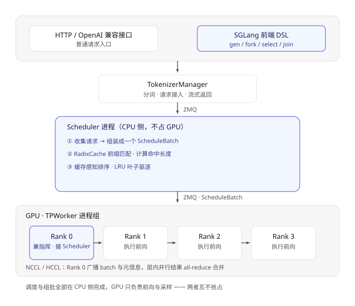
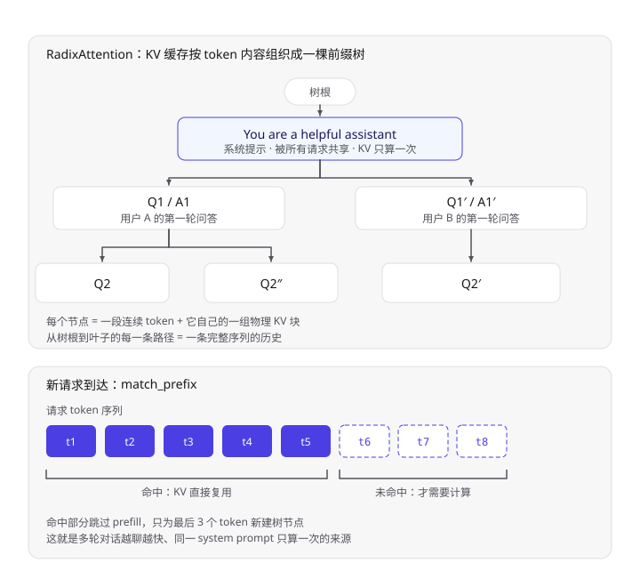
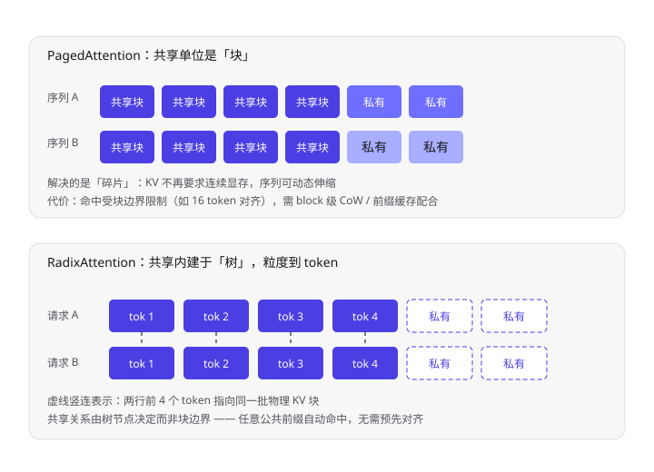
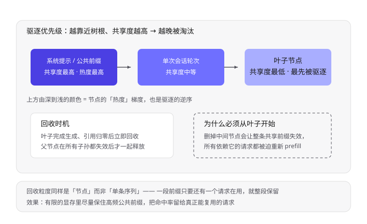
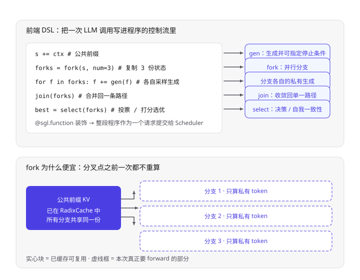
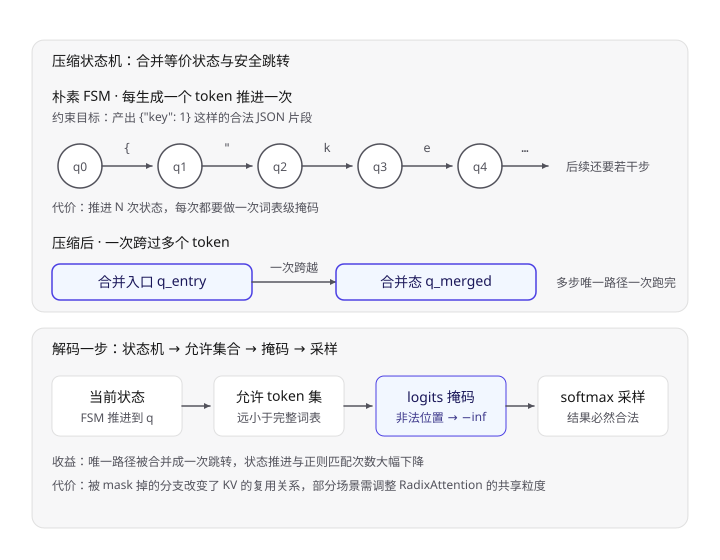
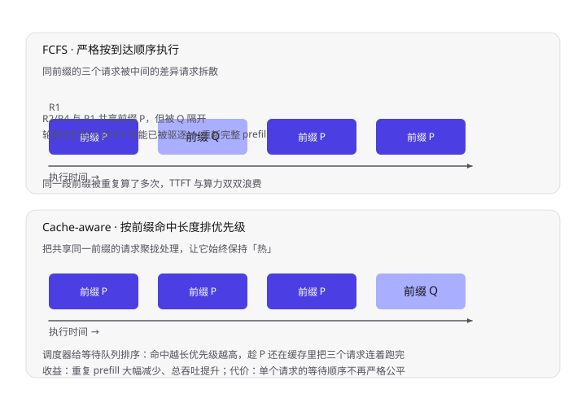
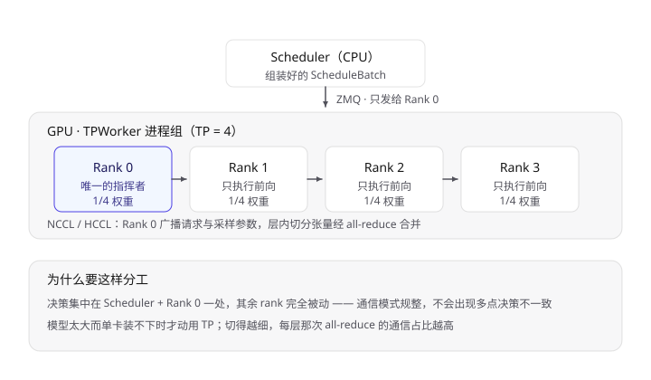

vLLM 那篇讲了"引擎怎么把 KV 缓存管好"，这一篇换个角度看 SGLang：它做的事情可以被一句话概括——**把"哪些计算可以复用"这件事，从引擎内部的运行时优化，提升成了编程模型层面的显式表达能力**。围绕这个目标，SGLang 在设计上做了三个层层递进的选择：

1. **调度器与执行器分离**：单个 Python 进程不再独自跑调度和模型执行，调度器化身 `Scheduler` 进程（CPU 上），执行器成为 GPU 侧的 `TPWorker`，中间用 ZMQ 收发 `ScheduleBatch`；
2. **RadixAttention**：KV 缓存不再以"序列"为单位管理，而是按 token 内容组织成一棵前缀树，任意请求之间只要有共同前缀就能自动命中共享；
3. **SGLang 前端 DSL**：`gen` / `fork` / `join` / `select` 这些原语让程序显式描述"哪里要并行、哪里要共享前缀、哪里要决策"，配合 `RadixAttention` 与压缩状态机 `compressed FSM` 实现高效约束解码。

三件事共用同一条主线：**最大化可复用的计算，最小化重复的 prompt 与重复的 KV**。下面按"整体架构 → RadixAttention → 并行采样 → 约束解码 → 缓存感知调度 → 多卡"的顺序拆开讲。

## 一、整体架构：Scheduler 与 Executor 分离

SGLang 的运行时结构比 vLLM 更"解耦"一点：

```
HTTP Server / 前端 DSL 程序
        │
   TokenizerManager        # 分词、请求接入
        │  ZMQ
   Scheduler 进程（CPU）    # 收集请求、RadixCache 匹配、组批
        │  ZMQ（ScheduleBatch）
   TPWorker（GPU，Rank 0）  # 跑模型、采样，向其他 rank 广播
        │  NCCL/HCCL
   其他 TP Rank
```

关键点：

- **调度是纯 CPU 工作**。ScheduleBatch 的组装、radix tree 的前缀匹配、KV 命中的块计算都不占 GPU 时间，从而让 GPU 专注于前向与采样。
- **TokenizerManager 与 Scheduler 通过 ZMQ 交互**，Scheduler 再通过 ZMQ 把 `ScheduleBatch` 推给 Rank 0 的 TPWorker。
- **TP 内部走 NCCL/HCCL**。Rank 0 负责把请求参数（`reqs`、`input_ids`、采样参数等）广播给其余 rank，保证各卡看到同一份 batch。

这个结构的一个直接后果是：**加长上下文和多轮对话的优化，主要发生在 Scheduler 侧的 RadixCache 上，而不是模型侧**。



> 上半部分是纯 CPU 的接入与调度链路，下半部分是 GPU 执行组。两条 ZMQ 通道把「决定的」和「干活的」彻底分开，TP 组内部才走 NCCL/HCCL。

## 二、RadixAttention：把 KV 缓存组织成前缀树

### 2.1 从"按序列分配"到"按前缀共享"

回忆 vLLM 的 PagedAttention：KV 缓存被切成物理块，每条序列持有一张 Block Table。块内可以有前缀共享（copy-on-write），但**默认的共享单位是"块"**，并且需要序列自己显式命中或引擎做前缀缓存匹配。

SGLang 的 RadixAttention 往前再走一步：**把整棵前缀树（radix tree / 压缩前缀树）作为全局的 KV 缓存索引结构**。树的每个节点对应一段连续的 token 及其 KV 块；一个请求进入时，从根开始逐字符匹配，命中的部分直接复用，只有未命中的后缀需要真正计算。

```
                 [根]
                  │
        "You are a helpful..."   ← 系统提示（所有请求共享）
                  │
        ┌─────────┴─────────┐
        │                   │
   "用户的第一个问题"     "另一个用户的问题"
        │                   │
    "......"            "......"
```

命中前缀的请求**不需要重算 prefill**，KV 直接从树中取；只有新节点才申请物理块。这一机制对下面三类负载收益最大：



> 上：树中每个节点是一段连续 token 加它自己的一组物理 KV 块，共同前缀只存一份；下：新请求进来后逐 token 匹配树，命中部分直接复用 KV，只有未命中的尾巴需要计算。

| 负载类型 | 共享来源 | 效果 |
| --- | --- | --- |
| 多轮对话 | 前面几轮的完整历史 | 每一轮只需 prefill 新问题 |
| Few-shot / 系统提示 | 固定的前缀模板 | 系统提示只算一次 |
| 树状搜索 / 并行采样 | 公共前缀 | 分支之后才分叉计算 |

和 PagedAttention 的对比可以这样记：



> 上：PagedAttention 的共享单位是块，命中要受块边界限制；下：RadixAttention 由树节点决定共享关系，粒度到 token，任意公共前缀自动命中。

- **PagedAttention 解决的是"碎片"问题**——让 KV 不再要求连续显存，序列可以动态伸缩。
- **RadixAttention 解决的是"复用"问题**——让不同请求之间的公共前缀自动被发现并共享，而不是靠用户或引擎手工配置。

两者在实现上并不冲突：RadixAttention 的每个树节点背后依然是一组物理 KV 块，块管理器复用 PagedAttention 那套机制。

### 2.2 树的维护策略

RadixCache 在内存吃紧时需要做驱逐（eviction）。SGLang 采用**类 LRU 的叶子优先驱逐**：越是共享程度高、越靠近根节点的前缀，越"烫"，越不容易被淘汰；而被淘汰的总是那些从此再也不被复用的叶子节点。这样可以在有限显存下尽量保住高频公共前缀。



> 颜色由深到浅是节点的热度梯度，也是驱逐的逆序：靠近根的公共前缀被所有请求依赖，删掉它等于让整条共享路径作废，所以回收永远从叶子开始。

## 三、以 LLM 为中心的前端 DSL

前端是 SGLang 最特别的部分。它提供了一组 Python 原语，让你把"一次 LLM 调用"当成程序里的一个指令来控制：

- **`gen(prompt, stop=..., ...)`**：生成调用，可以指定停止条件、采样参数；
- **`fork(n)`**：把当前状态复制成 n 份并行分支；
- **`select(choices)`**：在若干分支里做出选择（常用于自我一致性、投票）；
- **`join()`**：合并回一条路径。

`fork` 与 `select` 的组合，正是**并行采样**（parallel sampling）和**树状搜索**（tree search）的抽象来源，也是这套 DSL 名字里 "structured" 的含义——LLM 不再只是一个黑盒函数调用，而可以被嵌入到控制流里。



> 上：五个原语在一小段程序里的对应关系；下：fork 出来的分支只在分叉点之后各自计算，实心块是共享的那份前缀 KV。

配合 `RadixAttention`，这些原语的效果会被放大：多个 fork 出来的分支共享同一段前缀 KV，只在分叉点之后各自计算各自的 token，从而把"重复的前缀计算"压缩到近乎为零。

## 四、约束解码：压缩状态机（Compressed FSM）

需要严格输出格式（JSON、特定语法）时，SGLang 用**压缩状态机**做约束解码。

原理：把要遵守的语法（如正则表达式或 JSON Schema）编译成一个有限状态机（FSM）。解码每一步时，状态机给出"当前状态下允许的 token 集合"，然后对这个允许集合做掩码（masking），把不允许的 logits 置为 `-inf`，softmax 之后这些 token 自然不可能被采到。

所谓"压缩"，是指把状态机里**语义等价的状态、以及可安全跳过的转移边**做合并——例如连续多步都只有唯一可行转移的路径就可以一次跨过多个 token，而不是一步一步地、每步都带一个状态机推进与掩码开销。这在长文本、强格式约束的场景下能明显减少解码步数与正则匹配开销。



> 上：朴素 FSM 每生成一个 token 就要推进一步并做一次掩码，压缩后等价路径被合并成一次跳转；下：单步解码里状态机提供的允许集合如何一路变成采样结果。

一个重要的工程细节：**RadixAttention 与约束解码并不是时刻兼容的**。被语法 mask 掉的分支，其 KV 复用关系可能需要额外处理，实际实现中会根据是否开启约束解码来调整缓存共享的粒度。

## 五、缓存感知调度（Cache-Aware Scheduling）

默认的先到先服务（FCFS）调度会有一个问题：一个与新请求**共享前缀很长**的旧请求如果排在后面，那么等它先被处理时，前缀可能已经被驱逐出 RadixCache 了。

SGLang 的做法是**把"前缀匹配长度"纳入调度优先级**：在等待队列里优先挑选与当前缓存内容匹配度最高的请求，让尽可能多的前缀命中发生在它被驱逐之前，从而最大化缓存命中率、减少重复 prefill。



> 上：FCFS 严格按到达顺序，共享同一前缀的请求被差异请求拆散，等轮到后面几个时前缀可能已被驱逐；下：缓存感知调度把同前缀请求聚拢处理。

与 FCFS 的差别可以概括为：

| 调度策略 | 依据 | 目标 |
| --- | --- | --- |
| FCFS | 到达时间 | 公平性 / 尾延迟 |
| Cache-aware | 前缀命中长度 | 缓存利用率 / 总吞吐 |

在长共享前缀（如统一的系统提示 + 多轮历史）的工作负载下，cache-aware 调度带来的吞吐提升相当可观。

## 六、多卡执行

多卡场景下，SGLang 用张量并行（TP）切分模型：

- 每个 TP rank 起一个进程，跑各自的 `TPWorker`；
- **Rank 0 兼任"指挥"**，负责与 `Scheduler` 通信、并把 batch 相关的元信息广播给其余 rank；
- 其余 rank 只接收广播、执行前向，不参与调度决策；
- 卡间通信走 **NCCL（NVIDIA）或 HCCL（昇腾）**。



> 只有 Rank 0 与 Scheduler 对话，拿到 batch 后再广播给其余卡；其余 rank 全程被动执行，保证不会出现多点决策不一致。

可以看到，多卡侧设计保持了和单卡一致的思路：**调度与决策集中在一处（Scheduler + Rank 0），执行分散在各卡**，让通信模式尽量规整。

## 七、和 vLLM 的关系

| 维度 | vLLM | SGLang |
| --- | --- | --- |
| KV 管理 | PagedAttention，按序列 + 物理块 | RadixAttention，按前缀树全局共享 |
| 前缀复用 | block 级 copy-on-write / prefix caching | 树结构内建，自动命中任意公共前缀 |
| 调度 | FCFS + 抢占（swap / recompute） | 缓存感知调度，优先高命中请求 |
| 前端 | OpenAI 兼容 API 为主 | 状态机式 DSL（`gen`/`fork`/`select`）+ API |
| 约束解码 | 支持 grammar / JSON | compressed FSM 为核心特性之一 |
| 并行采样 | n / best_of | 原生 `fork`/`select` 原语 + 前缀共享 |

两者并非取代关系：vLLM 在"通用推理服务"上更成熟，SGLang 在"带大量共享前缀的结构化生成"（多轮 Agent、树搜索、强格式输出）上更占优势。

## 八、学习路径

1. **跑通体感**：装 `sglang[all]`，用 `python -m sglang.launch_server` 起服务，先跑通一个 Qwen 小模型的 OpenAI 兼容接口，观察启动日志里 RadixCache 相关的输出；
2. **读 RadixAttention 源码**：重点看 `radix_cache.py` 里的树结构、`match_prefix` 与 `evict` 逻辑；
3. **写一个 DSL 程序**：用 `gen` / `fork` / `select` 实现一次 best-of-n 或 Tree-of-Thought，体会前缀共享带来的加速；
4. **看约束解码**：对照 `compressed FSM` 的实现，理解状态压缩与 token 掩码的关系；
5. **多卡实操**：用 `--tp-size` 起多卡，观察 Rank 0 的广播与 NCCL/HCCL 通信。

## 参考

- Zheng et al. *SGLang: Efficient Execution of Structured Language Model Programs* (NeurIPS 2024)
- [SGLang 官方仓库](https://github.com/sgl-project/sglang)
- [SGLang 文档](https://docs.sglang.ai/)
