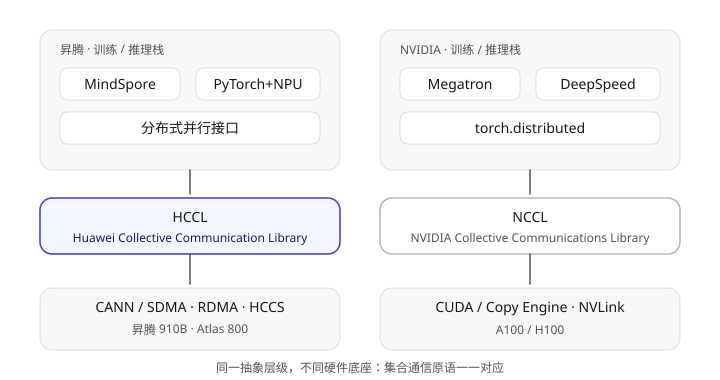
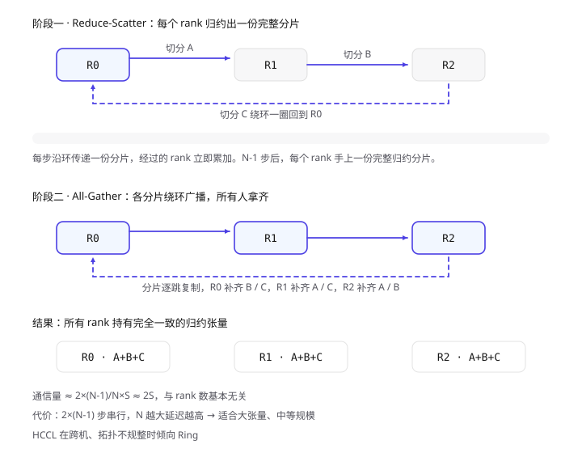
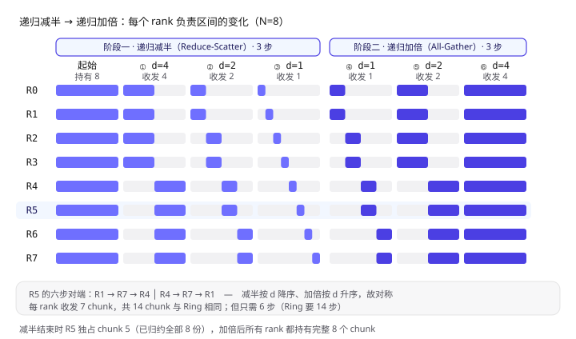
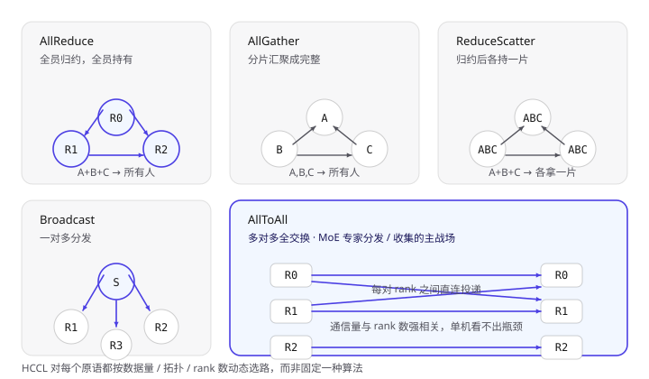
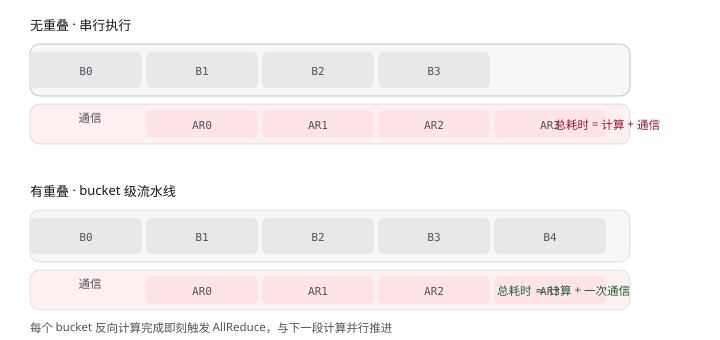
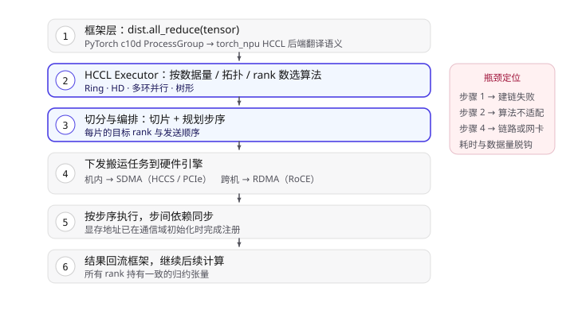
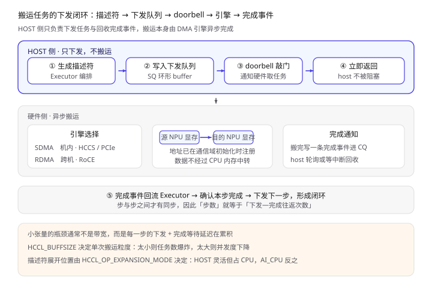
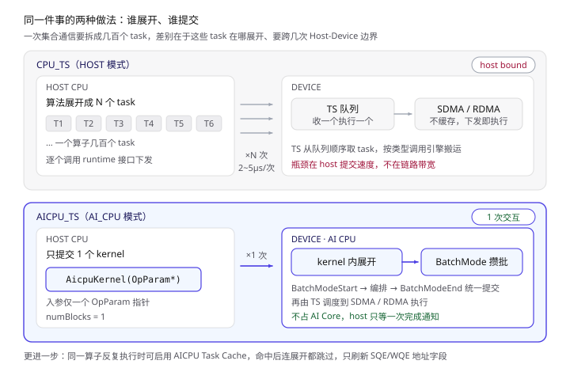

上一篇文章把 MPI 的集合通信过了一遍，最后留了个尾巴：昇腾上的集合通信由 HCCL 承担。这篇把它拆开讲清楚——HCCL 不是"昇腾版 MPI"，它是一套**面向 AI 训练/推理场景重新设计的集合通信库**，要解决的是 MPI 没打算解决的那部分问题：多 NPU 卡间怎么建立通信、张量怎么切分、算子怎么在拓扑上滚起来、以及如何让通讯和数据搬运重叠起来。

先给一个直觉：HCCL 之于昇腾，等价于 NCCL 之于 NVIDIA。都是"设备内多卡通信库"，都提供 allreduce / allgather / reducescatter / alltoall / broadcast 这一套集合原语，都自己管拓扑、自己选算法、自己调度硬件搬运引擎。区别在于底层硬件与软件栈不同，实现路径也各有取舍。



> 左侧 PyTorch/TensorFlow 通过集合通信 API 发起调用；中间 c10d 插件负责把框架语义翻译成设备通信库语义；右侧 HCCL 落到昇腾软件栈与硬件。

## 一、HCCL 是什么，位于哪一层

HCCL（Huawei Collective Communication Library）是 CANN（Compute Architecture for Neural Networks）软件栈中的一个独立组件，向下管理 HCCS/PCIe/RoCE 等多种互联介质，向上提供集合通信 API，并被集成进各种分布式训练框架。它不依赖 MPI，但组件划分上与 MPI 的思路有相通之处——通信原语 + 通信域 + 拓扑感知。

一个完整的昇腾分布式训练栈自上而下是这样：

| 层 | 职责 | 关键组件 |
| --- | --- | --- |
| 框架层 | 模型切分、梯度同步 | PyTorch、MindSpore |
| 分布式通信接口 | 集合通信原语（设备无关） | torch.distributed（c10d）、MindSpore 分布式接口 |
| HCCL 适配层 | 框架语义 → HCCL 语义 | torch_npu 的 HCCL 后端、hccl_test |
| **HCCL 核心** | 通信域管理、算法选择、算子编排 | HCCL Executor、Communicator、Operator |
| 传输层 | 单次数据搬运、内存注册 | SDMA（片内）、RDMA（跨机） |
| 硬件层 | 物理链路与搬运引擎 | 昇腾 NPU、HCCS、RoCE 网卡 |

这里最关键的一层是**传输层**。HCCL 不直接操作网卡寄存器，而是把搬运工作外包给两个引擎：

- **SDMA**（System DMA）：板内/跨卡搬运引擎，负责同一台机器内经 HCCS 或 PCIe 互联的 NPU 之间的 HBM↔HBM 数据搬运；
- **RDMA**：跨机器搬运，走 RoCE（RDMA over Converged Ethernet）网络，数据从源 NPU 显存直接绕开 CPU 送到目标 NPU 显存。

HCCL 的价值就在这一层之上——它把"一坨张量要同步"翻译成"在哪个链路上、用哪个算法、按什么顺序搬多少块"。至于这些"块"最终怎么变成硬件能执行的指令，是第七节的主题。

### 两级拓扑与分级通信

从上面传输层的分工可以看出，昇腾的物理拓扑天然分两级：

- **Server 内（机内）**：同一台服务器内的多张 NPU 通过 **HCCS** 板内高速互联，类比 NVIDIA 的 NVLink，带宽高、延迟低，搬运走 SDMA 引擎；
- **Server 间（跨机）**：多台服务器通过 **RoCE** 高速以太网互联，搬运走 RDMA 引擎。在超节点（SuperPod）形态下，集群可扩展到几百上千张卡。

两级带宽差异巨大——HCCS 的板内带宽通常比跨机 RoCE 高一个数量级以上。如果直接把一张卡的梯度广播给全网，大量流量会涌入慢速的跨机链路，板内带宽反而闲置。因此 HCCL 采用**分级通信**策略：

1. **先在 Server 内归约**：同机 NPU 先用 HCCS 做一轮归约，把本机的数据归约成一份；
2. **再跨 Server 归约**：各机代表再用 RoCE 做一轮跨机归约，得到全局结果；
3. **最后 Server 内广播**：把全局结果在机内广播给所有卡。

这样跨机链路上只跑机间归约后的数据量，而不是所有卡的原始梯度。对 AllReduce 而言，跨机通信量从 `N×S` 降到了 `(Server数)×S/每机卡数`，大集群下节省非常可观。

此外，归约类操作支持**随路完成**（reduce 在搬运过程中就地累加，不需要额外 kernel 启动），且与计算流并发执行——这正是第四节"通信与计算重叠"的硬件基础。

### HCCS 与 SDMA：机内搬运的硬件底座

上面反复出现的 HCCS 和 SDMA，是机内通信的物理基础，值得单独讲清楚。

**HCCS（Huawei Cache Coherent System，华为一致性系统总线）** 是昇腾 NPU 之间的高速互联总线，地位等同 NVIDIA 的 NVLink——用专用的高带宽、低延迟链路把多张 NPU 两两直连，而不是走 PCIe 这种通用外设总线（NPU 与 CPU 之间才走 PCIe）。

HCCS 的物理拓扑是 **Fullmesh（全互联）**：一台服务器内的所有 NPU 两两之间都有直连链路，任意两卡通信不需要经过第三张卡中转。典型形态有两种 [$TRAE_REF](https://www.hiascend.com/document/detail/zh/canncommercial/80RC2/developmentguide/hccl/hcclug/hcclug_000005.html)：

- **8P 形态**：8 张 NPU 通过 HCCS 总线两两全互联（Fullmesh）；
- **16P 形态**：分成两个 8P Fullmesh 组，组内 8 张 NPU 全互联，两个组之间经 PCIe-SW 桥接。

> Fullmesh 的工程意义：任意两卡之间都有一条独占的高速直连，这让 HCCL 的"多环并行"策略有了物理基础——可以把一次 AllReduce 拆成多条互不重叠的环，每条环走不同的直连链路，把全互联拓扑的带宽吃满。若拓扑是单环或星形，多环并行就无路可走。

**SDMA（System DMA，系统级直接内存访问）** 是机内的搬运引擎，运行在 HCCS 链路之上。它的行为就是 DMA 的定义：允许在外部设备和存储器之间直接读写数据，既不通过 CPU，也不需要 CPU 干预 [$TRAE_REF](https://www.hiascend.com/doc_center/source/zh/Pytorch/60RC1/ptmoddevg/trainingmigrguide/performance_tuning_0034.html)。落到 HCCL 场景，就是源 NPU 的 HBM 显存数据经 HCCS 直接写到目的 NPU 的 HBM，全程不经过 CPU 内存、不占用 CPU 算力。

这里要区分 SDMA 与 NPU 内部搬运单元（MTE2/MTE3）：MTE2/MTE3 是 AI Core 内部的**片内搬运单元**，负责片上 Global Memory 与 Local Memory 之间的数据搬入搬出；SDMA 是**板级/机内搬运引擎**，负责跨卡的 HBM↔HBM 搬运。两者是不同层级的搬运——MTE 管片内，SDMA 管跨卡，RDMA 管跨机。HCCL 调度的最小搬运单位走的是后两者。

机内通信默认走 SDMA 而非 RDMA，根本原因就是 HCCS 的板内带宽远高于跨机 RoCE——把能在机内用快链路做完的活，绝不放给跨机慢链路，这正是分级通信的物理依据。

## 二、通信域（Communicator）：一切从 rank table 开始

写 MPI 第一句话是 `MPI_Comm_rank`，HCCL 里对应的是**通信域（communicator）**。所有集合通信操作都必须在某个通信域内执行，通信域决定了"这次同步的参与方是谁、谁排第几"。

HCCL 初始化通信域有两条路：

**路径一：环境变量 + rank table 文件。** 分布式训练启动时由框架生成一份 rank table（`HCCL_RANK_TABLE`），本质是一个 JSON，记录每个 rank 所在设备的物理信息：

```json
{
  "version": "1.0",
  "rank_count": 2,
  "rank_list": [
    {
      "rank_id": 0, "device_id": 0,
      "device_ip": "192.168.1.10",
      "server_id": "10.0.0.1", "host_ip": "10.0.0.1",
      "device_port": 60000
    },
    {
      "rank_id": 1, "device_id": 1,
      "device_ip": "192.168.1.11",
      "server_id": "10.0.0.2", "host_ip": "10.0.0.2",
      "device_port": 60000
    }
  ]
}
```

`server_id` 相同的 rank 在同一台机器上，可以走 HCCS/SDMA；不同 `server_id` 的则必须走 RDMA。**HCCL 的算法选择、链路选择全部建立在这份表上**，所以 rank table 的准确性直接决定性能甚至连通性。

**路径二：Root Info 方式（`HCCL_ROOT_INFO`）。** 不依赖预先落盘的文件，由一个 rank 作为 root 把连接信息通过 socket 广播给其他 rank，各 rank 再用收集到的信息建链。这种方式适合动态集群，也是 MindSpore 等框架默认采用的路径之一。

启动方式一般是通过 `torchrun` 或 MindSpore 的启动脚本，把 `RANK_TABLE_FILE`、`RANK_ID`、`RANK_SIZE`、`DEVICE_ID` 等环境变量注入每个进程：

```bash
export RANK_TABLE_FILE=/path/hccl_8p.json
export RANK_SIZE=8
export RANK_ID=0            # 每个进程不同
export DEVICE_ID=0          # 每个进程不同
export HCCL_CONNECT_TIMEOUT=1200
```

> `HCCL_CONNECT_TIMEOUT` 是排查问题的第一把钥匙：建链阶段卡住多半是 rank table 里 IP 不通，或某些 rank 根本没起来。默认超时较短，大集群建议显式调大。

### 建链做了什么

通信域初始化的核心动作是**拓扑发现 + 链路建立**：

1. 每个 rank 读取 rank table，确定自己与其他 rank 的相对位置（同板 / 同机 / 跨机）；
2. 按拓扑分组建链。同一 HCCS 环内的 rank 通过 HCCS 建链，跨机 rank 通过 RDMA 建链；
3. 每个 rank 与对端交换 QP（Queue Pair）信息、内存注册地址等握手数据；
4. 建立完成后，所有 rank 进入一个"逻辑拓扑"，后续算子在这个拓扑上编排。

这一步完成得慢是分布式训练的常见坑，而它一旦完成，后面每个 step 的通信就只是复用已有链路，开销很小。

## 三、集合通信算子的实现：HCCL 怎么"滚"起来

这是本篇的核心。HCCL 对每个集合通信原语，都不是"写一个 kernel 简单跑一遍"，而是**按数据量、拓扑、链路类型动态选择算法**。下面按原语逐个拆。

### 3.1 AllReduce：最常用的那个

AllReduce 是梯度同步的主角。HCCL 上主要有三种实现：

**（1）Ring AllReduce（环状算法）**

所有 rank 排成一个逻辑环，分两阶段：

- **Reduce-Scatter 阶段**：把张量切成 N 份（N = rank 数），每个 rank 沿环把一份数据传一圈，每经过一个 rank 就累加一次。N-1 步后，每个 rank 手上有一份"完整归约后的分片"。
- **All-Gather 阶段**：再从自己那份完整分片开始，沿环传一圈，把别人的分片收集齐。又是一个 N-1 步。

总通信量是 `2 × (N-1)/N × S`，接近 `2S`，与 rank 数基本无关，这是 Ring 算法的核心优势。但它的问题也很明显：**N-1 步串行**，每步的数据量小（`S/N`），延迟随 rank 数线性增长。所以 Ring 适合**大张量、rank 数中等**的场景。



> 8 个 rank 排成环。第一阶段每个 rank 归约出一份完整分片，第二阶段各分片绕环广播，最终所有 rank 拿到完整结果。

**（2）Recursive Halving-Doubling（递归二分加倍，简称 HD，跨机层称 RHD）**

Ring 的问题在于步数太多——每步只搬 `S/N`，却要串行 `2(N-1)` 步。递归二分加倍（下称 HD）换了个思路：**每一步都把数据量砍一半，而不是把步数拉长**。

#### 从一个例子出发

先看一个具体场景：8 个 rank（N=8），张量切成 8 个 chunk，目标是把所有 rank 的张量求和，且每个 rank 都拿到完整结果。约定 rank `r` 本地的第 `j` 个 chunk 值为 `r*100 + j`。

HD 分两个阶段，每阶段 `log2(N) = 3` 步：

**阶段一 · 递归减半（Reduce-Scatter）。** 距离 `d` 从 `N/2` 递减到 `1`。每步把自己负责的区间对半劈开，**丢掉的那半发给对端 `r^d`，保留的那半收对端的同位置数据并累加**。区间随之减半：

```python
def reduce_scatter_hd(rank, buf, N):
    """buf: 长度 N 的本地数据。结束时 rank r 独占已完全归约的 chunk r。"""
    lo, size = 0, N                       # 当前"我负责"的区间 [lo, lo+size)
    d = N // 2
    while d >= 1:                         # d: N/2 → N/4 → … → 1
        peer, half = rank ^ d, size // 2
        if rank & d:                      # 我保留上半，下半发出去
            send_lo, keep_lo = lo, lo + half
        else:                             # 我保留下半，上半发出去
            send_lo, keep_lo = lo + half, lo

        peer_buf = exchange(buf[send_lo:send_lo + half], peer)   # 与对端收发对调
        for i in range(half):             # 累加到保留的那半
            buf[keep_lo + i] += peer_buf[i]

        lo, size = keep_lo, half          # 区间减半
        d //= 2
```

为什么 `rank ^ d` 就是对端？因为 `rank` 与 `rank^d` 只在第 `log2(d)` 位上不同，低位完全相同——**两者的 `[lo, size)` 一定一致**，所以一个保留上半、另一个必然保留下半，发出去的正好是对方要收的。

**阶段二 · 递归加倍（All-Gather）。** 距离 `d` 从 `1` 递增到 `N/2`。每步把**整个当前区间**与对端 `r^d` 互换，区间随之翻倍：

```python
def all_gather_hd(rank, buf, N):
    """接在 reduce_scatter_hd 之后。结束时每个 rank 持有完整 N 个 chunk。"""
    lo, size = rank, 1                    # 此刻 rank r 只持有 chunk r
    d = 1
    while d < N:                          # d: 1 → 2 → … → N/2
        peer = rank ^ d
        peer_buf = exchange(buf[lo:lo + size], peer)              # 整段互换

        if rank & d:                      # 对端在我下方，区间向下扩
            lo -= size
            dst = lo
        else:                             # 对端在我上方，区间向上扩
            dst = lo + size
        for i in range(size):
            buf[dst + i] = peer_buf[i]

        size *= 2                         # 区间加倍
        d *= 2
```

#### 跟踪一遍：R5 的六步

把上面两段跑起来，8 个 rank 每一轮同步推进，R5 的路径是这样的：

| 步 | 阶段 | 距离 d | 对端 `r^d` | 收发量 | 之后 R5 持有 |
| --- | --- | --- | --- | --- | --- |
| — | 起始 | — | — | — | chunk 0-7（全部，未归约） |
| ① | 减半 | 4 | R1 | 4 chunk | chunk 4-7 |
| ② | 减半 | 2 | R7 | 2 chunk | chunk 4-5 |
| ③ | 减半 | 1 | R4 | 1 chunk | **chunk 5**（已归约 8 份） |
| ④ | 加倍 | 1 | R4 | 1 chunk | chunk 4-5 |
| ⑤ | 加倍 | 2 | R7 | 2 chunk | chunk 4-7 |
| ⑥ | 加倍 | 4 | R1 | 4 chunk | chunk 0-7（完整结果） |

减半阶段 `d` 降序、加倍阶段 `d` 升序，所以**对端序列是对称的**：`R1 → R7 → R4 │ R4 → R7 → R1`。



> 每格是 8 个 chunk 的位置空间，紫色块表示该 rank 此刻负责的区间。左半三列逐级减半，右半三列逐级加倍，R5 行高亮。

第三步结束时有个关键性质：**减半按 d 从大到小走，意味着高位先定**——`rank` 的第 `log2(d)` 位决定 `chunk` 下标的同一位，所以 `rank r` 最终拿到的正是 `chunk r`（而不是某种位反转的置换）。这也保证了加倍阶段能自然拼回连续区间。如果把 `d` 写成升序（1→2→4），最终 ownership 会变成位反转置换，加倍阶段的对端就没法用简单的 `r^d` 拼出连续区间了——这是实现时最容易写错的地方。

按上面的取值约定，`chunk j` 的归约结果应为 `100×(0+1+…+7) + 8j = 2800 + 8j`。跑完六步后 8 个 rank 的 buffer 应该**逐元素完全相等**，等于 `[2800, 2808, 2816, 2824, 2832, 2840, 2848, 2856]`。这是验证 HD 实现是否正确最省事的检查——只要有一个 rank 对不上，多半是减半阶段的 `d` 写成了升序。

#### 与 Ring 的账

| | Ring | HD |
| --- | --- | --- |
| 步数 | `2(N-1)` = 14 | `2·log2(N)` = 6 |
| 每步数据量 | `S/N` 恒定 | `S/2 → S/N`（减半）/ `S/N → S/2`（加倍） |
| 每 rank 总收发 | `2(N-1)/N·S` | `2(N-1)/N·S`（**相同**） |
| 延迟敏感度 | 高，步数随 N 线性增长 | 低，步数随 N 对数增长 |
| 前提 | 任意 N | N 为 2 的幂（否则需拆分处理） |

**通信量一模一样，HD 赢在步数。** 8 卡时 14 步 vs 6 步；64 卡时 126 步 vs 12 步——规模越大差距越悬殊。这就是 HD 适合**小张量、大 rank 数**的原因：这种场景下瓶颈是每步的启动延迟（latency），而不是带宽，砍步数比省带宽更有效。

反过来，HD 的代价是：
- **每步数据量更大**（首步就是 `S/2`），大数据量下首步容易把链路打满，反而不如 Ring 细水长流；
- **要求 N 为 2 的幂**，非幂次时要把多余的 rank 摘出去单独处理；
- **对拓扑规整性有要求**——`r^d` 这个对端关系是逻辑上的，若物理链路不支持这种跨步配对直连，实际要走多跳，优势就没了。

所以 **HCCL 在拓扑规整（比如整机 8 卡全 HCCS 互联）且张量偏小时倾向选 HD，在跨机、拓扑不规整或张量很大时退回 Ring。**

**（3）树形 / 星形归约**

在 rank 数较少、或存在明确中心节点的场景，HCCL 会退化到树形或星形结构，把 N 卡同步变成两次"根节点聚合 + 广播"。整机 8 卡场景下，HCCL 常采用**每张卡同时参与多个环**的并行环策略，让所有链路的带宽都被吃满，而不是串在一个环上互相等。

### 3.2 AllGather / ReduceScatter

这两个是 AllReduce 的"半成品"，实现上共用同一套环逻辑：

- **AllGather**：每个 rank 持有 `S/N` 的分片，从邻居开始逐跳收集，N-1 步后所有人都拿到完整数据；
- **ReduceScatter**：每个 rank 持有完整张量 S，逐跳归约，N-1 步后每个 rank 拿到一份完整归约分片。

实现上，HCCL 把 AllGather 与 ReduceScatter 抽象为**同一类原语的收发模式**，只在每步的数据处理上区分"直接转发"还是"累加后转发"。

值得注意的是，**AllReduce = ReduceScatter + AllGather** 这个分解在 HCCL 里是真实存在的优化路径：某些场景下 HCCL 会把一次 AllReduce 拆成两次通信，中间落到显存，以换取更短的串行链。

### 3.3 Broadcast 与 AllToAll

- **Broadcast**：一对多。HCCL 用树形或多环并行来做，避免 root 出带宽成为瓶颈；
- **AllToAll**：多对多，MoE 里的专家分发就是典型场景。AllToAll 没有简单的环算法，HCCL 采用**分片直连**策略——把每个 rank 的发送数据按目标 rank 切成 N-1 份，直接投递到对端对应的显存位置。通信量与 rank 数强相关，是 MoE 训练最贵的通信原语。



> 五种原语的收发模式：AllReduce 全员归约后全员持有；AllGather 分片汇聚；ReduceScatter 归约后分片；Broadcast 一对多；AllToAll 多对多全交换。

### 3.4 算法选择的决策依据

HCCL 内部有一个算子执行器（Executor）负责选路，主要依据四项：

1. **数据量**：小数据用低延迟算法（HD / 树形），大数据用高带宽算法（Ring / 多环并行）；
2. **拓扑形态**：是否同板、是否同机、是否跨机，HCCS 与 RDMA 的带宽差异巨大；
3. **rank 数**：步数敏感度不同；
4. **并发串流能力**：能否拆成多个通道并行传输。

这套逻辑和 NCCL 的 tuning 模型思路一致——**没有万能算法，只有场景最优解**。所以同一个模型，8 卡单机与 32 卡跨机的通信瓶颈点完全不同。

需要补充的是，以上四条依据主要描述**单级拓扑**内的选路逻辑。到了多 Server 场景，选路是**分级的**：机内层始终用 HCCS + Ring/多环并行，跨机层则在六种 Server 间算法中选取（见 3.5 节）。两层的算法选择相互独立——机内走 Ring 不代表跨机也走 Ring。

### 3.5 六大 Server 间算法

前面 3.1–3.3 讲的是单级拓扑下的算法原理。到了多 Server 场景，HCCL 在跨机这一层有六种算法，Executor 根据拓扑、数据量、Server 数自动选择，也可以用环境变量 `HCCL_ALGO` 手动指定。

**（1）Ring（环状）**

与 3.1 的 Ring 原理一致，但这里的"环"是跨 Server 的逻辑环。Server 之间排成环，每个 Server 内部先归约、再沿环传递。

- 步数随 Server 数**线性**增长，时延较高；
- 抗拥塞能力强——每步只有相邻两个 Server 通信，不存在多点同时打同一链路的问题；
- 适合 **Server 数少、数据量小**的场景。

**（2）RHD（Recursive Halving-Doubling，递归二分倍增）**

就是 3.1 详述的 HD 算法在跨机层的表现：

- 步数为 `2·log2(Server数)`，**对数**增长，时延低；
- 每步数据量从 `S/2` 到 `S/N` 递减（减半阶段）或递增（加倍阶段）；
- 要求 **Server 数为 2 的整数次幂**，否则需要拆分处理；
- 适合 Server 数恰好为 2 的幂、且数据量中等的场景。

**（3）NHR（Non-uniform Hierarchical Ring，非均衡层次环）**

针对 RHD"必须 2 的幂"的限制而设计。NHR 把 Server 分成层次子环，每层子环可以是不等长的：

- 步数同样是对数级，但不再要求 2 的幂；
- 适合 **Server 数多且非 2 的幂**的场景（比如 6 机、10 机、12 机）；
- 代价是子环长度不均匀时，最长的子环会拖慢整体步调。

**（4）NB（Non-uniform Bruck，非均匀 Bruck）**

Bruck 算法的非均匀变体。Bruck 的思路是把"全员交换"变成"每步只跟固定对端交换、但交换的内容不断翻倍"：

- 步数对数级；
- 适合 **Server 数多**的场景，尤其当 Server 数既非 2 的幂、层次也不规整时；
- 与 NHR 相比，NB 在非均匀拓扑下更稳定，但每步通信量稍大。

**（5）Pipeline（流水线）**

把数据切成多个 chunk，沿两级链路流水线式搬运：

- 每个 chunk 在 Server 内归约后立刻送往下一个 Server，不等后续 chunk；
- 同时利用**板内 HCCS 与跨机 RoCE 两级链路**的并发——一个 chunk 在跨机传输时，另一个 chunk 正在板内归约；
- 适合**数据量大、每机卡数多**的场景——数据量足够切出多个 chunk 才有流水线空间。

**（6）Pairwise（逐对通信）**

不走环、不走树，而是把 N 个 Server 两两配对，直接点对点交换：

- 仅用于 **AllToAll 系列**（AllToAll、AllToAllv），其他原语不用；
- 规避"一打多"：AllToAll 的本质是每个 rank 都要给其他所有 rank 发不同数据，如果走 Ring/HD 的收发模式，中间节点会频繁中转不属于自己的数据，中转开销随 rank 数平方增长。Pairwise 让每对 rank 直接通信，没有中转；
- 大集群 AllToAll 的优选——MoE 训练的专家分发是典型受益场景。

#### 六种算法的决策表

| 算法 | 步数 | 时延 | 适用原语 | 典型场景 |
| --- | --- | --- | --- | --- |
| Ring | 线性 | 高 | 通用 | Server 少 / 数据量小 / 抗拥塞 |
| RHD | 对数 | 低 | 通用 | Server 数为 2 的幂 |
| NHR | 对数 | 低 | 通用 | Server 多，非 2 的幂 |
| NB | 对数 | 低 | 通用 | Server 多，拓扑不规整 |
| Pipeline | 线性 | 中 | 通用 | 数据量大 / 每机多卡 |
| Pairwise | N-1 | 中 | AllToAll | 大集群 AllToAll |

实际使用中，`HCCL_ALGO` 不设时由 Executor 自动选路；设了则强制走指定算法，通常用于对比测试或定位问题。**六种算法对应的是跨机层**，机内层始终用 HCCS + Ring/多环并行，分级通信的框架不变。

## 四、通信与计算重叠

分布式训练的效率不只是通信快不快，更在于**通信能不能被计算掩盖**。HCCL 提供两方面支撑：

**一方面是多流并发。** HCCL 支持把一次大集合通信拆成多个子通信并发执行，比如同时用两条 HCCS 链路传不同分片，让多份带宽叠加。配合算子切分，通信可以被打散到多个流上，与计算流并行。

**另一方面是通信与反向传播的重叠。** 这是框架侧（如 MindSpore 的 `all_reduce_fusion`、DDP 的 bucket 机制）与 HCCL 配合完成的：把梯度按 bucket 分组，算完一个 bucket 就立刻发起一次 AllReduce，让第 k 个 bucket 的通信与第 k+1 个 bucket 的反向计算重叠。HCCL 侧要做的是支持异步下发，保证多个通信算子能同时在飞。



> 每个 bucket 的反向计算完成后立即触发 AllReduce，通信与下一段计算并行推进。理想情况下总耗时接近计算耗时，通信被完全掩盖。

## 五、HCCL 的关键配置项

调优 HCCL 基本就是在调这几个环境变量。

### 5.1 拓扑与链路

| 变量 | 作用 | 典型取值 |
| --- | --- | --- |
| `RANK_TABLE_FILE` | rank table 路径 | 由启动脚本生成 |
| `HCCL_INTRA_ROCE_ENABLE` | 机内是否允许走 RoCE 而非 HCCS | `0` 强制走 HCCS |
| `HCCL_INTRA_PCIE_ENABLE` | 机内 PCIe 互联开关 | 视硬件拓扑 |
| `HCCL_RDMA_TC` / `HCCL_RDMA_SL` | RoCE 流控优先级 | 需与交换机 QoS 对齐 |
| `HCCL_IF_IP` / `HCCL_SOCKET_IFNAME` | 指定通信网卡 | 多网卡机器必设 |

> 多网卡机器上，HCCL 选错网卡是最常见的性能问题：本该走 RoCE 数据网卡却选了管理网卡，带宽直接掉一个数量级。显式指定 `HCCL_SOCKET_IFNAME` 是标配。

### 5.2 超时与重试

| 变量 | 作用 | 备注 |
| --- | --- | --- |
| `HCCL_CONNECT_TIMEOUT` | 建链超时（秒） | 大集群建议 1200+ |
| `HCCL_EXEC_TIMEOUT` | 算子执行超时 | 卡住时用于快速失败 |
| `HCCL_RDMA_RETRY_CNT` | RoCE 重传次数 | 网络抖动场景调大 |

### 5.3 算法与性能调节

| 变量 | 作用 |
| --- | --- |
| `HCCL_ALGO` | 强制指定跨机算法（`Ring`、`RHD`、`NHR`、`NB`、`Pipeline`、`Pairwise`，见 3.5 节） |
| `HCCL_BUFFSIZE` | 通信缓冲区大小，决定单次搬运粒度 → 影响任务数与并发度（见第七节） |
| `HCCL_OP_EXPANSION_MODE` | 算子展开模式（`AI_CPU` / `AIV` / `HOST` / `HOST_TS`），影响下发效率（见第八节） |

> `HCCL_OP_EXPANSION_MODE` 决定**通信算法的编排展开位置**——也就是"把一次集合通信拆成几百个搬运任务"这个动作，交给谁去做。`HOST` 交给 host 侧 CPU，`AI_CPU` 下沉到 NPU 上的 AI CPU 计算单元，`AIV` 交给 Vector Core，`HOST_TS` 则由 host 展开后交给 Device 的 Task Scheduler 调度。不同产品支持的配置不同，设置了不支持的值会静默回退到默认值。

这三个变量其实在调同一件事——**每一步"下发 → 等完成"的开销**（详见第七、八节）：`HCCL_ALGO` 决定步数，`HCCL_BUFFSIZE` 决定每步切出多少任务，`HCCL_OP_EXPANSION_MODE` 决定谁去展开这些任务。

## 六、一次 AllReduce 的完整链路

把上面所有环节串起来，一次 `dist.all_reduce(tensor)` 在昇腾上走完的路径是：



> 六步链路，右侧标注了每一步对应的典型瓶颈表现——这是排查通信问题的入口。

1. **框架侧**：PyTorch 的 `dist.all_reduce` 进入 c10d ProcessGroup，torch_npu 的 HCCL 后端把设备无关语义翻译成 HCCL 调用；
2. **HCCL 侧**：在已初始化的通信域内，Executor 根据张量大小、rank 数、拓扑选取算法（Ring / HD / 多环）；
3. **切分与编排**：按算法把张量切成对应分片，为每个分片规划发送目标与步序；
4. **下发搬运**：把每步的搬运任务下发给 SDMA（机内）或 RDMA（跨机）引擎，NPU 显存地址在通信域初始化时已完成注册——**这一步是整条链路里最"硬"的一层，下一节单独展开**；
5. **执行与同步**：搬运引擎按步序执行，每步之间有依赖同步，最终所有 rank 拿到归约结果；
6. **回流框架**：结果张量就绪，框架继续后续计算。

理解这条链路的意义在于**定位瓶颈**：如果卡在步骤 2（算法选择不合理），表现为大张量通信慢；如果卡在步骤 1（建链失败），表现为启动 hang 住；如果卡在步骤 4（链路带宽不足或选错网卡），表现为通信时间与数据量不成比例。

## 七、搬运任务是怎么下发到硬件引擎的

上一节步骤 4 只有一句话，但前面所有的算法决策——选 Ring 还是 HD、切成几片、发给谁——最终都要落成**硬件能听懂的一串搬运任务**。这一层决定了算法优势能不能真正兑现，值得单独拆开讲。

### 7.1 为什么不能简单地 memcpy

直觉上"把 A 卡的张量加到 B 卡上"像是两次内存拷贝，但在 NPU 上这条路走不通，原因有三：

1. **CPU 看不到对端显存的普通地址空间**。跨卡访问 NPU 显存必须经过 DMA 引擎，CPU 亲自读写要么不支持，要么慢到没有意义；
2. **通信必须能与计算重叠**。如果 CPU 同步等着搬完，第 4 节讲的"通信与计算重叠"就无从谈起——NPU 会因为 CPU 在跑通信而空转；
3. **一次集合通信是几十上百次搬运**，靠 CPU 一条条发指令，指令本身就成为瓶颈。

所以 HCCL 在这一层真正做的事是**描述搬运意图，而不是执行搬运**：host 侧只负责把"从哪搬到哪、搬多少、搬完怎么通知"写清楚，交给 DMA 引擎异步执行，自己立刻返回。

### 7.2 搬运的前提：内存注册

DMA 引擎有个硬性要求——**它只认物理地址，而且这块内存必须被 pin 住**。训练过程中如果这块显存被换出、被迁移、或地址发生变化，引擎就会搬错数据甚至访问非法地址。所以通信 buffer 必须先"注册"给 DMA 引擎，拿到可访问的密钥（RDMA 语境下即本地/远端访问密钥）。

这个动作在**通信域初始化阶段**就完成了，不是每次通信都做一遍。由此推出两个工程上很重要的结论：

- **通信 buffer 要提前分配并长期复用**。训练过程中频繁申请/释放显存会触发反复注册，注册的开销远大于一次搬运。这也是为什么框架侧普遍用内存池管理通信 buffer，而不是每次 allreduce 临时 malloc；
- **`HCCL_BUFFSIZE` 是有实际含义的**。它决定单次搬运的粒度——太小则一次集合通信要切出海量任务，描述符下发本身成为瓶颈；太大则并发度下降，链路吃不饱。调它就是在"任务数"与"并发度"之间找平衡。

### 7.3 一次搬运 = 一个任务描述符

Executor 把一次集合通信拆成一串**任务描述符（task descriptor）**，每个描述符描述一次单向搬运，核心字段大致是这些：

| 字段 | 含义 |
| --- | --- |
| `src_addr` / `dst_addr` | 源 / 目的 NPU 显存地址（已注册） |
| `len` | 本次搬运的字节数 |
| `peer_id` | 对端 rank |
| `link` | 走哪条链路：SDMA（机内）还是 RDMA（跨机） |
| `notify` | 搬完后如何通知：写完成队列 / 置标志位 / 触发中断 |

一次 AllReduce 会产生多少个描述符？以 N=8 为例，每个 rank 每步都要发一片、收一片，所以描述符数 ≈ 步数 × 2：

| | Ring | HD |
| --- | --- | --- |
| 步数 | `2(N-1)` = 14 | `2·log2(N)` = 6 |
| 描述符数（每 rank） | 28 | 12 |
| 同步点（步间） | 14 | 6 |

> 真实实现会把大张量再切成多个 chunk 走多通道并行，描述符数会成倍放大，但**步数与同步点的对比关系不变**。

这里有个容易被忽略的点：**HD 的价值不只是"步数少"，更是"下发—完成往返次数少"**。每个同步点都意味着一次"下发 → 等完成 → 再下发"的回路，小张量下传输本身只要几微秒，而一次回路的固定开销可能比传输还贵。步数砍半，省的主要是这部分。

### 7.4 下发闭环：队列 + doorbell + 完成事件

描述符不是写进寄存器就完事，它走一个标准的异步闭环：



> 上：host 侧四步（生成描述符 → 写入下发队列 → doorbell 敲门 → 立即返回）；中：硬件引擎异步搬运，数据不经过 CPU 内存；下：完成事件回流，Executor 才能下发下一步。

拆开看每一步：

1. **生成描述符**：Executor 按算法编排，把这一步的所有分片写成描述符；
2. **写入下发队列（SQ）**：描述符批量写进一个环形 buffer。批量写很关键——写 100 个描述符再敲一次门，比写一次敲一次快得多；
3. **doorbell**：host 往门铃寄存器写一下，告诉硬件"队列里有新活"。硬件自己去队列取，host 不等；
4. **引擎执行**：SDMA 或 RDMA 引擎按描述符搬运，源地址读、目的地址写，全程不经过 CPU 内存；
5. **完成通知**：搬完一条就往完成队列（CQ）写一条完成事件。host 侧轮询或等中断回收，确认这一步真正落地；
6. **回到第 1 步**：确认完成后，Executor 才下发下一步——**步与步之间的依赖就是靠这个回路串起来的**。

注意这个结构里 host 的占用时间极短：只有"写描述符 + 敲 doorbell"和"回收完成事件"两段，中间的搬运时间完全空出来，可以去跑别的计算流。这正是第 4 节"通信与计算重叠"能成立的底层原因。

### 7.5 这一步为什么会成为瓶颈

第 6 节说"卡在步骤 4 表现为通信时间与数据量不成比例"，具体有四种典型成因：

| 现象 | 可能原因 | 排查方向 |
| --- | --- | --- |
| 小张量通信特别慢 | 步数太多，往返延迟累积 | 换 HD / 树形，减少步数 |
| 描述符下发跟不上 | CPU 展开能力不足 | 调 `HCCL_OP_EXPANSION_MODE` |
| 带宽远低于硬件标称 | 选错网卡或走了 PCIe 而非 HCCS | 显式设 `HCCL_SOCKET_IFNAME` |
| 任务数异常爆炸 | 通信 buffer 太小，切片过碎 | 调大 `HCCL_BUFFSIZE` |

其中第一条最容易被误判。小张量场景下看到"通信很慢"，第一反应往往是带宽不够，但真实原因通常是**同步点太多**——每次回路的固定延迟（下发 + doorbell + 等完成）在累积，而真正的传输时间占比很小。判断方法很简单：**同样的总数据量，切成一次大包 vs 多次小包，如果后者明显更慢，瓶颈就在往返次数而非带宽**。

## 八、AICPU 模式：通信任务到底在哪展开

第七节留下一个没回答的问题：那几百个任务描述符，**究竟是谁展开、谁提交**的？这正是 `HCCL_OP_EXPANSION_MODE` 要决定的事，也是 HCCL 源码里"通信引擎（CommEngine）"这层抽象的核心。

> 本节结论来自 CANN 开源的 HCCL / HCOMM 仓源码（仓库本地路径 `hccl/`、`hcomm/`），关键文件在下文中标注。

### 8.1 通信引擎 = Thread + 调度器

HCCL 把"执行通信任务的模块"抽象成**通信引擎**，定义是两个东西的组合：

- **Thread**：通信任务的执行上下文，承载一串数据面算子（`LocalReduce`、`ChannelRead/Write`、`Notify` 等），一个引擎可含多个 Thread 并发执行；
- **线程执行调度器**：把 Thread 上的算子调度到硬件执行，如 TS（Task Scheduler）/ STARS。

源码里一共四种引擎：

| 通信引擎 | Thread 抽象 | 工作方式 | 特点 | 适用场景 |
| --- | --- | --- | --- | --- |
| **AICPU_TS** | NPU Stream | AI CPU 运行通信 Kernel 并下发 Task 描述符，TS 调度到硬件 | 不占计算核 | 大数据量通信 |
| **CPU_TS** | NPU Stream | Host CPU 运行通信逻辑，TS 调度下发 | 不占计算核，下发开销大 | Atlas A2 |
| **AIV** | AICore Block | Vector Core 直接执行通信算子 | 低延迟，占 Vector 核 | 小数据低延迟 |
| **CCU** | Mission | 硬化通信单元，微码执行 | 硬化调度 | 专用硬件 |

命名对应值得记一下：环境变量里的 **`HOST` 对应 CPU_TS 引擎**，**`AI_CPU` 对应 AICPU_TS 引擎**。源码里 `AI_CPU` 还有个演进名 `AICPU_TS`（改用 STARS 调度器），两者当前功能一致。

模式判定的代码很直白（`hccl/experimental/ops/reduce_scatter/reduce_scatter_op_experimental.cc`）：

```cpp
if (IsAiCpuMode(param.deviceType, userRankSize)) {
    CHK_RET(LoadAICPUKernel());                        // 加载 AICPU kernel 二进制
    param.engine = CommEngine::COMM_ENGINE_AICPU_TS;
} else {
    param.engine = CommEngine::COMM_ENGINE_CPU_TS;     // HOST 模式
}
```

### 8.2 本质差别：Host-Device 交互次数

这是理解 AICPU 模式最关键的图：



> 上：HOST 模式下 host 把算法展开成几百个 task，逐个下发，每个 2~5 μs；下：AICPU 模式 host 只提交 1 个 kernel，展开动作下沉到 AI CPU，配合批量提交一次搞定。

**CPU_TS（HOST）模式**的问题在于：一个通信算子展开出来是**几百个 task**，而 host 下发一个是 2~5 μs，且单算子场景不会在 device 侧缓存——**下发一个、执行一个**。几百乘几微秒，就是毫秒级的纯 host 开销，此时瓶颈根本不在链路上，而在 host 的提交速度上，即所谓的 **host bound**。

**AICPU_TS 模式**把这件事整个搬进 device：host 只提交**一个** AICPU kernel，kernel 在 AI CPU 上跑，在函数内部完成全部编排，再把 task 描述符提交给 TS。host-device 交互从几百次降到一次。

### 8.3 源码级：一次 AICPU 模式调用发生了什么

**Host 侧**（`hccl/examples/05_custom_ops_allgather/aicpu/op_host/launch_kernel.cc`）：

```cpp
HcclResult LaunchKernelWithAclrt(OpParam& param, aclrtStream stream)
{
    CHK_RET(LoadAICPUKernel());                     // ① 加载 kernel（thread_local，只加载一次）
    // ② host stream 通知 device 主 thread
    CHK_RET(HcommThreadNotifyRecordOnThread(param.cpuThread, param.aicpuThreadOnCpu,
                                            param.aicpuRecordCpuIdx));
    // ③ 取 kernel 函数句柄，入参只有一个 OpParam*
    ACLCHECK(aclrtBinaryGetFunction(g_binKernelHandle, kernelName.c_str(), &funcHandle));
    ACLCHECK(aclrtKernelArgsAppend(argsHandle, &param, sizeof(OpParam), &paraHandle));

    // ④ 下发 kernel —— 只起 1 个 block
    constexpr uint32_t numBlocks = 1;
    ACLCHECK(aclrtLaunchKernelWithConfig(funcHandle, numBlocks, stream, &cfg, argsHandle, nullptr));

    // ⑤ 等 device 完成通知
    CHK_RET(HcommThreadNotifyWaitOnThread(param.cpuThread, 0, CUSTOM_TIMEOUT));
    return HCCL_SUCCESS;
}
```

其中 `LoadAICPUKernel()` 走的是 `aclrtBinaryLoadFromFile()` + `ACL_RT_BINARY_LOAD_OPT_CPU_KERNEL_MODE`，从 `$ASCEND_HOME_PATH/opp/vendors/cust/aicpu/config/*.json` 加载 kernel 二进制，用 `thread_local` 句柄避免重复加载。

**Device 侧**（`hccl/examples/05_custom_ops_allgather/aicpu/op_kernel_aicpu/aicpu_kernel.cc`）——这段代码就是跑在 AI CPU 上的 kernel 本体：

```cpp
extern "C" unsigned int HcclLaunchCustomAllGatherAicpuKernel(OpParam* param)
{
    // ① 反序列化 host 传下来的资源上下文（threads / channels …）
    AlgResourceCtx resCtxDevice;
    std::vector<char> seq(ctx, ctx + param->ctxSize);
    resCtxDevice.DeSerialize(seq);

    HcommBatchModeStart(param->tag);                 // ② 进入批量模式

    // ③ 主 thread 等 host stream 的通知
    HcommThreadNotifyWaitOnThread(resCtxDevice.threads[0], param->aicpuRecordCpuIdx, CUSTOM_TIMEOUT);

    CHK_RET(ExecOp(*param, resCtxDevice));           // ④ 算法编排：展开全部 task

    HcommThreadNotifyRecordOnThread(resCtxDevice.threads[0], param->cpuThreadOnAicpu, 0);
    HcommBatchModeEnd(param->tag);                   // ⑤ 结束批量模式，统一提交
    return 0;
}
```

两个细节值得注意：

1. **资源靠序列化过河**。通信域、Thread、Channel 这些资源是在 host 侧创建的，AI CPU 要用就得重新拿到——源码里的做法是 host 侧 `Serialize`、device 侧 `DeSerialize`（对应类型名 `AlgResourceCtxSerializable`）。这也解释了为什么资源上下文要设计成可序列化的。
2. **同步靠 ThreadNotify**。host 与 device 之间用 `HcommThreadNotifyRecordOnThread` / `WaitOnThread` 配对，而不是靠轮询标志位。

### 8.4 批量模式：把 N 次提交压成 1 次

上一段里的 `HcommBatchModeStart` / `End` 是 AICPU 模式省开销的第二个关键。官方接口文档对它的描述是：

> 在 `HcommBatchModeStart` 和 `HcommBatchModeEnd` 之间的所有数据面接口调用（如 `HcommLocalCopy`、`HcommWrite` 等）**将被缓存，不会立即执行**。所有操作将在调用 `HcommBatchModeEnd` 时**统一提交并执行**。

也就是说，编排过程中产生的几百个 task 描述符先在本地攒着，攒完一次性提交给 TS。再加上编排本身已经下沉到 device，双重叠加才把"几百次 host 交互"压成了"一次 kernel 提交 + 一次批量提交"。

### 8.5 AICPU Task Cache：连展开都省掉

更进一步，同一算子反复执行时（训练里每个 step 都在跑同样的 AllReduce），连"展开"这一步都可以缓存下来。HCOMM 提供了四个配套接口：

```c
HcommAicpuTsTaskCacheLookup(tag, &isHit);      // 查缓存
if (isHit) {
    // 命中：用新地址刷新已缓存的 task，直接下发
    HcommAicpuTsTaskCacheExecute(tag, addrs, sizes, count);
} else {
    HcommAicpuTsTaskCacheStart(tag, addrs, sizes, count);   // 开始录制
    /* ... 正常执行算子展开 ... */
    HcommAicpuTsTaskCacheEnd(tag);                          // 结束录制
}
```

命中时 `Execute` 做的事很实在——**根据新的内存基址刷新 SQE/WQE 中的地址字段及相关 token，然后按下发顺序统一提交执行**。这里的 SQE/WQE 就是第七节所说的"任务描述符"在源码里的真实名字（Send/Work Queue Element，RDMA 的标准术语）。换句话说：**缓存的是编排骨架（拓扑、切分、步序），地址可以重新绑定**。

缓存键（cacheTag）由这些字段拼成，用 `-` 分隔（`hccl/src/ops/op_common/algorithm/template/aicpu/task_cache/aicpu_task_cache_key.cc`）：

```
inputSize - opType - dataType - reduceType - isZeroCopy - opMode
          - supportSymmetricMemory - rootRank - commId
```

**注意 `inputSize` 在键里**——数据量一变，切分就变，缓存必然 miss。这正是官方文档提示"通信数据量频繁变化的服务场景建议关闭缓存（对应 `AICPU_CacheDisable`）"的原因：此时缓存只占显存却不命中。

使能条件相当严格（`aicpu_task_cache_policy.cc`），任何一条不满足就走正常展开：

| 条件 | 要求 |
| --- | --- |
| 硬件 | 仅 Ascend 950（DEV_TYPE_950），且 CANN ≥ 9.1.0 |
| 模式 | 仅 AICPU 模式，且在 Device 侧调用 |
| 链路协议 | 仅 UB_CTP / UBOE（不支持 UB_RTP、跨超 RDMA、PCIe P2P） |
| 排除场景 | MC2、图模式、aclgraph、零拷贝、对称内存、inplace |
| 算子白名单 | Broadcast / AllGather / AlltoAll / Scatter / AllReduce / Reduce / ReduceScatter |
| 数据类型 | AllReduce/Reduce/ReduceScatter 遇 INT64/UINT64/FP64 或 PROD 不支持（需在 AI CPU 上做 reduce） |
| 并发 | 相同 tag 必须串行——写入是"先占位、后回填"，并发可能命中不完备的缓存条目 |

### 8.6 编排骨架长什么样

不管哪种引擎，一个通信模板的执行骨架是统一的（`hccl/experimental/.../aicpu/aicpu_base_template.cc` 的 `RunMultiRank`）：

```
PreSyncSubThreads        ← NHR 在搬运边界同步
  PreCopy                ← input → cclBuffer
PreSyncSubThreads        ← Mesh 在通信段边界同步
  RunAlgorithm           ← 子类实现：算出每一步的收发切片
  SendAll                ← 循环调用 DataTransferSend(ctx) 下发
PostSyncSubThreads
  PostCopy               ← cclBuffer → output
PostSyncSubThreads
```

几个有意思的细节：

- **main thread + sub threads**：`threads[0]` 是主线程，其余为从线程；每对 main↔sub 分配 2 个 notify，索引 0 用于通信启动同步、索引 1 用于搬运启动同步；
- **NHR 与 Mesh 的同步边界不同**：由 `syncAtCopyBoundary_` 开关区分，因此 `PreSync` 的位置一前一后；
- **单 rank 可以走捷径**：`CopyInputToOutput` 直接从 input 拷到 output，跳过 cclBuffer 中转；
- **PostCopy 可与末步通信重叠**：多步场景下倒数第二步通信完成就启动 `LaunchPostCopy`，与末步写入并行。

### 8.7 怎么选，以及几个坑

| 场景 | 建议 |
| --- | --- |
| 大数据量、高带宽需求 | `AI_CPU`（AICPU_TS），不占计算核 |
| 小数据、极致低延迟（推理） | `AIV`，但要接受占用 Vector 核 |
| Atlas A2 训练 | 默认 `HOST` 即可，A2 上 AIV 仅支持推理特性 |

几个从文档和源码里挖出来的坑：

1. **AI CPU 核是有限资源**。Atlas A3 上采用 AI CPU 模式时，**单卡并发通信域数量不能超过 6 个**，否则 AI CPU 核被占满会导致通信阻塞。做 TP/PP/EP 混合并行、通信域开得多的场景要特别小心。
2. **AI CPU 模式下不支持 profiling 采集**（Atlas 300I Duo 明确列出），排查问题时可能要临时切回 `HOST`。
3. **`HCCL_DETERMINISTIC=true` 会让 `HCCL_OP_EXPANSION_MODE` 失效**，以确定性计算为准。
4. **设置了产品不支持的取值会静默回退默认值**，不会报错——所以调完要确认真的生效了。
5. **`AI_CPU` 配置项后续版本将废弃**，由 `AICPU_TS` 取代，当前两者功能一致。

回过头看，`AICPU_TS`、`CPU_TS`、`AIV`、`CCU` 这四种引擎的划分，本质是在回答同一个问题：**编排展开这件事，放在哪个计算单元上做最划算**。放在 host，灵活但受 host-device 交互次数拖累；下沉到 AI CPU，省交互但占用核资源；交给 Vector Core，延迟最低但抢计算核；硬化成 CCU，效率最高但灵活度最低。

## 九、和 NCCL 的对照

最后做个横向对照，方便从 CUDA 侧迁移认知。

| 维度 | HCCL（昇腾） | NCCL（NVIDIA） |
| --- | --- | --- |
| 定位 | 昇腾集合通信库 | GPU 集合通信库 |
| 硬件互联 | HCCS / PCIe / RoCE | NVLink / PCIe / InfiniBand |
| 搬运引擎 | SDMA + RDMA | Copy Engine + RDMA |
| 通信域初始化 | rank table / Root Info | 环境变量 + 自举协商 |
| 典型算法 | Ring、RHD、NHR、NB、Pipeline、Pairwise（跨机）+ 多环并行（机内） | Ring、Tree、CollNet |
| 框架接入 | torch_npu、MindSpore | torch.cuda、各框架原生 |
| 配置方式 | 环境变量为主 | 环境变量 + NCCL 调优器 |

**核心设计哲学是一致的**：把"通信"抽象成拓扑感知的算子编排问题，用与规模无关的通信量（Ring）和与规模对数相关的步数（HD / Tree）两套工具，在延迟与带宽之间找平衡。

差异主要来自硬件——昇腾的 HCCS 互联拓扑、SDMA 搬运引擎的能力边界，决定了 HCCL 的算法选择偏好与 NCCL 不完全相同。**照搬 NCCL 的调优经验到 HCCL 上，经常会踩坑**，比如 NCCL 常用的 Tree 算法参数在 HCCL 里没有对应项，而 HCCL 的多环并行策略在 NCCL 里也不完全等价。

## 十、小结

把 HCCL 的实现原理压缩成五句话：

1. **通信域是地基**：rank table 定义了拓扑，一切算法选择与链路选择都建立在它之上；
2. **算子是编排，不是 kernel**：每个集合原语都对应一组"切分 + 分步搬运"的方案，HCCL 按数据量、拓扑、rank 数动态选路；
3. **下发是异步闭环**：算法最终落成描述符（SQE/WQE）→ 队列 → doorbell → 引擎 → 完成事件这条回路，host 只下发不搬运，步数就等于往返次数；
4. **展开位置决定下限**：同样几百个 task，放在 host 展开就是几百次 host-device 交互（host bound），下沉到 AI CPU 配合批量提交只需一次——`HCCL_OP_EXPANSION_MODE` 调的就是这个；
5. **性能靠重叠**：通信速度有物理上限，真正的效率来自通信与计算的重叠，这需要框架与 HCCL 两侧配合。

第 3、4 条是理解调优的关键：**小张量的瓶颈往往不是带宽，而是往返次数；大算子的瓶颈往往不是链路，而是 host 提交速度**。所以砍步数（`HCCL_ALGO`）、放大 buffer（`HCCL_BUFFSIZE`）、下沉展开位置（`HCCL_OP_EXPANSION_MODE`）这三类手段，本质上都在压缩同一件事——每一步"下发 → 等完成"的固定开销。

下一篇可以接着聊 HCCL 在 MoE 训练里的具体表现——AllToAll 的调度开销往往是 MoE 扩展性的真正瓶颈，而这一点在单机 8 卡上几乎看不出来。
