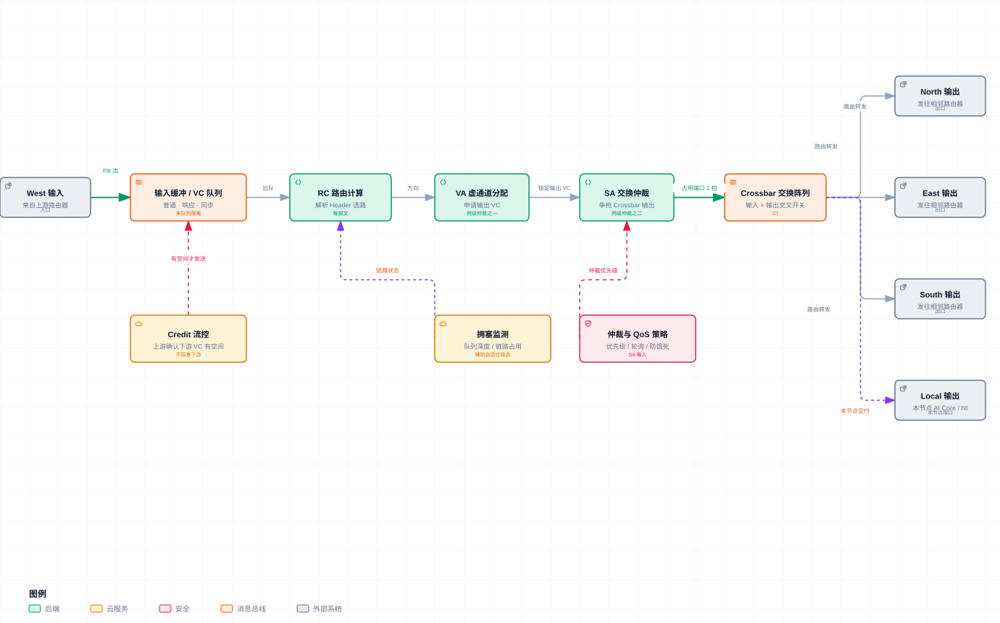

## 一、NoC 是什么

NoC（Network-on-Chip，片上网络）是芯片内部的通信网络。它借鉴了计算机网络的思想：把需要传输的数据切成报文，在片内的路由节点之间逐跳转发，而不是让所有单元争抢同一条总线。

昇腾 NPU 里不只有 AI Core。一颗 SoC 通常还会集成 AI CPU、内存控制器、DVPP、PCIe/RoCE 控制器等模块。AI Core 要读 HBM，AI CPU 要下发任务，视频预处理要把数据交给 AI Core，网络包要进显存，这些流量都需要一条可扩展的片内数据通路。NoC 承担的就是这个角色。

```text
                 ┌───────────────────────────┐
                 │          NoC              │
                 │  片内路由、仲裁、同步、访存   │
                 └───────────────────────────┘
                    │        │       │       │
              ┌─────┘        │       │       └─────┐
        ┌──────────┐  ┌──────────┐  ┌────────┐  ┌────────┐
        │ AI Core  │  │  AI CPU  │  │ 内存控制 │  │ IO/DVPP │
        │ 多核张量计算│  │ 控制与调度 │  │ HBM/DDR │  │ 视频/网络│
        └──────────┘  └──────────┘  └────────┘  └────────┘
```

可以把 SoC 比作一座城市：AI Core 是工厂，HBM 是大仓库，AI CPU 是调度中心，DVPP 和网卡是港口，NoC 是城市里的道路系统和交通调度规则。算子写得再好，如果道路堵了，工厂也会停工。

## 二、为什么 AI 芯片需要 NoC

传统总线适合单元数量较少的场景。随着 AI 芯片集成几十个 AI Core，共享总线会遇到三个问题：

1. **带宽不够**：多个 Core 同时搬运张量时，总带宽会被共享；
2. **延迟不可控**：一个长时间占用总线的数据搬运会阻塞其他单元；
3. **扩展性差**：Core 数量增加后，总线仲裁和布线成本都会快速上升。

NoC 把通信资源分布到片内多个节点上，让不同区域的数据传输可以并行进行。它的收益不是某一条链路变快，而是整体通信吞吐、路径选择和流量隔离能力变强。

## 三、NoC 的关键概念

### 3.1 拓扑与节点

**拓扑（Topology）**描述片内节点的连接形状，常见有 Ring、Mesh、Torus 等。AI 芯片经常使用 Mesh 类拓扑：节点排列成行和列，相邻节点之间有直接链路，数据可以沿网格逐跳移动。

**节点（Node）**是挂在 NoC 上的一个端点，可能是一个 AI Core、一个内存控制器端口，也可能是一个 IO 单元。节点通常有自己的编号或坐标，NoC 根据目标地址决定数据去往哪里。

### 3.2 路由与仲裁

**路由器（Router）**负责接收报文、查目标、选择下一跳。它相当于片内的交通枢纽。

**跳（Hop）**指数据从一个路由节点移动到相邻节点的过程。跳数越多，经过的缓冲和仲裁次数越多，延迟通常越高。

路由器内部并不是一个简单的开关。一个报文穿过路由器时，通常要经过路由计算、虚通道分配、交换仲裁和 Crossbar 传输几个阶段。下图展示了一条从 West 输入进入的报文，如何在路由器内部走完这条流水线，并最终从 North / East / South / Local 四类输出端口之一离开：



图中下半部分还标注了两类外围机制：Credit 流控保证下游缓冲不会溢出；仲裁与 QoS 策略决定多个输入争抢同一个输出端口时谁先通过。

**维序路由（Dimension-Order Routing）**是一类确定性路由方法。以 XY 路由为例，数据先沿 X 方向走到目标列，再沿 Y 方向走到目标行。路径固定，便于分析延迟，也有助于避免循环等待。

**仲裁（Arbitration）**决定多个输入争抢同一个输出端口时谁先通过。常见策略包括轮询、优先级仲裁等。

**确定性路由**与**自适应路由**相对。前者表示同一对源和目标总是走相同路径；后者可以根据链路拥堵情况改道。确定性路由更容易预测，自适应路由更能利用空闲链路，但设计更复杂。

### 3.3 虚通道与流控

**虚通道（Virtual Channel，VC）**把一条物理链路逻辑上分成多个独立队列。例如“远端访存请求”“大块数据返回”“同步消息”可以走不同虚通道，减少相互干扰。

没有虚通道时容易出现**队头阻塞（Head-of-Line Blocking）**：队列头部的报文被堵住，后面本来可以去其他方向的报文也只能一起等待。

**流控（Flow Control）**防止下游缓冲溢出。接收方可以向上游返回 credit 或暂停信号，表示还能接收多少数据。NoC 里的可靠传输不只靠“线路快”，也依赖缓冲和流控的配合。

### 3.4 QoS 与死锁

**QoS（Quality of Service）**给不同流量划分优先级。同步信号、实时控制消息、小规模关键数据通常优先级更高；大块数据搬运如果占满资源，会导致关键路径延迟抖动。

**死锁（Deadlock）**指多个报文互相等待对方释放资源，形成循环等待。NoC 通过路由约束、虚通道分层、报文分类等机制降低死锁风险。

## 四、存储层级与数据通路

昇腾 AI Core 内部有一个典型的分层存储结构：最靠近计算单元的是寄存器和 L0 缓冲，往上是 UB/L1，再往外是 L2 和 HBM。不同层级的容量、带宽和延迟差异很大。

| 层级 | 常见角色 | 特点 |
| --- | --- | --- |
| 寄存器 / L0 | 立即参与计算的数据 | 最快，容量最小 |
| UB / L1 | AI Core 内部工作区 | 高带宽，容纳 tile 数据 |
| L2 | Core 集群或 SoC 级缓存 | 减少重复访问 HBM |
| HBM / DDR | 全局大容量存储 | 容量大，延迟和功耗更高 |

**HBM（High Bandwidth Memory）**通过堆叠 DRAM 和宽接口提供高带宽，是训练芯片的常见主存形态。**DDR**容量大、成本相对低，但带宽低于 HBM。

**Unified Buffer（UB）**是 AI Core 内部的高速工作区。典型算子流程是：从全局内存搬入一块 tile 到 UB，Cube/Vector 单元在 UB 上反复计算，再把结果搬回全局内存。AI 算子优化经常就是围绕“怎么切 tile、什么时候搬、能不能少搬”展开。

**DMA（Direct Memory Access）**让数据搬运不占用计算单元的指令周期。昇腾 AI Core 里的 MTE（Memory Transfer Engine）就是 DMA 类硬件，负责在全局内存、UB、L1 等层级之间搬数据。不同代际芯片的 MTE 编号和分工有差异，但核心思想一致：计算和搬运尽量并行。

**统一地址空间（Unified Address Space）**是理解昇腾数据通路的重要概念。片上可访问的存储被纳入统一的地址视图，访存请求可以携带目标地址交给 NoC 解析。这样 AI Core 不只能访问自己的私有缓冲，也能按地址访问全局内存或其他节点的可共享存储。

## 五、AI Core 与 AI CPU

**AI Core**是昇腾的主要计算单元，内部通常包含：

- **Cube 单元**：负责矩阵乘累加，是 Transformer 里 GEMM 的主力；
- **Vector 单元**：负责逐元素运算，如激活函数、残差加、归一化；
- **Scalar 单元**：负责地址计算、循环控制、条件判断等标量逻辑；
- **MTE / DMA 单元**：负责数据搬入搬出。

一个算子在 AI Core 上执行时，往往是 Scalar 控制循环，MTE 搬数据，Cube 做矩阵乘，Vector 做后处理。NoC 则在更外层把这些 Core 和全局内存、其他 Core 连起来。

**AI CPU**不是跑大算子的主力。它更多承担控制面任务，例如算子调度、动态 Shape 逻辑、部分非张量计算和任务编排。可以把 AI Core 理解为大量并行工人，AI CPU 理解为现场调度员。

## 六、核间通信与同步

多核算子通常需要多个 AI Core 协同。常见模式包括：

1. **数据分片**：每个 Core 处理输出的一部分；
2. **流水线**：不同 Core 分别负责不同阶段；
3. **生产者-消费者**：Core A 写数据，Core B 等数据准备好后读取。

为了让这种协同不靠忙等，NoC 会承载硬件同步原语，例如硬件信号量、事件标志、原子操作等。开发模型里常见的 `SetFlag` / `WaitFlag` 语义，底层就是让硬件感知“某个阶段已经完成”或“某个资源已经可用”。

**硬件信号量（Hardware Semaphore）**可以理解为一个计数器：生产者完成后递增或置位，消费者等待计数器满足条件后继续执行。

**事件 / 标志（Event / Flag）**是更轻量的同步标记，用来表达依赖关系。它减少了两层风险：一是消费者读到半成品数据，二是生产者过早覆盖消费者还没读完的数据。

## 七、片内 NoC 与片间互联的关系

NoC 只负责芯片内部。出了芯片边界，通信交给片间互联和通信库。

| 层级 | 常见技术 | 作用 |
| --- | --- | --- |
| 片内 | NoC | AI Core、AI CPU、HBM、IO 之间的通信 |
| 封装内 / 片间 | HCCS | 多 Die 或近距芯片互联 |
| 卡间 / 机间 | RoCE、PCIe | 集群横向扩展和主机通信 |
| 通信库 | HCCL | 提供 AllReduce、Broadcast 等集合通信接口 |

**HCCS（Huawei Cache Coherent System）**是华为的高速缓存一致性互联，用于连接多 Die 或近距离芯片，可以类比 NVIDIA 的 NVLink。

**PCIe**是服务器主机和 NPU 之间的标准 IO 总线，负责下发任务、传输数据和连接外部网络。

**RoCE（RDMA over Converged Ethernet）**在以太网上实现 RDMA。RDMA 允许一块网卡直接访问远端节点内存，减少 CPU 参与和协议开销，适合大规模分布式训练。

**HCCL（Huawei Collective Communication Library）**是昇腾的集合通信库，对标 NCCL。它把底层 HCCS、RoCE、PCIe 等细节封装起来，向训练框架提供统一的 AllReduce、AllGather、Broadcast、ReduceScatter 等接口。

一次跨芯片的 AllReduce 可以简化为：

```text
AI Core A
  → NoC → 本地 HBM
  → HCCS / RoCE → 远端 NPU
  → 远端 NoC → 远端 AI Core
```

NoC 是这条链路的第一段和最后一段。片间带宽再高，如果片内 AI Core 到 HBM、HBM 到网卡接口的通路堵住，集群通信性能也上不去。

## 八、软件栈中的 NoC

**CANN（Compute Architecture for Neural Networks）**是昇腾的异构计算软件栈，包含运行时、编译器、算子库、图引擎和调试工具。

**Ascend C**是面向昇腾硬件的算子开发语言。开发者用类似 C++ 的方式描述 tile 切分、数据搬运、计算和同步，编译器再生成适合 AI Core 执行的代码。

多数模型开发者不需要直接操作 NoC。CANN 和 Ascend C 会把地址解析、数据搬运、核间同步等细节封装到编程模型里。但在以下场景，NoC 相关知识很有用：

1. **多核算子优化**：判断数据是放在本核 UB，还是跨核共享；
2. **大模型推理优化**：分析 HBM 带宽、核间同步和通信是否成为瓶颈；
3. **集群性能分析**：区分算子慢、片内搬运慢、片间通信慢三种问题；
4. **算子调度**：让计算、DMA 和同步重叠，减少 AI Core 空等。

## 九、术语速查表

| 术语 | 中文/全称 | 简要含义 |
| --- | --- | --- |
| SoC | System on Chip | 片上系统，一颗芯片集成计算、存储和 IO |
| NoC | Network on Chip | 片上网络，负责芯片内部数据传输 |
| Topology | 拓扑 | NoC 节点的连接形状，如 Ring、Mesh |
| Router | 路由器 | 片内转发节点，决定数据下一跳 |
| Hop | 跳 | 报文经过一个路由节点到相邻节点的过程 |
| VC | Virtual Channel | 虚通道，物理链路上的逻辑隔离队列 |
| QoS | Quality of Service | 服务质量，按流量优先级调度 |
| HoL Blocking | Head-of-Line Blocking | 队头阻塞，队首报文堵住后续报文 |
| Flow Control | 流控 | 防止接收端缓冲溢出的机制 |
| HBM | High Bandwidth Memory | 高带宽内存 |
| DDR | Double Data Rate SDRAM | 传统大容量内存 |
| UB | Unified Buffer | AI Core 内部高速工作区 |
| DMA | Direct Memory Access | 直接内存访问，由硬件搬运数据 |
| MTE | Memory Transfer Engine | 昇腾 AI Core 内的数据搬运单元 |
| AI CPU | AI CPU | 负责控制、调度和部分非张量逻辑 |
| HCCS | Huawei Cache Coherent System | 华为高速缓存一致性互联 |
| RoCE | RDMA over Converged Ethernet | 以太网上的远程直接内存访问 |
| HCCL | Huawei Collective Communication Library | 昇腾集合通信库 |
| CANN | Compute Architecture for Neural Networks | 昇腾异构计算软件栈 |
| Ascend C | Ascend C | 昇腾算子开发编程模型 |

## 十、一句话总结

NoC 是昇腾 NPU 的片内交通系统。它连接 AI Core、AI CPU、HBM、IO 和同步设施，决定数据能不能及时到达计算单元。对模型开发者来说，NoC 通常是被框架隐藏的细节；对系统性能优化来说，它是理解昇腾算子执行、显存访问和集群通信的重要基础。
