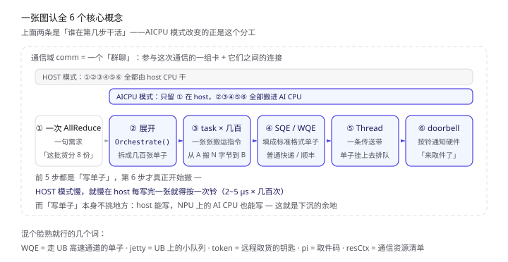
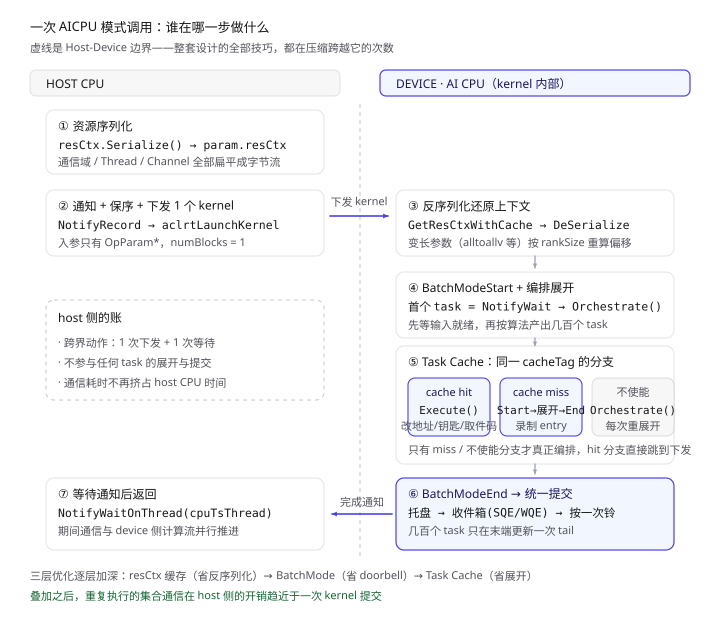
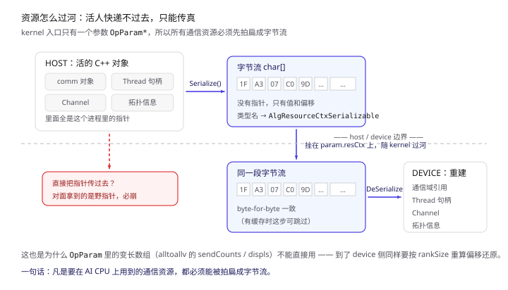
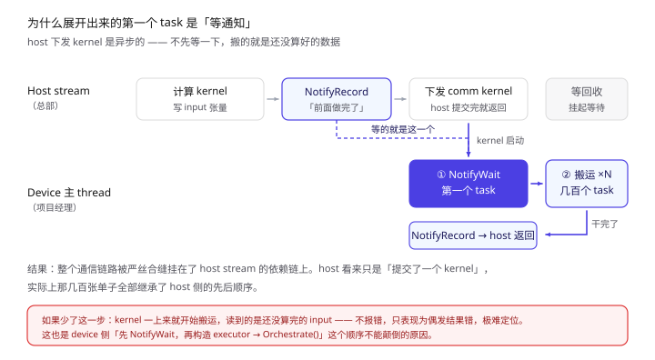
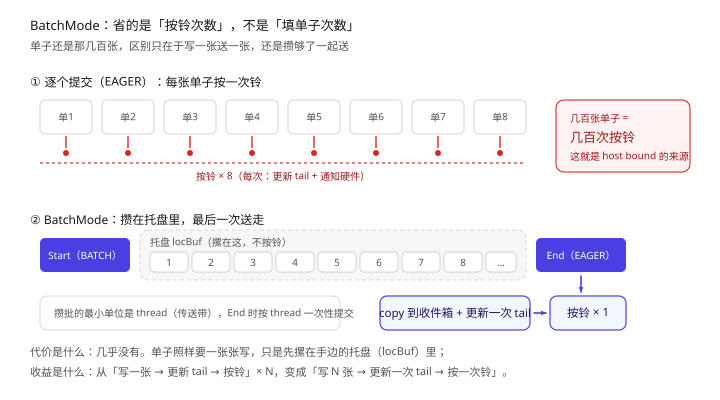
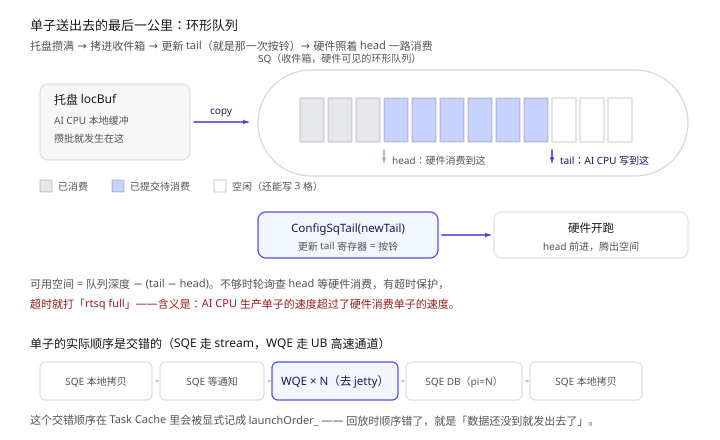
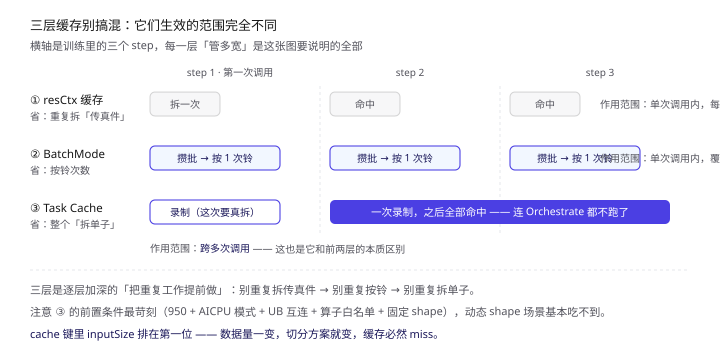
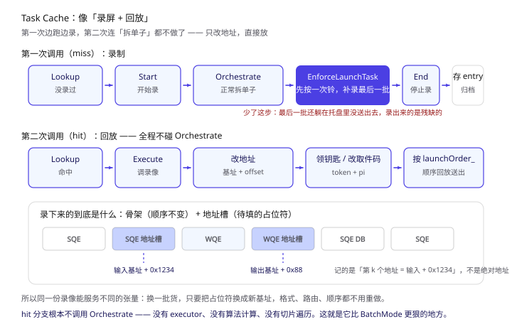

上一篇讲 HCCL 实现原理时，把"通信任务到底在哪展开"压在了最后一节——因为它值得单独拆开。这一篇只回答一个问题：

> **一次 AllReduce，为什么要让 host 写几百条搬运指令？能不能让 NPU 自己写？**

AICPU 模式就是这个问题的答案。先把结论摆这儿，后面再解释每一个词：

- **HOST 模式**：host（服务器上的 CPU）一条一条写指令给 NPU，写几百条；
- **AICPU 模式**：host 只发一句话给 NPU——"你去把这次通信拆开自己干"，然后就等结果。

就这么点区别。但真要做到，得顺带解决四个麻烦：资源怎么送过去、顺序怎么保证、几百次提交怎么压成一次、重复的通信能不能连"拆"都省掉。这篇就按这四个麻烦往下读。

> 本文所有结论均来自 CANN 开源仓库源码，本地路径 `hccl/`、`hcomm/`，关键出处标注为 `文件:行号`。
> **看不懂的代码块可以直接跳过**，每段前后都有大白话总结。

---

## 〇、读之前：先认 6 个词

这篇文章的术语密度确实高。但其实**必须懂的只有 6 个**，剩下的混个脸熟就行，遇到时我会再提一句。

**必须懂（贯穿全文）：**

| 词 | 一句话 | 打个比方 |
| --- | --- | --- |
| **通信域（comm）** | 参与这次通信的一组卡，以及它们之间的连接关系 | 一个"群聊"，群里每个人都要收发消息 |
| **task（任务）** | 一条最底层的搬运指令：从 A 地址搬 N 字节到 B 地址 | 一张"搬运单" |
| **SQE** | task 写出来之后的样子，是硬件能读的二进制格式 | 把搬运单填成**标准格式的表格** |
| **doorbell（门铃）** | 告诉硬件"我新放了几张单子，来取"的那一脚 | 快递柜的**"取件"按钮** |
| **Thread（线程）** | device 上的一条执行流，任务挂在它上面按顺序跑 | 一条**传送带** |
| **展开（Orchestrate）** | 把"一次 AllReduce"翻译成"几百张搬运单"的过程 | 把一句"把这批货分给 8 个人"**拆成 8 张快递单** |

**混个脸熟就行（不影响理解主线）：**

| 词 | 一句话 |
| --- | --- |
| **WQE** | 和 SQE 一样是任务单，只是走另一条高速通道（UB）时用这个格式 |
| **jetty** | UB 通道上的一个小队列，WQE 先放这儿 |
| **UB / UB_CTP / UBOE** | 卡与卡之间的一种高速互连方式，可以理解为"更快的网线" |
| **token** | 远程访问一块内存需要的"钥匙"，地址换了钥匙要重领 |
| **pi** | 硬件的"我已消费到第几张单"的计数，类似取件码 |
| **resCtx** | 通信资源的清单（通信域、线程、连接……），host 要打包发给 device |

> 一句话记住 SQE 和 WQE 的关系：**都是搬运单，只是投递渠道不同**——普通快递 vs 顺丰。

把这六个词按发生顺序串起来，就是一次通信的完整路径：



> 上面两条是最关键的：**HOST 模式六步全在 host 干；AICPU 模式只把"提需求"留在 host，其余五步搬进 AI CPU。** 后面所有内容都是这五步的展开。

---

## 一、先搞清楚在解决什么

### 1.1 一个比喻：总部和仓库

把一次集合通信想象成"把一批货按规则分给 8 个仓库"：

- **host（服务器 CPU）** = 总部；
- **NPU** = 外地仓库，仓库里有一批搬运工（硬件队列）；
- **一次 AllReduce** = 总部要完成的一次分货任务；
- **展开** = 把"分货"这件事拆成几百张具体搬运单。

**HOST 模式**的做法是：总部自己把几百张单子全填好，然后**打几百次电话**，每次电话说一张单子。仓库搬一张，等总部打下一个电话。

问题就在这：一次电话来回要 2~5 微秒。几百张单子 = 几百次电话 = **毫秒级的纯等待**。这时候仓库搬运得再快也没用，瓶颈在总部打电话的速度上。这个状态就叫 **host bound**（被 host 拖住了）。

**AICPU 模式**的做法是：总部派一个**项目经理**去仓库，带一份完整的方案（这次分货要用到哪些人、哪些通道、多少货）。项目经理到了仓库现场，自己把方案拆成几百张单子，一次性全扔进收件箱，按一下取件铃，最后给总部回个电话说"搞定了"。

**总部只打了 2 次电话**（派活 + 收到回执）。这就是全部的优化。

> 这个"项目经理"就是跑在 NPU 的 **AI CPU** 核上的一个小程序（kernel）。AI CPU 是 NPU 上的通用计算核，和做矩阵运算的 AI Core、做向量的 Vector Core 并列——它不擅长算矩阵，但擅长"跑逻辑、做调度"，正好适合干编排这件事。

### 1.2 四种"展开位置"

`HCCL_OP_EXPANSION_MODE` 就是选择"派谁去拆单子"。四个取值对应 HCOMM 里的四种通信引擎：

| 环境变量取值 | 引擎名 | 谁在拆单子 | 特点 |
| --- | --- | --- | --- |
| `HOST` | CPU_TS | 总部（host CPU）自己拆 | 灵活，但被"打电话次数"拖累 |
| `AI_CPU`（→`AICPU_TS`） | AICPU_TS | 派项目经理去仓库拆 | 只打 2 次电话，代价是占用 AI CPU 核 |
| `AIV` | AIV | 让搬运工里最灵巧的那批（Vector 核）边搬边拆 | 最快，但抢了做计算的核 |
| `HOST_TS` | CPU_TS + TS | 总部拆好，交给仓库的调度器分发 | 折中方案 |

命名上有个坑值得记：**环境变量里的 `HOST` 对应 CPU_TS 引擎，`AI_CPU` 对应 AICPU_TS 引擎**，名字对不上。`AI_CPU` 的演进名是 `AICPU_TS`（调度器从 TS 换成 STARS），当前两者功能一致，`AI_CPU` 后续会废弃。

模式判定的代码很直白（`hccl/experimental/ops/reduce_scatter/reduce_scatter_op_experimental.cc`）：

```cpp
if (IsAiCpuMode(param.deviceType, userRankSize)) {
    CHK_RET(LoadAICPUKernel());                        // 把"项目经理"这个程序加载起来
    param.engine = CommEngine::COMM_ENGINE_AICPU_TS;
} else {
    param.engine = CommEngine::COMM_ENGINE_CPU_TS;     // HOST 模式
}
```

### 1.3 代价：AI CPU 核是稀缺资源

派项目经理是要占人的。**Atlas A3 上采用 AI CPU 模式时，单卡并发通信域数量不能超过 6 个**——通信域开太多，AI CPU 核被占满，通信反而堵住。

做 TP / PP / EP 混合并行（通信域开得很多）的场景，这个限制往往比带宽更早成为瓶颈。这是选 AICPU 模式前必须先算的一笔账。

---

## 二、全景：一次 AICPU 调用走完的路径

先把骨架摆出来，后面逐段拆。记住这张图，后面所有细节都是往里填。



> 左侧是 host 侧动作，右侧是 AI CPU 上那个 kernel 内部的动作。中间那道虚线就是 host-device 边界——**整个设计全部的技巧，都在压缩跨越它的次数。**

拆成六个阶段，每个阶段一句大白话：

| # | 阶段 | 谁在做 | 大白话 |
| --- | --- | --- | --- |
| ① | 准备资源 | host | 把这次通信要用的东西打包成一份"方案" |
| ② | 下发 kernel | host | 把方案交给项目经理，让他出发（**第 1 次跨界**） |
| ③ | 还原上下文 | device | 项目经理拆开方案，认出人、通道、货 |
| ④ | 批量展开 | device | 在现场把方案拆成几百张搬运单，先摞在手边 |
| ⑤ | 统一提交 | device | 一次性全塞进收件箱，按一次取件铃 |
| ⑥ | 通知回收 | device→host | 回个电话说搞定了（**第 2 次跨界**） |

**只有 ② 和 ⑥ 跨了界。** 这就是 AICPU 模式相对 HOST 模式的全部优势来源。

对照一下上篇的图，更直观：


> 上：HOST 模式，host 逐个下发几百个 task；下：AICPU 模式，host 只提交 1 个 kernel，展开下沉到 AI CPU。

---

## 三、Host 侧：把整个上下文塞进一个指针

### 3.1 为什么资源必须"可序列化"

这是 AICPU 模式里最容易被忽略、但影响最深的一个约束。



> 左边是 host 内存里那些"活"的 C++ 对象，右边是 device 上照着字节流重建出来的同构对象。中间那条虚线是 host-device 边界——**它只认字节，不认指针。**

项目经理（kernel）是**独立编译的一个程序**，和 host 不共享内存里的 C++ 对象。host 这边活的那些对象——通信域、Thread 句柄、Channel、拓扑信息——到了 device 那边全是无意义的野指针。

而 kernel 的入口参数只有一个：

```cpp
extern "C" unsigned int HcclLaunchAicpuKernel(OpParam* param)
```

**只有这一个参数。** 所以所有资源必须变成一段字节流，跟着 `OpParam` 一起过河。源码里就是 `Serialize` / `DeSerialize`（`hccl/examples/05_custom_ops_allgather/aicpu/op_host/utils.cc:85`）：

```cpp
std::vector<char> seq = resCtxHost.Serialize();   // 活的 C++ 对象 → 字节流
char* ctx = new char[seq.size()];
std::copy(seq.begin(), seq.end(), ctx);
*resCtxSequence = ctx;                            // 交给 OpParam 带过去
```

打个比方：**不能把活人快递过去，只能把他的资料传真过去，对面再照着资料重建一个。** 那个"传真件"就是序列化后的字节流。

对应的类型叫 **`AlgResourceCtxSerializable`**——名字里的 Serializable 不是装饰，是这个约束的直接产物。**凡是要在 AI CPU 上用到的通信资源，都必须能被拍扁成字节流。**

同理，指针类的变长参数也没法直接用。`OpParam` 里 `alltoallv` 的 `sendCounts`、`displs` 这些数组到了 device 侧是野指针，需要按 rankSize 重新算偏移量还原出来（`RestoreVarDataByOpType`，`hccl/src/ops/op_common/algorithm/template/aicpu/kernel_launch.cc:470`）。

### 3.2 下发那一个 kernel

`HcclAicpuKernelEntranceLaunch`（`hccl/src/ops/op_common/op_common.cc:1036`）是 host 侧总入口，主干就五步：

```cpp
param.resCtx = resCtxSequence;                    // ① 把"传真件"塞进 OpParam

// ② host stream 先给 device 主 thread 打个招呼（notify）
HcommThreadNotifyRecordOnThread(cpuTsThread, exportedCpuTsThread, notifyNumOnMainThread - 1);

HcclOrderLaunchToOrderStream(comm, param, unfoldThread, ...);   // ③ 排队，别插队
AicpuKernelLaunch(comm, param, unfoldThread);                   // ④ 真正下发 kernel
HcclOrderLaunchToKernelStream(comm, unfoldThread, ...);

// ⑤ 等设备回的电话
HcclThreadNotifyWaitOnThreadDefault(cpuTsThread, param.aicpuRecordCpuIdx, hostNotifyWaitTime);
```

`AicpuKernelLaunch`（同文件 `:1186`）内部是标准的 kernel 下发四件套：

```cpp
aclrtBinaryGetFunction(binHandle, "HcclLaunchAicpuKernel", &funcHandle);
aclrtKernelArgsInit(funcHandle, &argsHandle);
size_t paramSize = sizeof(OpParam) + param.varMemSize;
aclrtKernelArgsAppend(argsHandle, &param, paramSize, &paraHandle);   // 入参：只有 OpParam*
aclrtLaunchKernel(funcHandle, 1, stream, ...);                       // numBlocks = 1
```

两个细节：

- **入参是整块 `OpParam` 按值拷过去的**（`sizeof(OpParam) + varMemSize`，变长数据跟在结构体后面），不是传一堆散参数。这正是资源必须序列化的原因——不能靠指针引用 host 侧对象。
- **只起 1 个 block**。AI CPU 上不需要像 AI Core 那样铺一堆核：通信编排本质是"一个线程串行拆单子 + 往多条传送带（Thread）上挂单子"。

### 3.3 为什么还要 OrderLaunch

一句话：**防止多个算子乱序。**

host 上可能有多个 stream 在并发下发不同算子。如果不显式保序，就会出现"前一个 kernel 还没跑完，下一个 allreduce 已经提交了"的数据竞争。源码里按 `ORDER_LAUNCH_OPBASE` / `ORDER_LAUNCH_GE` / `ORDER_LAUNCH_ACLGRAPH` 三种模式分别处理，图模式下还要用 `rtEvent` 做跨 stream 同步。

对 AICPU 模式这点格外重要：**host 提交完 kernel 就立刻返回、在 notify 上等着**。如果顺序错了，device 侧按 notify 顺序执行，就会读到还没算好的输入。

---

## 四、Device 侧：项目经理到了现场

现在跨过那道虚线。`HcclLaunchAicpuKernel`（`kernel_launch.cc:640`）就是那个"项目经理"本人。主干精简后：

```cpp
extern "C" unsigned int HcclLaunchAicpuKernel(OpParam* param)
{
    sched_setscheduler(0, SCHED_OTHER, &schedParam);   // ① 设置调度策略
    HcommAcquireComm(param->commName);                 // ② 拿通信域的"引用"
    CommRefGuard commGuard(param->commName);           //    RAII 兜底，异常也保证归还

    HcclOrderLaunchNotifyRecord(param);                // ③ device 侧保序

    if (IsOpsV2(param->algName, param->deviceType)) {  // ④ A5 / opv2_ 走新流程
        u32 statusRet = CheckCommStatus(param, commGuard);
        if (statusRet != 0) return statusRet;

        resCtxPtr = GetResCtxWithCache(param, cachedResCtxHolder, resCtx);   // ⑤ 拆"传真件"（带缓存）
        RestoreVarDataByOpType(param, resCtxPtr);                            //    变长参数还原

        GetMainThreadAndRegDfx(param, resCtxPtr, thread);                    // ⑥ 取主 thread + 开启批量模式
        /* ... ⑦ 展开 / 查缓存 / 提交 ... */

        HcommThreadNotifyRecordOnThread(thread, param->opThread, 0);         // ⑧ 给 host 回电话
        HcommBatchModeEnd(param->algTag);                                    // ⑨ 统一提交
    } else {
        RunLegacyExecutorPath(param, algName);                               // 老流程
    }
    return ReleaseCommAndLogSuccess(param, commGuard);
}
```

### 4.1 它是个"程序"，不是个"算子核"

`① sched_setscheduler` —— 连线程调度策略都要自己设。这侧面说明了 AICPU kernel 的本质：**它不是"一个计算核"，而是一个跑在通用核上的完整用户态程序**，有自己的线程、栈、调度。

`② 通信域引用 + RAII` —— `HcommAcquireComm` / `HcommReleaseComm` 成对出现，用 `CommRefGuard`（`kernel_launch.cc:344`）兜底。原因是：host 可能在 device 还在跑的时候销毁通信域，引用计数保证资源不会中途被拆掉。

### 4.2 那个 301U 报错

`④ CheckCommStatus` 里有个特殊分支：如果通信域正处于 `HCCL_COMM_STATUS_SUSPENDING`（比如正在做 ns recovery 故障恢复），kernel 会**主动释放引用并返回错误码 301U（AICPUSUSPENDING_ERROR）**。

这是 AICPU 模式特有的错误码。排查"训练跑着跑着突然报 301"时，可以直接定位到这里。

### 4.3 拆"传真件"还带一层缓存

`⑤ GetResCtxWithCache`（`:434`）维护了一张 `algTag → 资源上下文` 的表，**避免每次调用都重新拆一遍"传真件"**，并且统计命中率：

```cpp
cachedResCtxHolder = g_cacheManager.Get(param->algTag, param->commName);
if (cachedResCtxHolder != nullptr && IsResCtxCacheReusable(*cachedResCtxHolder, *param)) {
    return cachedResCtxHolder.get();                  // 命中，直接用
}
resCtx = DeserializeResCtx(param);                    // 未命中，重新拆
g_cacheManager.Put(param->algTag, *resCtx, param->commName);
```

有个细节：通信域恢复后如果 `commInfoPtr` 变了，缓存会被判定为"陈旧"并刷新。

> ⚠️ 这是**第一层缓存**（缓存"拆好的资源"）。后面第七节还有一层叫 Task Cache（缓存"拆好的单子"）。**别把两者搞混**，第七节开头有三层缓存的对照表。

### 4.4 最关键的一点：第一个 task 是"等通知"

这是理解整个流程的钥匙。先看时序：



> host 下发 kernel 是异步的：kernel 可能在上一个计算 kernel 还没跑完时就启动了。所以 device 侧第一件事不是搬运，而是**先等 host 那句"前面做完了"**。

`OpOrchestrate`（`:275`）里做的第一件实事是：

```cpp
CHK_RET(HcclThreadNotifyWaitOnThreadDefault(thread, maxNotifyNum, resCtxPtr->waitTimeout));
// 之后才构造 executor -> executor->Orchestrate(...)
```

也就是说：**展开出来的第一张单子不是搬运，而是"等 host 的通知"。**

为什么必须有这一步？因为 host 下发 kernel 是异步的——kernel 可能在上一个计算 kernel 还没跑完的时候就启动了。如果一上来就开始搬运，搬的是还没算好的数据。

所以先插一张"等通知"的单子，接住 host 在 3.2 节步骤② 打的那个招呼，**保证"上一个 kernel 已经算完"之后，通信搬运才真正开始**。

结果是：整个通信链路被严丝合缝地挂在了 host stream 的依赖链上。host 看来只是"提交了一个 kernel"，实际上那几百张单子全部继承了 host 侧的先后顺序。

---

## 五、BatchMode：把几百次按铃压成一次

### 5.1 一个开关，两个马甲

BatchMode（批量模式）的接口只有一对：`HcommBatchModeStart(tag)` / `HcommBatchModeEnd(tag)`。但它们其实是同一个三态开关的两个马甲（`hcomm/src/base_comm/primitives/api_c_adpt/aicpu_ts_primitives_c_adpt.cc:1067`）：

```cpp
int32_t HcommBatchModeStart(const char* t) { return HcommSetLaunchMode(t, HCOMM_LAUNCH_MODE_BATCH); }
int32_t HcommBatchModeEnd  (const char* t) { return HcommSetLaunchMode(t, HCOMM_LAUNCH_MODE_EAGER); }
```

三种状态（`LaunchContext::SetLaunchMode`，`hcomm/src/base_comm/primitives/launch_context.cc:134`）：

| 状态 | 行为 | 比喻 |
| --- | --- | --- |
| **BATCH** | 数据面调用只生成 SQE，**摞在手边的托盘（locBuf）里，不按铃** | 埋头填单子，先不送 |
| **EAGER** | 把摞着的单子按 thread 一次性提交出去，然后清空托盘 | 一摞单子一次性塞进收件箱，**按一次铃** |
| **RESERVED** | 只清空，不提交（用于废弃某个 tag 的缓存） | 把填了一半的单子扔掉 |

官方接口的措辞也很直白：`Start` 和 `End` 之间的所有数据面调用**会被缓存、不会立即执行**，到 `End` 时**统一提交并执行**。

### 5.2 攒在哪、怎么提交

两种做法的差别，看这张图最直观：



> 上面是"写一张送一张"，8 张单子按 8 次铃；下面是"攒在托盘里，最后一次送走"。**单子的数量没变，变的只是按铃次数。**

**攒批的最小单位是 thread（传送带）。** `LaunchContext` 内部维护两个记录结构（`launch_context.h:62`）：

```cpp
std::string launchTag_;
std::unordered_map<std::string, std::unordered_set<ThreadHandle>> launchModeMap_;  // 按 tag 记录 thread
std::vector<ThreadHandle> threadVec_;                                              // 不区分 tag
```

每次数据面操作会调 `AddThread(thread)` 把自己所在的 thread 登记进去，`End` 的时候一次性提交（`launch_context.cc:23`）：

```cpp
CHK_RET(CommTaskLaunch(threadVec.data(), threadVec.size()));   // N 个 thread 上的单子批量提交
```

**所以 BatchMode 的本质是：用"一次提交多少"换"按几次铃"。**

- 优化前：每张单子 → 写单子 → 更新 tail → 按铃（**几百次按铃**）
- 优化后：写 N 张单子 → 更新一次 tail → 按一次铃（**1 次按铃**）

至于 `launchTag_` 为什么存在：源码注释（`:106`）解释了另一层用途——CPU_TS（FFTS+ 子图）场景下，相同 tag 在第二次执行时可以**直接复用整组缓存的 task**，相当于 CPU_TS 版本的"图捕获"。AICPU_TS 场景下它更多是作用域标识。

---

## 六、落到硬件：单子怎么真的送出去

攒完批最终还是要写给硬件。A5 上负责这件事的是 `RtsqA5`（`hcomm/src/legacy/ascend950/unified_platform/resource/stream/aicpu/rtsq_a5.cc`），一个标准的**环形队列**：



> 上：`tail` 是 AI CPU 写到哪，`head` 是硬件消费到哪，两者之间的格子就是"已提交待消费"。下：单子的实际顺序是交错的（SQE 走 stream，WQE 走 UB）。

用文字描述这条路径就是：

```
locBuf（手边的托盘） ──copy──> SQ VA（收件箱，硬件可见） ──ConfigSqTail──> 硬件开跑
     攒批就在这儿                 sqHead_/sqTail_ 环形管理                 这就是"按铃"
```

`LaunchTask`（`:222`）是单次提交的核心路径：

```cpp
MakeSureAvailableSpace();          // ① 收件箱满了？等
bool needCacheTask = false;
PreLaunchSqeForCache(needCacheTask);   // ② 问一句：要不要给缓存留一份
CopySqeBufToSq(locBuf);                // ③ 托盘 → 收件箱（处理环形回绕）

u32 newTail = (sqTail_ + pendingSqeCnt) % sqDepth_;
ConfigSqTail(newTail);             // ④ 更新 tail 寄存器 = 按铃
sqTail_ = newTail;

if (needCacheTask) {
    PostLaunchSqeForCache();       // ⑤ 回调缓存：把这段单子录下来
}
```

这一段解释了好几件事：

**① 收件箱满了是真的会等的。** `MakeSureAvailableSpace`（`:78`）里 `while (availableSpace <= pendingSqeCnt)` 循环查 head，有 `sqFullTimeout_` 超时保护，超时会打 "Rtsq full" 日志并抛异常。

> **"rtsq full" 这个报错的含义就是：AI CPU 生产单子的速度，超过了硬件消费单子的速度。**

**⑤ 是缓存的录制钩子。** 注意它挂在 `LaunchTask` 的尾巴上——**只有真正被送出去的那批单子才会被录下来**。这个细节直接导致了第七节那个看起来很奇怪的 `EnforceLaunchTask`。

### 关于 WQE（了解即可）

A5 上除了走 stream 的 SQE，还有一路走 UB（卡间高速互连）的数据面：这部分不写成 SQE，而是写成 **WQE**（前面说的"顺丰单"），先塞进 jetty 的小队列，再用一个特殊的 **DB SQE** 告诉硬件"jetty 里有新 WQE 了，取件码到 pi 了"。

于是单子的实际序列是**交错**的：

```
SQE(本地拷贝) → SQE(等通知) → WQE×N(去 jetty) → SQE(按铃, pi=N) → SQE(本地拷贝) → ...
```

这个交错顺序在 Task Cache 里会被显式记成 `launchOrder_`。**顺序一旦重放错了，就是"数据还没到就发出去了"这类最难查的 bug。**

---

## 七、Task Cache：连"拆单子"都省掉

这一节是全文最硬的部分。先给一句话和比喻，再进代码。

> **一句话**：训练里每个 step 都在跑同一条 AllReduce——同样的 shape、同样的卡数、同样的算法。那每次都重新拆一遍几百张单子，就是纯浪费。能不能**第一次拆完录下来，后面只改改地址就放出去**？
>
> **比喻：这就是"录屏 + 回放"。** 第一次把整个填单过程录下来，后面不再重填，只把录好的单子上的地址改一改，直接送出去。

### 7.1 先分清三层缓存（很容易混）

走到这一步，源码里其实叠加了三层缓存：

| 层 | 缓存对象 | 跨多大范围 | 省掉了什么 |
| --- | --- | --- | --- |
| ① **resCtx 缓存** | 拆好的资源上下文 | 单次 kernel 调用 | 重复"拆传真件"的 CPU 开销 |
| ② **BatchMode** | 本次展开产生的 SQE | 单次 kernel 调用内 | 按铃次数 / 提交次数 |
| ③ **Task Cache** | 整条 SQE/WQE 序列 | **跨多次 kernel 调用** | **整个"拆单子"的过程** |

画成时间轴更清楚——区别不在"省多少"，而在**管多宽**：



> 前两层都只在单次调用内部生效（每个 step 各来一遍）；只有第三层是**跨调用**的——第一次录完，之后每个 step 都直接吃现成的。

第三层才是本节主角，也是三者里最狠的——它省的不是一个步骤，而是**整个编排过程**。

### 7.2 四个按钮



> 上：第一次调用，边跑边录；下：第二次调用，命中后只改地址直接放。**注意下半部分从头到尾没有 `Orchestrate` 出现。**

HCOMM 暴露了四个 C 接口（`hcomm/src/base_comm/primitives/aicpu/aicpu_task_cache_c_adpt.cc`），对应录屏和播放：

```c
HcommAicpuTsTaskCacheLookup (tag, &isHit);                    // 查：有没有录过
HcommAicpuTsTaskCacheStart  (tag, addrs, sizes, count);       // 开始录
HcommAicpuTsTaskCacheEnd    (tag);                            // 停止录
HcommAicpuTsTaskCacheExecute(tag, addrs, sizes, count);       // 录过：改地址 + 直接放
```

kernel 里的调用顺序（`kernel_launch.cc:711` 起）：

```cpp
if (enableCache) {
    AicpuTaskCacheKey::GetAicpuTaskCacheTag(*param, inputSize, cacheTag);
    HcommAicpuTsTaskCacheLookup(cacheTag.c_str(), &isCacheHit);

    if (!isCacheHit) {                                   // 没录过 → 边跑边录
        HcommAicpuTsTaskCacheStart(cacheTag.c_str(), addrs, sizes, ADDRS_COUNT);
        OpOrchestrate(param, resCtxPtr, thread, algName);  // 正常展开
        EnforceLaunchTask(param->algTag);                  // ⚠️ 见 7.3
        HcommAicpuTsTaskCacheEnd(cacheTag.c_str());
        AicpuTaskCacheCommManager::Instance().AddCommTagMap(param->hcclComm, cacheTag);
    } else {                                             // 录过 → 直接放
        HcommAicpuTsTaskCacheExecute(cacheTag.c_str(), addrs, sizes, ADDRS_COUNT);
    }
} else {
    OpOrchestrate(param, resCtxPtr, thread, algName);     // 不使能：老老实实展开
}
```

**关键看 hit 分支：它根本不调用 `OpOrchestrate`。** 没有 executor、没有算法计算、没有切片遍历，只有"改地址 + 送出去"。这就是它比 BatchMode 更狠的地方——BatchMode 省的是按铃次数，Task Cache 省的是**整个拆单子的 CPU 时间**。

### 7.3 那个看起来多余的 EnforceLaunchTask

miss 分支里夹了一句很奇怪的代码（`kernel_launch.cc:262`）：

```cpp
inline HcclResult EnforceLaunchTask(const char* algTag)
{
    HcommBatchModeEnd(algTag);      // 先按一次铃，把攒的都送出去
    HcommBatchModeStart(algTag);    // 再回到批量模式
}
```

为什么？回到第六节那个 `⑤ PostLaunchSqeForCache`——**录制钩子挂在"真正送出去"的那一刻**。

如果拆完单子直接调 `CacheEnd`（停止录制），那么**最后一批还躺在托盘（locBuf）里、还没送出去的单子就永远进不了录像**——录出来的是残缺的，回放时就漏了最后一段。

所以必须先用一次 `BatchModeEnd` 把它们**在录制状态下**推一把（此时录制开关还开着，会回调 `AddSqeArray` 录下来），再 `BatchModeStart` 回去继续。

### 7.4 录的到底是什么：骨架 + 地址槽

这是整个机制里最优雅的地方。

问题很直接：第一次拆单子时，单子上的地址是**当次调用**的输入/输出张量地址。下一次调用换了张量，地址就变了。那录下来的东西怎么用？

答案是：**录的不是"能直接跑的成品"，而是"编排骨架 + 待填的地址槽"。**

录制完成时，`SubmitCacheEntry`（`aicpu_task_cache_entry.cc:259`）会遍历每张单子，判断它的地址字段是否落在"记录时的动态内存区间"里：

```cpp
// UpdateAddrRefreshInfo_，entry.cc:812
if (InRange(baseAddr, memSize, addr)) {      // addr 在 [输入 或 输出) 区间内？
    addrRefreshInfo.needRefresh = true;
    addrRefreshInfo.memIdx = memIdx;         // 属于哪段内存（0=输入, 1=输出）
    addrRefreshInfo.offset = addr - baseAddr; // 相对偏移
}
```

一句话：**记的是"第 k 个地址 = 输入地址 + 0x1234"，而不是记绝对地址。**

回放时（`RefreshAndLaunch`，`:432`）反过来重建：

```cpp
const uint64_t newAddr = baseAddrs[addrRefreshInfo.memIdx] + addrRefreshInfo.offset;
```

不同类型的单子要改的字段不同，源码逐个 switch（`RefreshOneSqe_` / `RefreshWqe*`）：SDMA 的 `srcAddrLow/High`、`dstAddrLow/High`，write-value 的 `writeAddr`，WQE 的 `dataAddr` 与 `rmtAddr`。而 `notify wait/record`、DB 这类没有地址字段的，直接跳过。

> **打个比方**：录下来的是一份带占位符的快递单模板——"收件人：{本次输入组}的第 3 格"。下次换了一批货，只要把占位符换成新地址就行，整张单子的格式、路由、顺序都不用重做。

**光改地址还不够，还得重领钥匙（token）。**（这段可以先跳过）

RDMA 语境下访问远端内存需要"钥匙"，地址换了钥匙就得重算：

```cpp
// RefreshTokenInfos_，entry.cc:473
if (tokenInfo.needLocTokenIdFlag) {
    ubTransportLitePtr->BuildLocRmaBufferLite(baseAddr, memSize, locRmaBuf);
    tokenInfo.locTokenId = locRmaBuf.GetTokenId();
}
if (tokenInfo.needRmtTokenIdAndValueFlag) {
    Hccl::RmtRmaBufSliceLite s = ubTransportLitePtr->GetRmtRmaBufSliceLite({baseAddr, memSize});
    tokenInfo.rmtTokenId = s.GetTokenId();
    tokenInfo.rmtTokenValue = s.GetTokenValue();
}
```

这些 flag 是提交阶段根据"哪些 WQE 真的用了这段地址"**反向标出来的**（`UpdateTokenFlagsByAddrRefreshInfo_`），避免每条 WQE 每次都无条件重算钥匙——又一处抠性能的地方。

### 7.5 回放时还有两处容易漏

**一是顺序（`launchOrder_`）。** 第六节说过 SQE 和 WQE 是交错产生的。`AicpuTaskCacheEntry` 用一个数组记录每一段的类型（`:189`、`:241`）：

```cpp
launchOrder_.emplace_back(TaskArrayType::kTaskArrayTypeSqe);   // 或 kTaskArrayTypeWqe
```

回放时严格按这个序列走（`LaunchTasksByOrder_`，`:556`）：SQE 段就"改地址 → 送出"，WQE 段就"改地址 → 送出 → 更新取件码"。**顺序错了，就是"数据还没到就发出去了"——这类 bug 不报错，只表现为偶发结果错，极难查。**

**二是取件码（pi）。**（这段可以先跳过）

WQE 送出去后，硬件侧的消费计数会前进，DB SQE 里记录的 `piValue1` 每次都不一样，必须刷新（`RefreshDbSqe_`，`:1230`）：

```cpp
const uint16_t pi = ubConnLitePtr->GetPiAndIncrementSeq(seq);
dbSqePtr->piValue1 = pi;
rtsqA5Ptr->RecordDbSendSlot(ubTransportLiteImplPtr, dbSqeLocation.dbSqeIdx, seq, pi);
```

那个 `RecordDbSendSlot` 是为了让完成跟踪器（ciTracker）能继续追踪——**缓存不能绕过完成跟踪机制**，否则 profiling 和异常检测都会失真。

### 7.6 容量、溢出与生命周期

- **容量有上限**。`AicpuTaskCache::AddEntry`（`aicpu_task_cache.cc:81`）在 `cacheBytes_ >= maxCacheBytes_` 时**静默不缓存**（返回成功但 entry 为空），打一条 RUN_INFO 日志告知 cache full。注意这不是错误，只是**退化**——功能正常，只是没有加速。
- **放不下要重试**。jetty 队列深度有限，命中时先体检：`CheckWqeOverflow_`（`entry.cc:543`）对每个 `UbConnLite` 调 `CheckOverflow(wqeCount)`，不够就返回 `HCCL_E_AGAIN`，上层看到要重试。**所以调用方不能假设 `HcommAicpuTsTaskCacheExecute` 一定成功。**
- **生命周期跟着通信域**。第一次缓存时登记 `AddCommTagMap(hcclComm, cacheTag)`，通信域销毁时通过 `HcclLaunchAicpuCacheEvictKernel`（`kernel_launch.cc:1145`）清理对应 entry。
- **相同 tag 必须串行**。源码注释（`c_adpt.cc:37`）说得很明确：相同 tag 的算子不能被多个 AI CPU thread 同时展开，否则后来的 thread 可能命中前一个 thread 插入的**不完整**缓存——因为写入是"先占位、后回填"的。

### 7.7 什么条件下才生效：相当严格

`AicpuTaskCachePolicy::IsAicpuTaskCacheEnable`（`hccl/src/ops/op_common/algorithm/template/aicpu/task_cache/aicpu_task_cache_policy.cc:18`）逐条过滤：

| 维度 | 要求 |
| --- | --- |
| 硬件 | 仅 Ascend 950（`DEV_TYPE_950`），且 CANN ≥ 9.1.0 |
| 模式 | 仅 AICPU 模式，Device 侧调用 |
| 互连 | 仅 UB_CTP / UBOE（不支持 UB_RTP、跨超节点 RDMA、PCIe P2P） |
| 算子白名单 | Broadcast / AllGather / AlltoAll / Scatter / AllReduce / Reduce / ReduceScatter |
| 数据类型 | AllReduce/Reduce/ReduceScatter 遇 INT64/UINT64/FP64 或 PROD 不走缓存（reduce 要在 AI CPU 上做） |
| 排除场景 | MC2、图模式（OFFLOAD）、aclgraph、零拷贝、对称内存、inplace |

inplace 的判定写得挺细（`:85`）：用输入/输出地址区间是否重叠来判，并给 Broadcast 开了特例（Broadcast 天然 input==output，属于合法的 outplace）。

### 7.8 缓存键里藏着什么：动态 shape 必然不命中

缓存键由九个字段拼成，用 `-` 分隔（`aicpu_task_cache_key.cc:42`）：

```
inputSize - opType - dataType - reduceType - isZeroCopy - opMode
          - supportSymmetricMemory - rootRank - commId
```

**`inputSize` 在键里，而且排在第一位**（源码注释：方便解析）。这意味着：**数据量一变，切分方案就变，缓存必然 miss。**

这正是官方文档建议"通信数据量频繁变化的服务场景关闭缓存（对应 `AICPU_CacheDisable`）"的原因——此时缓存只占内存却不命中，白白承担维护开销。

反过来也给出一个调优直觉：

> **动态 shape 的推理服务大概率吃不到这个优化；固定 shape 的训练迭代才是它的主战场。**

---

## 八、怎么选 & 踩过的坑

### 8.1 选型建议

| 场景 | 建议 |
| --- | --- |
| 大数据量、高带宽需求 | `AI_CPU`（AICPU_TS），不占 AI Core |
| 小数据、极致低延迟（推理） | `AIV`，但要接受占用 Vector 核 |
| Atlas A2 训练 | 默认 `HOST` 即可，A2 上 AIV 仅支持推理特性 |
| 固定 shape、重复执行的集合通信（950） | `AI_CPU` + 保持 Task Cache 开启 |

回过头看 `AICPU_TS`、`CPU_TS`、`AIV`、`CCU` 四种引擎，本质是在回答同一个问题：**"拆单子"这件事，放在哪个计算单元上做最划算？**

放 host，灵活但被交互次数拖累；下沉 AI CPU，省交互但占核；交给 Vector Core，延迟最低但抢计算核；硬化成专用单元（CCU），效率最高但最不灵活。

### 8.2 从源码和文档里挖出来的坑

1. **AI CPU 核是有限资源**。A3 上单卡并发通信域 ≤ 6 个，TP/PP/EP 混合并行时要数着通信域开。
2. **AI CPU 模式下不支持 profiling 采集**（Atlas 300I Duo 明确列出），排查问题可能要临时切回 `HOST`。
3. **`HCCL_DETERMINISTIC=true` 会让 `HCCL_OP_EXPANSION_MODE` 失效**，以确定性计算为准。
4. **设置了产品不支持的取值会静默回退默认值**，不报错。调完一定要确认真的生效。
5. **`AI_CPU` 配置项后续废弃**，由 `AICPU_TS` 取代，当前两者功能一致。
6. **错误码 301U = AICPUSUSPENDING_ERROR**，来自 device 侧 `CheckCommStatus` 的通信域挂起分支。
7. **"rtsq full" 的含义是生产快于消费**——AI CPU 拆单子的速度超过了硬件消费单子的速度。
8. **命中后报错先怀疑 `HCCL_E_AGAIN`**（jetty 队列溢出），它是设计内的重试信号，不是故障。
9. **Task Cache 对地址、钥匙（token）、取件码（pi）三处刷新缺一不可**。任何一处漏刷都表现为"偶发数据错乱"而不是"报错"，排查成本极高。

---

## 九、小结：记住这五句

1. **它解决的是 host bound**：把"写几百条指令"从 host 搬进 device，host 与 device 之间从几百次往返降到 2 次（派活 + 回执）；
2. **代价是资源约束**：AI CPU 核是稀缺的（A3 上并发通信域 ≤ 6），且所有通信资源必须能"拍扁成字节流"才能过河（这就是 `AlgResourceCtxSerializable`）；
3. **BatchMode 压的是"按铃次数"**：拆单子期间先摞在托盘（locBuf）里，`托盘 → 收件箱 → 更新 tail` 这条路径到最后只走一次；
4. **Task Cache 压的是"拆单子本身"**：同样的缓存键第二次直接"改地址 → 领钥匙 → 改取件码 → 按顺序回放"，连 `Orchestrate` 都不跑；
5. **录的是骨架不是成品**：`AddrRefreshInfo{memIdx, offset}` 这个"相对槽位"设计，是同一份录像能服务不同地址的根本原因。

最后留一个视角：那三层优化（resCtx 缓存 → BatchMode → Task Cache）是**逐层加深的"把重复工作提前做"**——从"别重复拆传真件"到"别重复按铃"再到"别重复拆单子"。它们叠加起来，才把一个本来是毫秒级 host 开销的通信算子，压到 device 侧几乎无感。

下一篇可以顺着这条线往下看 AIV 模式：同样是"下沉到 device"，Vector Core 上的通信算子写得完全是另一个思路——因为它要跟 AI Core 抢核，**能拆出多少张单子就不再是无所谓的事了**。

如果想先看看上面这些机制在一个真实算子里的样子，可以读实战篇 [《跟着 07_alltoallv 走一遍：AlltoAllV 在 AICPU 上到底怎么跑》](/2026/09/23/HCCL-AlltoAllV-AICPU/)。选 AlltoAllV 是因为它的四个参数全是运行时才定长的数组，正好把"序列化过河"这套机制吃满。
