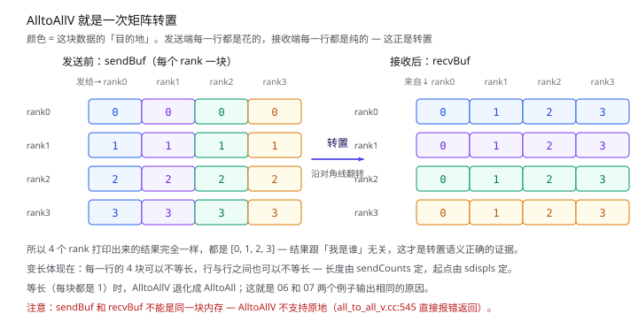
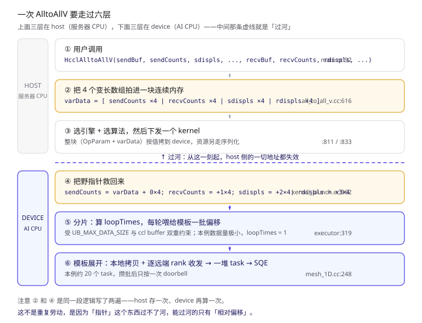
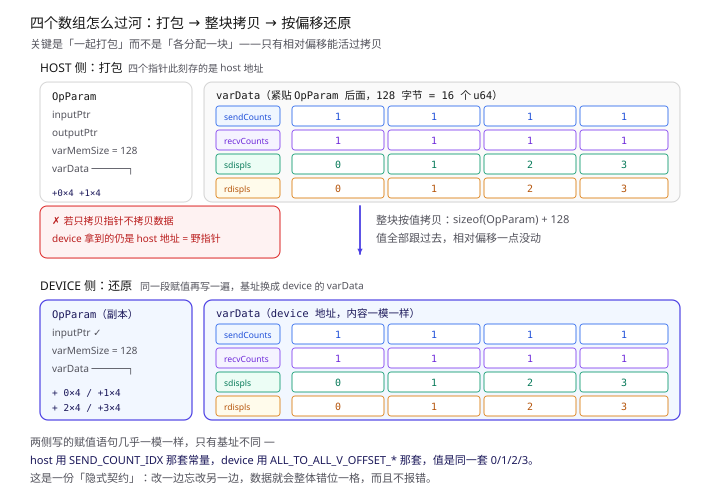
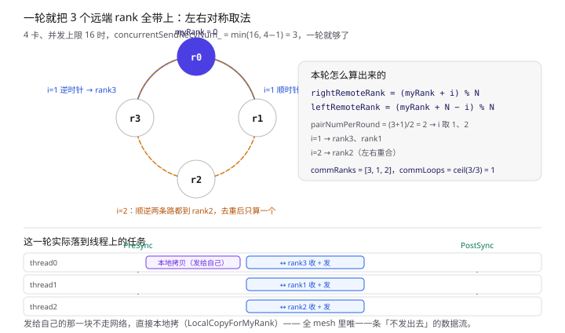
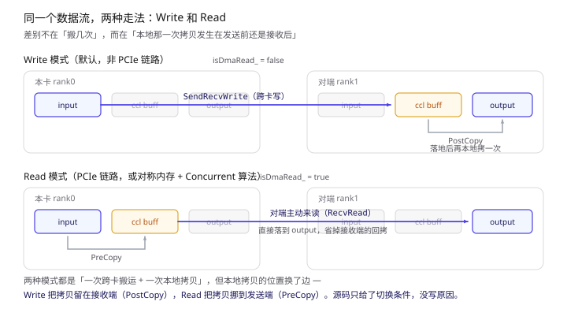

上一篇把 AICPU 模式的机制讲完了，但全是"一般来说"。这篇换一种读法：**挑一个具体算子，从示例代码一路读到硬件队列**，看那些机制在一个真实调用里长什么样。

挑的是 AlltoAllV。理由有三个：它是 MoE 里最关键的通信算子；它是**唯一一个参数长度运行时才确定**的集合通信算子，因此能吃满 AICPU 那套"序列化过河"机制；而且仓库里正好有现成的例子 `examples/02_collectives/07_alltoallv`。

> 本文默认你已经看过 [《HCCL 的 AICPU 模式》](/2026/09/23/HCCL-AICPU-mode/) 的术语速查——通信域、task、SQE、doorbell、Thread、展开，这六个词这里直接用，不再解释。
> 所有结论来自 CANN 开源仓库源码，本地 `hccl/`，出处标为 `文件:行号`。**看不懂的代码块可以直接跳过。**

---

## 〇、先看这个例子在干什么

`main.cc` 干的事用一句话说完：**4 张卡，每张卡给其他每张卡发 1 个 float。**

```cpp
std::vector<uint64_t> sendCounts(rankSize, 1);   // main.cc:83  发给每个 rank 1 个元素
std::vector<uint64_t> recvCounts(rankSize, 1);   // :84
for (size_t i = 0; i < rankSize; ++i) {
    sdispls[i] = i;                               // :88  [0,1,2,3]
    rdispls[i] = i;                               // :89
}
HcclAlltoAllV(sendBuf, sendCounts.data(), sdispls.data(), HCCL_DATA_TYPE_FP32,
              recvBuf, recvCounts.data(), rdispls.data(), HCCL_DATA_TYPE_FP32,
              hcclComm, stream);                  // :92
```

**大白话**：`sendCounts[j]` 说"我要给 rank j 发多少"，`sdispls[j]` 说"这块数据在我 sendBuf 的第几个元素开始"。所以 sendBuf 被切成 4 段，第 j 段发给 rank j。

输入数据填的是自己的 rankId（`tmpHostBuff[i] = device`，`:67`），所以 rank i 的 sendBuf 四个格子全是 `i`。走完 AlltoAllV 之后：



**这张图要看的**：颜色是这块数据的目的地。发送端每一行花的（一块数据去四个不同地方），接收端每一行纯的（四块数据来自四个不同地方）——**沿对角线翻了一下**，这就是"AlltoAll = 转置"。

因为结果跟"我是谁"无关，4 个 rank 打印出来必然都是 `[0, 1, 2, 3]`。**看到四行输出完全一致，就知道转置语义对了**，这是个很巧的验证设计。

顺便，这就是为什么 `06_alltoall` 和 `07_alltoallv` 两个例子输出一模一样——**每块长度都相等时，AlltoAllV 退化成 AlltoAll**。差别只在"长度是编译期常量还是运行时数组"。

---

## 一、六层链路：一句调用到一条 SQE

从 `HcclAlltoAllV` 这一行，到硬件队列里的一堆 SQE，中间隔着六层。先把地图摆出来，后面每一节对应一层：



**这张图要看的**：上面三层在 host CPU，下面三层在 AI CPU，中间那条虚线是分界。**② 和 ④ 是同一段逻辑写了两遍**——这就是本文最想讲清楚的一件事，下一节展开。

---

## 二、host 侧：把四个数组拍进一块连续内存

这是整条链路里最巧妙的一步，也是 AlltoAllV 区别于其他算子的地方。

**大白话**：AlltoAllV 的四个参数（`sendCounts`/`recvCounts`/`sdispls`/`rdispls`）都是**指针**，指向用户随便在哪分配的数组。问题是——指针过不了河。所以要先把四个数组的内容**抄进一块紧贴 `OpParam` 的连续内存**里，再把整块内存按值拷过去。

内存大小这么算（`all_to_all_v.cc:811`）：

```cpp
u64 vectorNum = needPeerRdisplsSlot ? ALL_TO_ALL_VC_VECTOR_NUM : ALL_TO_ALL_V_VECTOR_NUM;  // = 4
u64 varMemSize = vectorNum * rankSize * sizeof(u64);   // 4 × 4 × 8 = 128 字节
void* paramMem = malloc(sizeof(OpParam) + varMemSize); // varData 紧贴 OpParam
```

然后 `ConstructVarData`（`:616`）按行优先把四个数组依次写进去：

```cpp
u64* data = reinterpret_cast<u64*>(param.varData);
for (u64 i = 0; i < ALL_TO_ALL_V_VECTOR_NUM * userRankSize; i++) {
    u64 val = i / rankSize;          // 第几个数组
    switch (val) {
        case SEND_COUNT_IDX:  data[i] = sendCountsData[i % rankSize]; break;
        case RECV_COUNT_IDX:  data[i] = recvCountsData[i % rankSize]; break;
        case SEND_DISPL_IDX:  data[i] = sdisplsData[i % rankSize];    break;
        case RECV_DISPL_IDX:  data[i] = rdisplsData[i % rankSize];    break;
    }
}
```

写完再让结构体里的四个指针分别指向各段（`:686`）：

```cpp
param.all2AllVDataDes.sendCounts = data;
param.all2AllVDataDes.recvCounts = data + RECV_COUNT_IDX * rankSize;
param.all2AllVDataDes.sdispls    = data + SEND_DISPL_IDX * rankSize;
param.all2AllVDataDes.rdispls    = data + RECV_DISPL_IDX * rankSize;
```

**此刻这四个指针存的是 host 地址。** 下一章它们就会变成野指针。

还有个第五段：`AlltoAllVC`（带 peer 信息的变体）时会多出 `peerRdispls`（`:691`），`PEER_RECV_DISPL_IDX = 4`。所以 `varMemSize` 的取值范围是 4 段到 5 段——记住这个范围，device 侧校验要用。

---

## 三、选引擎、选算法、下发

**大白话**：host 决定"这次用哪种通信引擎"和"用哪个算法"，然后一次性把 `OpParam + varData` 整块拷到 device，顺手把通信资源（通信域、线程、连接）序列化成字节流一起发过去。

AlltoAllV 的 AICPU 算法三选一（`alltoallv_auto_selector.cc:102`）：

| 拓扑 | 算法名 | 模板 |
| --- | --- | --- |
| MESH_1D / CLOS / PCIE 混插 | `AicpuAllToAllVSoleMesh` | `InsTempAlltoAllVMesh1D` |
| MESH_1D_CLOS 且 rankSize ≤ 4 | `AicpuAllToAllVSoleMeshConcurrent` | 同模板，executor 换 Concurrent 版 |
| MESH_1D_CLOS 其他 | `AicpuAllToAllVSoleMeshMultiJetty` | `InsTempUBXAllToAllVMesh1D` |

算法名到 executor + 模板的映射靠宏注册（`ins_v2_all_to_all_v_sole_executor.cc:579`），运行时按名字查表。

> **更正与补充**：上面这张表是**硬规则选择器**（`ExecuteSelector`）里的分支树，只在 level0 拓扑不是纯 `MESH_1D` 时才生效。而 4 卡单机大多就是 `MESH_1D`，会走另一套**代价模型打分**的选择器（`op_common.cc:184` 一行决定分流）。两套并存，输出的算法名字是同一批。完整机制见 [《HCCL 怎么选算法》](/2026/09/24/HCCL-算法选择/)。

下发之后，host 的任务就结束了。接下来全部发生在 AI CPU 上。

---

## 四、device 侧：把野指针救回来

**大白话**：kernel 拿到的是 `OpParam` 的一份**拷贝**，里面的四个指针还是 host 的地址值——直接解引用就是访问 host 内存，必崩。所以要按**同样的相对偏移**重新算一遍。

`kernel_launch.cc:962`，进门先校验大小对不对：

```cpp
u64 rankSize = resCtx.topoInfo.userRankSize;
u64 minVectorNum = ALL_TO_ALL_V_VECTOR_NUM;                        // 4
u64 maxVectorNum = (param.opType == HCCL_CMD_ALLTOALLVC)
                 ? ALL_TO_ALL_VC_VECTOR_NUM : ALL_TO_ALL_V_VECTOR_NUM;   // 4 或 5
CHK_PRT_RET(param.varMemSize < minVectorNum * rankSize * sizeof(u64)
         || param.varMemSize > maxVectorNum * rankSize * sizeof(u64), ...);
constexpr u32 ALL_TO_ALL_V_OFFSET_SCOUNTS     = 0;
constexpr u32 ALL_TO_ALL_V_OFFSET_RECV_COUNTS = 1;
constexpr u32 ALL_TO_ALL_V_OFFSET_SDISPLS     = 2;
constexpr u32 ALL_TO_ALL_V_OFFSET_RDISPLS     = 3;
u64* data = reinterpret_cast<u64*>(param.varData);
param.all2AllVDataDes.sendCounts = data;
param.all2AllVDataDes.recvCounts = data + ALL_TO_ALL_V_OFFSET_RECV_COUNTS * rankSize;
param.all2AllVDataDes.sdispls    = data + ALL_TO_ALL_V_OFFSET_SDISPLS * rankSize;
param.all2AllVDataDes.rdispls    = data + ALL_TO_ALL_V_OFFSET_RDISPLS * rankSize;
```

**和 host 侧的代码几乎一模一样，只是基址从 host 的 `varData` 换成了 device 的 `varData`。**



**这张图要看的**：上下的格子内容完全一样，变的是左边那四个指针指向哪里——host 侧指向 host 地址，device 侧指向 `varData + 偏移`。**能过河的只有相对偏移，不是指针本身。**

有个细节值得停下来看一眼：host 侧用的常量叫 `SEND_COUNT_IDX`，device 侧叫 `ALL_TO_ALL_V_OFFSET_SCOUNTS`，**两套名字、同一套值 0/1/2/3**，分别在 `all_to_all_v.h:53` 和 `kernel_launch.cc:977`。这是一份隐式契约——改一边忘改另一边，数据会整体错位一格，而且不会报错，只是结果全错。

---

## 五、executor：分片，决定 loop 几轮

**大白话**：一次要搬的数据可能比卡上的中转缓冲区还大，所以要切成几轮。每轮喂给模板一组"这一轮搬多少、从哪开始"。

`OrchestrateLoop`（`ins_v2_all_to_all_v_sole_executor.cc:201`）先把四个数组从还原好的指针里读回本地 vector（`:262`），然后算分片上限（`:281`）：

```cpp
maxTmpMemSize_ = tempAlgParams.buffInfo.hcclBuff.size;
u64 transportBoundDataSize = UB_MAX_DATA_SIZE;
u64 scratchBoundDataSize = maxTmpMemSize_ / templateScratchMultiplier
                         / HCCL_MIN_SLICE_ALIGN * HCCL_MIN_SLICE_ALIGN;
maxDataSizePerLoop = std::min(transportBoundDataSize, scratchBoundDataSize);  // 双重约束
u64 maxDataCountPerLoop = maxDataSizePerLoop / dataTypeSize_;
```

两个约束：单次的传输上限 `UB_MAX_DATA_SIZE`，以及 ccl 中转缓冲区按并发数摊薄之后的大小。取小的那个。

然后数一下最大那一份有多大（`:296`）：

```cpp
for (u64 i = 0; i < rankSize_; i++) {
    maxSendOrRecvDataCount = std::max(maxSendOrRecvDataCount, sendCounts[i]);
    maxSendOrRecvDataCount = std::max(maxSendOrRecvDataCount, recvCounts[i]);
}
u64 loopTimes = maxSendOrRecvDataCount / maxDataCountPerLoop
              + (maxSendOrRecvDataCount % maxDataCountPerLoop != 0);
```

**本例 maxSendOrRecvDataCount = 1（就一个 float），所以 loopTimes = 1，只有一轮。** 想看到多轮，得把数据量放大到超过 ccl buffer 或 UB 上限。

每轮开始时，四个数组要按"本轮已经处理了多少"重算一遍（`:363`）：

```cpp
if (sendCounts[i] > processedDataCount) {
    tempAlgParams.sendCounts[i] = std::min(currDataCount, sendCounts[i] - processedDataCount);
    tempAlgParams.sdispls[i]    = sdispls[i] + processedDataCount;
} else {
    tempAlgParams.sendCounts[i] = 0;      // 这个 rank 的数据上一轮就发完了
    tempAlgParams.sdispls[i]    = sdispls[i] + sendCounts[i];
}
```

**注意这个"减"的动作**：第二轮开始，传进模板的 `sdispls` 已经是"原始位移 + 已处理量"了，而 `sendCounts` 是"还剩多少"。变长算子的麻烦在这里体现得最明显——每轮都得重算一遍，等长的 AlltoAll 就没这事。

---

## 六、模板：把一轮展开成一堆 task

终于到了真正"拆单子"的地方。`InsTempAlltoAllVMesh1D::RunALLtoALL`（`ins_temp_all_to_all_v_mesh_1D.cc:248`）。

### 6.1 一轮能带几个 rank

并发上限 16（`:21`），实际取 `min(16, rankSize-1)`（`:138`）。4 卡时就是 3，**一轮能把 3 个远端 rank 全带上**，`commLoops = ceil(3/3) = 1`（`:162`）。

本轮带哪几个，用**左右对称**的取法（`:142`）：

```cpp
u32 pairNumPerRound = (concurrentSendRecvNum_ + 1) / 2;      // (3+1)/2 = 2
for (u32 i = roundIdx * pairNumPerRound + 1; i < (... + pairSize + 1); i++) {
    u32 leftRemoteRank  = (myRank_ + templateRankSize_ - i) % templateRankSize_;
    u32 rightRemoteRank = (myRank_ + i) % templateRankSize_;
    if (leftRemoteRank == rightRemoteRank) { commRanks.push_back(left); break; }  // 去重
    commRanks.push_back(leftRemoteRank);
    commRanks.push_back(rightRemoteRank);
}
```

4 卡、myRank=0 时：`i=1` 取到 rank3 和 rank1，`i=2` 时左右都算出 rank2，去重只留一个。结果 `commRanks = [3, 1, 2]`。

**为什么要左右对称取？** 因为全 mesh 里每对卡都要通信，如果大家都从 rank0 开始顺序取，所有的卡会同时涌向 rank0。错开取法让每一轮里各卡的"第一目标"分散开，避免热点。



**这张图要看的**：上半的环形——`i=1` 同时向左右各取一个（rank1 和 rank3），`i=2` 时顺逆两条路都指向 rank2，去重只算一次。下半是这些任务落到线程上的样子，**发给自己的那块走本地拷贝，不走网络**。

### 6.2 发给自己的那块

`LocalCopyForMyRank`（`:229`）—— 全 mesh 里唯一一条不经过网络的数据流：

```cpp
DataSlice srcSlice(inputPtr,  sdispls[myAlgRank] * dataTypeSize_, sendCounts[myAlgRank] * ...);
DataSlice dstSlice(outputPtr, rdispls[myAlgRank] * dataTypeSize_, recvCounts[myAlgRank] * ...);
if (sendCounts[myAlgRank] > 0) LocalCopy(thread, srcSlice, dstSlice);
```

只在第一轮做，挂在 0 号线程上（`:284`）。

### 6.3 写模式 vs 读模式

每个远端 rank 的数据先按 channel 分片（`CalcDataSplitByPortGroupCommon`，`:322`），然后有两种走法：

```cpp
bool isPcieProtocol = IsPcieProtocol(channels);
const bool useSymmetricAlltoAllRead = enableRemoteMemAccess_ && opType_ == HCCL_CMD_ALLTOALL
                                   && std::string(param.algName) == "AicpuAllToAllSoleMeshConcurrent";
isDmaRead_ = isPcieProtocol || useSymmetricAlltoAllRead;    // :209
```



**这张图要看的**：两种模式都是"一次跨卡搬运 + 一次本地拷贝"，但**本地拷贝换了个边**——Write 模式把它留在接收端（`PostCopy`），Read 模式挪到发送端（`PreCopy`），于是接收端直接落地不用再拷。

源码只给了切换条件（PCIe 链路，或对称内存 + Concurrent 算法），没写为什么。从条件反推：PCIe 上跨卡直接写的代价太高，所以改成"我把货摆好，你自己来取"。

### 6.4 前后各一次全量同步

```cpp
if (threadNum_ > 1) {
    PreSyncInterThreads(threads[0], subThreads, notifyIdxMainToSub_);   // :262
}
for (roundIdx ...) { ... LocalCopyForMyRank ... RunSendRecvByLoop ... }
if (threadNum_ > 1) {
    PostSyncInterThreads(threads[0], subThreads, notifyIdxSubToMain_);  // :297
}
```

**注意这两次同步在所有轮次的外面**——不管 loop 几轮，线程同步只做两次。本地拷贝和收发都挂在线程 0 到线程 N 上，得先对齐再开工，收工后再对齐一次。

---

## 七、算一算：这次调用到底产出多少 task

按本例 4 卡、每块 1 个 float、非 PCIe（`isDmaRead_ = false`）粗算：

| 来源 | 数量 |
| --- | --- |
| 进门挂到 host stream 的 NotifyWait | 1 |
| 前同步（主线程 → 3 个子线程）+ 后同步 | 6 |
| 发给自己的本地拷贝 | 1 |
| 3 个远端 rank ×（发 + 收） | 6 |
| 每个 rank 的回拷 PostCopy | 3 |
| 收尾通知 host 的 NotifyRecord | 1 |
| **合计** | **约 18~20** |

**这个数字的意义**：HOST 模式下，host 每下发一个 task 要 2~5 μs，20 个就是 40~100 μs，纯提交开销。AICPU 模式下这 20 个 task 在 device 上展开、写进本地缓冲、攒批，**末端只按一次 doorbell**——提交开销压成接近一条。

数据量越小，这个差距越致命。本例搬的是 16 个 float（64 字节），**传输本身几乎不耗时，全是提交开销**。这就是为什么 AICPU 模式对小数据量、高频次的通信收益最大。

---

## 八、几个容易踩的坑

**1. AlltoAllV 不支持原地。** `CheckAlltoAllVInputPara`（`all_to_all_v.cc:545`）明确拒绝 `sendBuf == recvBuf`。想原地得自己先拷一份。

**2. `sendCounts` 的单位是"元素个数"，不是字节。** 和 `HcclAlltoAll` 的 `sendCount`（发给每个 rank 多少个元素）是同一个习惯，但和 AllReduce / Broadcast 的 `count`（总元素数）**正好相反**。缓冲区实际大小是 `sendCounts` 求和，不是 `max(sendCounts)`。

**3. 变长参数的第五段容易忘。** 走 AlltoAllVC 时多了 `peerRdispls` 一段，`varMemSize` 变成 5 × rankSize × 8。device 侧的校验（`:968`）正是按 [4 段, 5 段] 这个区间卡的大小不匹配会直接报错返回，不会静默出错——这点还算友好。

**4. 例子里没设 `HCCL_OP_EXPANSION_MODE`。** 想在这个例子上验证 AICPU 路径，得自己配环境变量显式指定展开模式，否则走的是默认模式。

**5. 例子没调 `aclrtResetDevice`。** 每个线程 `SetDevice` 之后不 Reset，进程退出前资源不干净。跑完记得手动补上。

---

## 九、一条线索串起来

回到开头那个问题：AlltoAllV 特殊在哪？

**特殊在它的参数是"活的"**——不是几个整数，而是四个长度未知、内容运行时才定的数组。这逼出了一个设计：

1. host 把四个数组**抄进紧贴 `OpParam` 的连续内存**（不能各分配一块，否则相对偏移无从谈起）；
2. 整块**按值**拷过河；
3. device 用**同一套偏移**把指针重算一遍。

这三步连起来，本质上是**用"相对偏移"代替"指针"作为跨地址空间的寻址方式**。上篇讲的 `AlgResourceCtxSerializable`（通信资源序列化）是同一个思路在更大对象上的应用——不只是四个数组，整个通信域、线程、连接，全都得变成"可序列化的字节流"才能过河。

而等长算子（AlltoAll、AllReduce）没有这个问题：它们的参数是编译期就确定的标量，直接按值传就行。所以：**AlltoAllV 是把 AICPU 那套机制吃满的那个算子**，看懂它，上篇的机制就都有了着落。

---

> 相关阅读：
> [《HCCL 的 AICPU 模式：通信任务到底在哪展开》](/2026/09/23/HCCL-AICPU-mode/) —— 本文的机制基础
> [《HCCL 实现原理》](/2026/09/21/HCCL-实现原理/) —— 从算法选择到执行的全景
