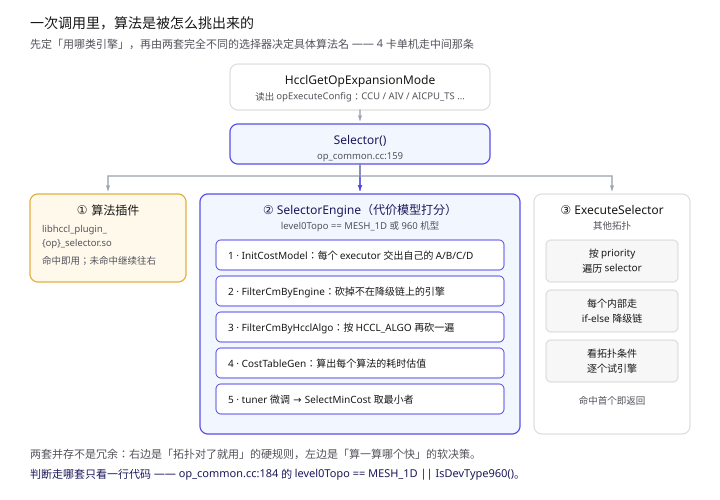
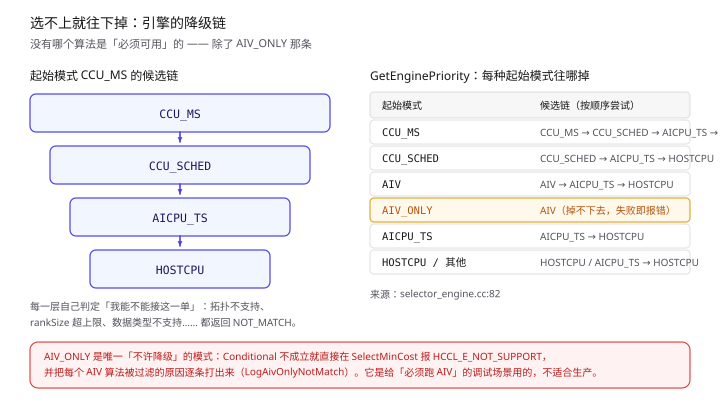
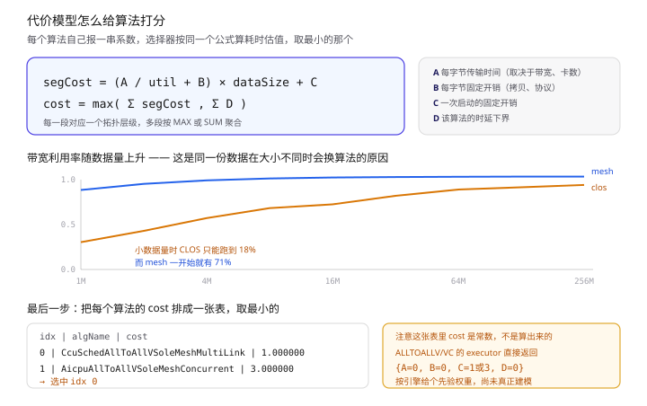

上一篇讲 AlltoAllV 时，第三节只留了一张"三选一"的表，然后一句带过：**AlltoAllV 在 AICPU 下有 SoleMesh / Concurrent / MultiJetty 三种算法，按拓扑挑一个**。

这其实跳过了一整个子系统。HCCL 选算法不是查一张表，而是**四步串起来的一条决策流水线**——而且里面同时存在两套思路完全不同的选择器。这篇把它拆开。

> 所有结论来自 CANN 开源仓库源码，本地路径 `hccl/`，出处标为 `文件:行号`。代码可以跳过，每段前后都有总结。
> 配套：[《HCCL 的 AICPU 模式》](/2026/09/23/HCCL-AICPU-mode/) · [《跟着 07_alltoallv 走一遍》](/2026/09/23/HCCL-AlltoAllV-AICPU/)

---

## 〇、先看全局：四步

一次 `HcclAlltoAllV` 进去，到 `algName` 出来，中间是这四步：

1. **定展开模式** —— 这次用哪类引擎（CCU / AIV / AICPU_TS / HOSTCPU），由环境变量或通信域配置决定；
2. **选哪套选择器** —— 一行代码按拓扑分流：新版代价模型打分，还是老版硬规则匹配；
3. **过滤 + 打分** —— 把所有算法按"我能不能用"过滤一遍，剩下的按耗时估值排队；
4. **降级** —— 首选的用不了就顺着候选链往下掉，尽量别失败。



**这张图要看的**：中间那个 `Selector()` 有三个出口。插件劫持优先（不在本文范围内）；**真正决定走向的是第 2 层那个分叉**——左边按耗时打分，右边按拓扑硬规则匹配。这两套并存不是历史遗留，第四节末会说为什么现在删不掉任何一套。

---

## 一、第一步：展开模式从哪来

**大白话**：用户通过环境变量说"我想用 AICPU / AIV / CCU"，HCCL 把它翻译成内部的 `OpExecuteConfig`，后面所有步骤都围着这个值转。

入口在 `op_common.cc:3482`，两步：先决定模式，再把它应用到 `param` 上。

### 1.1 两个来源

```cpp
// DecideHcclOpExpansionMode, op_common.cc:3527
if (hcommFunction.dlHcclConfigGetInfo) {                       // 通信域级配置
    hcommFunction.dlHcclConfigGetInfo(comm, HCCL_CONFIG_TYPE_OP_EXPANSION_MODE, ...);
    finalMode = configOpExpansionMode;
    useConfigOpExpansionMode = true;
} else {
    finalMode = static_cast<HcclOpExpansionMode>(opExpansionModeCcuMs);   // 兜底
}
```

有 `HcclConfigGetInfo` 就用它（A5 等新形态走这条路），否则读环境变量。**注意注释里那句"A5 仅通过 HcclConfigGetInfo 获取展开模式"**（`:3543`）——新硬件正在收紧这条入口。

### 1.2 环境变量本身的优先级

如果走的还是环境变量那条路（`:3546` 的条件 `!shouldGoOutPlace(deviceType) || !useConfigOpExpansionMode`），五个开关按这个顺序判定，**先命中者胜**：

```cpp
if (GetExternalInputHcclAicpuUnfold())       finalMode = AI_CPU;      // :3547
else if (GetExternalInputHcclAivOnlyMode())  finalMode = AIV_ONLY;    // :3549
else if (GetExternalInputHcclAivMode())      finalMode = AIV;         // :3551
else if (GetExternalInputHcclCcuMSMode())    finalMode = CCU_MS;      // :3553
else if (GetExternalInputHcclCcuSchedMode()) finalMode = CCU_SCHED;   // :3555
```

**两者冲突时环境变量赢**（`:3558`），只留一条 DEBUG 日志。这是个容易踩的坑：你在通信域配置里设了 A5 的模式，结果被一个残留的 `HCCL_AIV_MODE` 悄悄覆盖，而且日志级别还看不到。

### 1.3 翻译成内部配置

`ApplyOpExpansionMode`（`:3590`）是张直白的映射表：

| 模式 | opExecuteConfig | engine | 附加动作 |
| --- | --- | --- | --- |
| `AI_CPU` | `AICPU_TS` | `COMM_ENGINE_AICPU_TS` | `LoadAICPUKernel()` |
| `AIV` | `AIV` | `COMM_ENGINE_AIV` | `RegisterKernel()` |
| `AIV_ONLY` | `AIV_ONLY` | `COMM_ENGINE_AIV` | `RegisterKernel()` |
| `CCU_MS` | `CCU_MS` | `COMM_ENGINE_CCU` | — |
| `CCU_SCHED` | `CCU_SCHED` | `COMM_ENGINE_CCU` | — |
| **其他 / 非法值** | `AICPU_TS` | `COMM_ENGINE_AICPU_TS` | `LoadAICPUKernel()` |

**三条值得记的**：

- `CCU_MS` 和 `CCU_SCHED` 落到同一个 `engine`，区别只在它往下掉的方式；
- **`AIV` 和 `AIV_ONLY` 也共用 engine**，差别是 `AIV_ONLY` 不许降级（见第三节）；
- **填了不支持的值会静默回退到 AICPU_TS**，只打一条 WARNING。这是上篇里那个坑的来源。

`OpExecuteConfig` 的完整取值在 `alg_param.h:133`，一共 9 个；日志里打印的那个整数就是它的序号。

---

## 二、第二步：走哪套选择器

这一步只有一行代码，但它决定了后面完全不同的行为。`Selector()`（`op_common.cc:159`）：

```cpp
CHK_RET(HcclCalcTopoInfo(comm, param, topoInfo));                       // :174 先算拓扑
if (topoInfo->topLevelUboe && param.commOpExpansionMode != AIV_ONLY) {  // :175
    param.opExecuteConfig = OpExecuteConfig::AICPU_TS;                  // 顶层走 UBOE 时强制 AICPU
}
HCCL_ALGO_PLUGIN_SELECTOR_FAST_PATH(comm, param, topoInfo.get(), algName);  // :180 插件优先

if ((topoInfo->level0Topo == Level0Shape::MESH_1D) || AutoSelectorBase::IsDevType960()) {  // :184
    CHK_RET(SelectorEngine::Global()->Run(comm, param, topoInfo.get(), algName));          // 代价模型
} else {
    CHK_RET(std::make_shared<ExecuteSelector>()->Run(param, topoInfo.get(), algName));     // 硬规则
}
```

**大白话**：4 卡单机这种 level0 是 MESH_1D 的拓扑，以及 960 机型，走**代价模型打分**；其他拓扑走**一堆 if-else 硬规则**。

`Level0Shape` 一共三个取值（`alg_param.h:157`）：`CLOS`、`MESH_1D`、`MESH_1D_CLOS`。**上一篇那张"三选一"表讲的其实是 `ExecuteSelector` 那一支**——也就是非纯 mesh 的场景。而你手跑 4 卡示例时大概率走的是另一支。

还有个例外要先知道：`SelectDPUAlgo` 那条路在 `Select()` 最前面单独处理（`auto_selector_base.cc:24`），Host-DPU-Only 场景直接设 `COMM_ENGINE_CPU` 返回，后面的流程一概不参与。

---

## 三、降级：没有哪个算法是非用不可的

**大白话**：首选的算法用不了是常态——拓扑不支持、卡数超上限、数据类型不认。这时候不是报错，而是顺着一条预定好的候选链往下试。



### 3.1 候选链怎么定

`GetEnginePriority`（`selector_engine.cc:82`）是这张表的唯一出处。给一个起始模式，返回一串候选：

| 起始模式 | 候选链 |
| --- | --- |
| `CCU_MS` | CCU_MS → CCU_SCHED → AICPU_TS → HOSTCPU |
| `CCU_SCHED` | CCU_SCHED → AICPU_TS → HOSTCPU |
| `AIV` | AIV → AICPU_TS → HOSTCPU |
| **`AIV_ONLY`** | **AIV**（链长只有 1） |
| `AICPU_TS` | AICPU_TS → HOSTCPU |
| `HOSTCPU` / 其他 | HOSTCPU / AICPU_TS → HOSTCPU |

**`AIV_ONLY` 是唯一不降级的。**它在 `ProcessAivConfig` 里的待遇也不同（`auto_selector_base.cc:391`）：选不上直接返回失败，还要把每个 AIV 算法被过滤的**具体原因**逐条打出来（`LogAivOnlyNotMatch`，`selector_engine.cc:119`）。这是给"我就是要跑 AIV"的调试场景准备的，生产环境别开。

### 3.2 硬规则那一支怎么降级

实现很朴素（`auto_selector_base.cc:17`）——**靠改同一个变量继续往下走**：

```cpp
if (opParam.opExecuteConfig == OpExecuteConfig::CCU_MS) {
    ret = SelectCcuMsAlgo(...);
    if (ret == NOT_MATCH) { opParam.opExecuteConfig = OpExecuteConfig::CCU_SCHED; }  // :32 改变量
    else { return ret; }
}
if (opParam.opExecuteConfig == OpExecuteConfig::CCU_SCHED) { ... }                   // :37 接着试
if (ProcessAivConfig(...)) { return ret; }                                           // :45
if (IsStarsState(opParam.opExecuteConfig)) {                                         // :48
    ret = SelectAicpuAlgo(...);                                                      // :59
    if (ret == MATCH) { opParam.opExecuteConfig = OpExecuteConfig::AICPU_TS; }
}
```

四个 `if` 顺序执行，状态机式地往下掉。`IsStarsState`（`:104`）判断的是 `AICPU_TS` / `HOSTCPU_TS` / `CCU_FAIL` 这三个"已经掉到底"的状态。

**这里还藏着一次反向跳转**（`:50`）：本来要选 AICPU 了，如果 `IsRollBackAiv` 成立，会**先拐去选 AIV**。

```cpp
bool isPcieMeshScene = topoInfo->level0PcieMix && topoInfo->level0BigClosRange
                    && (isAllToAllOps || isInt64ReduceOps);   // :80
```

原因是 Mesh 类算法受 ATU 资源限制——**遇到 PCIe 混插 + AllToAll 家族，宁可跑去 AIV 也不走 Mesh**。这条规则对 AlltoAllV 是直接生效的，别忘记。

### 3.3 多个 selector 之间也有优先级

`ExecuteSelector::Run`（`execute_selector.cc:19`）外层还有一层：**同一个 opType 可以注册多个 selector**，按 priority 从小到大逐个试（`:43`）：

```cpp
selectors = SelectorRegistry::Global()->GetSelectorsByOpType(opParam.opType);
for (auto iter : selectors) {
    if (iter.second->Select(opParam, topoInfo, selectAlgName) == MATCH) { return HCCL_SUCCESS; }
}
```

AlltoAllV 注册时用的 priority 是 18（`alltoallv_auto_selector.cc:211`）。另外 `execute_selector.cc:25` 有个 `isMc2` 特判：MC2 场景下**只找 priority 18 的那个**，找不到就报错，不走遍历。

---

## 四、代价模型：怎么给算法打分

这是最有意思的部分，也是第二代选择器的核心。**思路是：别写规则了，让每个算法自己报告自己的性能模型，然后统一算估值。**

### 4.1 系数由算法自己提供

`InitCostModel`（`cost_model.cc:362`）遍历所有已注册算法，逐个问它要系数：

```cpp
for (int i = 0; i < algNum; ++i) {
    if (!IsAlgoMatchTopo(algName, topoInfo, needSoftCheck)) { continue; }   // :397 拓扑先过一遍
    auto exec = CollAlgExecRegistryV2::Instance().GetAlgExec(alg.opType, alg.algName);
    if (exec == nullptr) { continue; }                                      // :403 没注册 executor 就跳过

    auto params = exec->CalcCostCoeff(comm, topoInfo, alg.algName, param);  // :409
    if (params.empty()) { continue; }                                       // :411 交不出系数 = 不参与竞选
    AlgNetMetaRegistry::Global()->Register(alg.algName, exec->GetAlgNetMeta(...));  // :424
}
if (costModel.count == 0) { ... } else { ApplyTopoPriority(costModel, topoInfo); }   // :439
```

**三条筛选，任一不过就出局**：拓扑不匹配、没注册 executor、**交不出 A/B/C/D 系数**。第三条是这套思路能成立的前提——**算法必须自己给出性能模型才有资格参选**。

每个 `CostModelParam` 就是四个浮点数：`{A, B, C, D}`。

### 4.2 打分公式



`CostTableManager::CalcAlgCost`（`cost_table.cc:276`）逐段累加，每段对应一个拓扑层级：

```cpp
u64  perTransferSize = dataSize * dr;                    // :308 这一段实际搬运多少
QueryUbUtil(nt, perTransferSize, engine, util, ...);     // :313 查表得带宽利用率
float abCost  = (params[idx].A / util + params[idx].B) * dataSize;   // :317
float segCost = abCost + params[idx].C;                  // :318
groupCost = (intraGroupMode == MAX) ? max(groupCost, segCost) : groupCost + segCost;  // :319
...
cost = std::max(cost, totalD);                           // :325 最后由 D 兜底下界
```

**大白话**：这就是教科书里的 α-β 模型（`T = 启动 + 数据量/带宽`），多了一个"带宽打不满"的修正：

- **A** —— 每字节的传输时间，由带宽、端口数、卡数算出。mesh 上是 `n / crossChipBw`，CLOS 上是 `n×(rankSize-1) / (portNum × bw)`（`cost_model.cc:452`）；
- **B** —— 每字节的固定处理开销（拷贝、协议封装）；
- **C** —— 一次启动的固定成本。**小数据量时它才是决定项**；
- **D** —— 该算法的时延下界，兜底用。

### 4.3 那个"打不满"的系数

`util` 不是算出来的，是**实测打的表**（`cost_table.cc:362-382`）：

| 数据量 | 1M | 4M | 16M | 64M | 256M |
| --- | --- | --- | --- | --- | --- |
| mesh | 0.71 | 0.81 | 0.84 | 0.85 | 0.85 |
| CLOS | 0.19 | 0.43 | 0.57 | 0.72 | 0.76 |

**这张表是整个模型里最有信息量的东西**：小数据量时 CLOS 连两成带宽都用不到，而 mesh 一上来就有七成。所以同一个跨机算法在小数据量下会被这个分母放大好几倍 penalty——**选择结果随数据量翻转，主要就是它在起作用。**

选哪张表也有讲究（`QueryUbUtil`，`:386`）：AIV 引擎走 CLOS 时单独一张；jetty 数受限的 mesh 族算法（MESH / MESH_MULTILINK / ONESHOT / TWOSHOT）用 `closOneJettyOnePort` 那张更悲观的表。

### 4.4 取最小，平局怎么办

`SelectMinCost`（`selector_engine.cc:371`）遍历打分表取最小值，**顺带把整张表打进日志**（所以你知道去哪查）。平局处理很直白（`:428`）：

```cpp
if (tiedAlgos.size() > 1) {
    HCCL_WARNING("multiple algos with same cost=%f: [%s], selecting %s.", minCost, ...);
}
algName = ct.costs[minIdx].algName;
param.opExecuteConfig = GetEngineByAlgName(algName);   // :442 从算法名前缀反推引擎
```

**平局取表里第一个，并打 WARNING。**最后一行也值得注意：**算法名前缀就是它的身份证**——`GetEngineByAlgName` 靠前缀把 `CcuSched...` / `Aicpu...` / `Aiv...` / `Dpu...` 反解成引擎（`alg_parse.cc:888`）。所以 HCCL 里没有"算法名 → 引擎"的注册表，全靠命名约定。

### 4.5 一个诚实的观察：AlltoAllV 目前没真的建模

这条值得单独说。看 `ins_v2_all_to_all_concurrent_executor.cc:62`：

```cpp
if (param.opType == HCCL_CMD_ALLTOALLV || param.opType == HCCL_CMD_ALLTOALLVC) {
    if (attrs->engine == CCU_MS || attrs->engine == CCU_SCHED) {
        return {{0.0f, 0.0f, 1.0f, 0.0f}};      // C = 1.0
    } else if (attrs->engine == AICPU || attrs->engine == AICPU_TS) {
        return {{0.0f, 0.0f, 3.0f, 0.0f}};      // C = 3.0
    }
}
```

**A、B、D 全是 0，只有 C 有值。**代进 4.2 的公式：`cost = max(0 + 0 + C, 0) = C`。

意思是：**AlltoAllV/VC 当前没有真正的性能模型，只有一个"CCU 比 AICPU 便宜三倍"的先验常数。**数据量再大也不影响结果——因为含 `dataSize` 的那几项系数全是 0。这不是孤立写法，`reduce` 的 sequence executor（`ins_v2_reduce_sequence_executor.cc:38`）同样返回 `{0,0,1,0}`。

两个后果：

1. **所有同一引擎系的算法 cost 并列**，触发上面那条平局 WARNING，**实际选中的是表里顺序的第一个**；
2. 真正决定胜负的是"哪些算法有资格进表"——**拓扑过滤和 executor 是否实现了 `CalcCostCoeff` 才是要盯的地方**。

还有个现象值得留意：`ins_v2_all_to_all_v_sole_executor.h:46` 声明了 `CalcCostCoeff` 和 `GetAlgNetMeta` 两个 override，但在当前仓库快照里找不到对应实现。按 `cost_model.cc:411` 的逻辑，交不出系数的算法会被跳过。**这也解释了为什么老的那套 if-else 至今活着**——不是所有人都已经搬进新世界。

---

## 五、那些 if 判断到底在看什么

硬规则那一支的代码满屏 `topoInfo->xxx`。这些字段各自什么意思、为什么会卡住一个算法：

| 字段 | 含义 | 常见卡点 |
| --- | --- | --- |
| `level0Topo` | 最底层互联形状：`CLOS` / `MESH_1D` / `MESH_1D_CLOS` | 三选一的分岔点 |
| `level0MeshType` | mesh 是否跨两个 die：`SINGLE_DIE` / `TWO_DIE_REGULAR` / `TWO_DIE_NOT_REGULAR` | `TWO_DIE_NOT_REGULAR` 会被 CCU 直接拒（`alltoallv_auto_selector.cc:66`） |
| `level0PcieMix` | 是否存在 PCIe 链路（卡之间没能全直连） | PCIe 混插时 CCU 降级，并触发 AllToAll 回退 AIV |
| `level2UbRtp` | UB 上层走了 RTP | CCU 和 AIV 都不支持，双双重置（`:28` / `:159`） |
| `topoLevelNums` | 拓扑层数 | `>= 3` 层时 CCU、AIV 都不接（`:33` / `:166`） |
| `topLevelUboe` | 顶层走 UBOE | 直接强制 `AICPU_TS`（`op_common.cc:175`） |
| `userRankSize` | 参与通信的卡数 | 各家上限不同：AIV 看 `MAX_RANK_SIZE_V`，CCU 上限 64（`:21`、`:49`） |
| `serverNum` | 服务器数量 | `IsRollBackAiv` 里判 P2P 场景要用 |

数据类型也能卡：**CCU 明确拒 int8**（`alltoallv_auto_selector.cc:45`）。

同一个事实会被不同层级重复利用——`level0PcieMix` 在选择层把 CCU 拒掉，在模板层又把 Write 模式改成 Read 模式（上篇第六节讲过）。**选算法和跑算法用的是同一批拓扑事实。**

---

## 六、你能拧的几个旋钮

按插手深度从浅到深：

| 旋钮 | 作用层级 | 说明 |
| --- | --- | --- |
| `HCCL_OP_EXPANSION_MODE` | 决定起始模式 | AI_CPU / AIV / AIV_ONLY / CCU_MS / CCU_SCHED。非法值静默回退 AICPU_TS |
| 通信域级 `HcclConfigGetInfo` | 同上，优先级更高 | A5 上这是唯一入口；但**被环境变量覆盖时只有 DEBUG 日志** |
| `HCCL_ALGO` | 过滤候选 | `FilterCmByHcclAlgo`（`selector_engine.cc:219`）直接从 costModel 里砍 |
| Tuner 插件 | 改 cost | `HcclTunerCallGetCollInfo`（`:243`）可以直接改写打分表 |
| 算法插件 .so | 完全劫持 | `TryHandlePluginSelector`（`op_common.cc:95`），命中即返回，后面流程根本不走 |
| `HCCL_DETERMINISTIC` | 覆盖全局 | 上篇提过：设了它，展开模式就失效，一切以确定性计算为准 |

**一个容易忽略的联动**：配了 `HCCL_ALGO` 或加载了 tuner，`needSoftPolicyCheck` 会变成 false（`cost_model.cc:396`）——那些"软性"的算法偏好策略会整体让位。你以为只是加了个建议，实际上是把一整层策略关掉了。

另外，过滤之后如果表空了，`SelectMinCost` 报 `HCCL_E_NOT_SUPPORT`（`:377`）。**这不是降级失败，是过滤太狠了**——排查方向应该是谁把候选砍光了，而不是算法本身。

---

## 七、回到 07_alltoallv：这次走的是哪条路

把前面的串起来，套到那个 4 卡单机例子上：

1. **模式**：例子没设环境变量 → `DecideHcclOpExpansionMode` 拿到兜底值（`:3540`），落到某个具体的 `OpExecuteConfig`；
2. **分流**：level0 是 `MESH_1D` → **`SelectorEngine`（代价模型）那一支**；
3. **候选链**：按 `GetEnginePriority` 展开一串引擎；
4. **过滤**：砍掉不在链上的算法，`FilterCmByHcclAlgo` 再按 `HCCL_ALGO` 砍一遍；
5. **打分**：AlltoAllV 的 executor 交出的是常数 C（CCU 1.0 / AICPU 3.0）；
6. **结果**：cost 最小的胜出；**平局则取表里第一个并打 WARNING**；
7. **反推引擎**：从算法名前缀确认最终的 `opExecuteConfig`。

**上一篇那张"SoleMesh / Concurrent / MultiJetty 三选一"的表，严格说是 `MESH_1D_CLOS` 场景下的分支树**（`alltoallv_auto_selector.cc:121-136`）。4 卡纯 mesh 不走那套 if-else——但有意思的是，**两条路最终指向的算法名字是同一批**：`AicpuAllToAllVSoleMesh` / `...MeshConcurrent` / `...MeshMultiJetty`。两套选择器输出同一个算法池，只是到达方式不同。

想验证自己这次到底选了什么，`LogSelectedAlgo`（`selector_engine.cc:311`）那条日志就是给你看的：

```
op[ALLTOALLV] algName[...] engine[...] executor[...] templates[...]
opMode[..] dataSize[..] dataType[..] userRank[..] rankSize[..] serverNum[..]
topoLevelNums[..] level0Topo[..] level0MeshType[..] level0PcieMix[..]
```

**一行把整条决策链的输入输出都摊开了**，配上 `CalcAlgCost` 的逐段日志（各段 A/B/C/D 和 util）和 `SelectMinCost` 的打分表，基本可以完整复盘一次选择。

---

## 八、一句话总结

HCCL 选算法这件事的组织方式，其实挺反直觉的：**它没有一张中央决策表，而是让每个算法自己带着性能模型来竞选，再用统一的规则（拓扑过滤 → 引擎降级链 → 取最小 cost）决出胜者。**

代价模型这套东西成熟度参差——AllReduce 这种成熟算子有真系数，AlltoAllV 还停在"给引擎排个序"的常数阶段；老的那套 if-else 也还活着，守着新世界尚未覆盖的拓扑。**两套并存不是冗余，是迁移期的常态。**

理解了这个结构，再遇到"为什么选了这个算法"的问题就不再是查表，而是顺着四步走一遍：模式对不对 → 走的哪支 → 谁被过滤了 → 分数多少。
