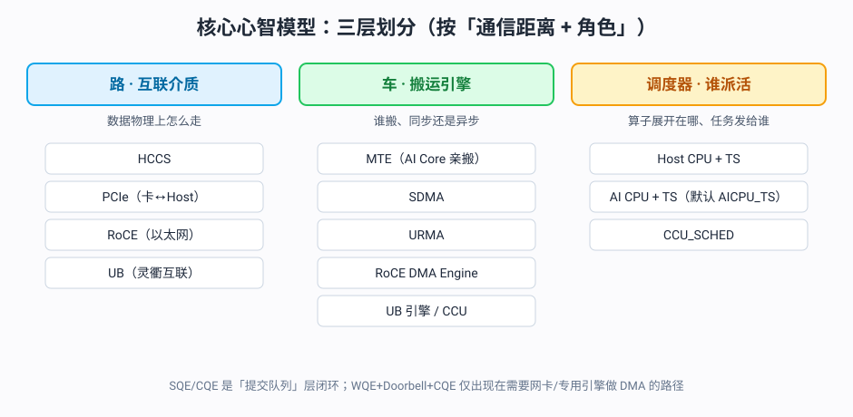
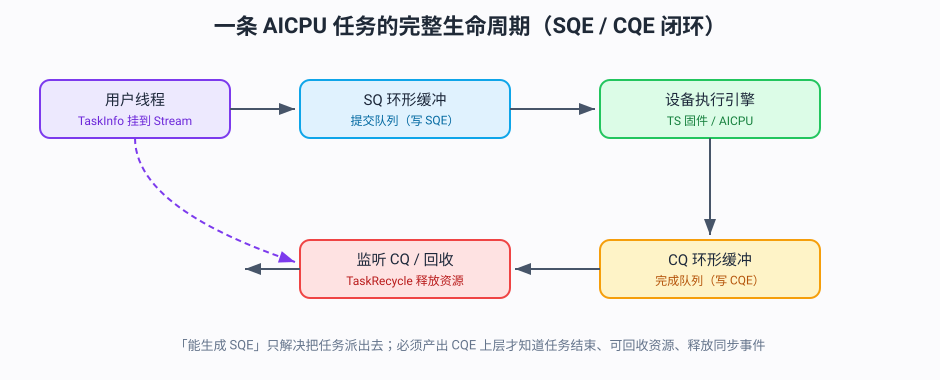
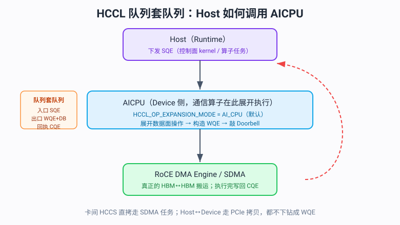
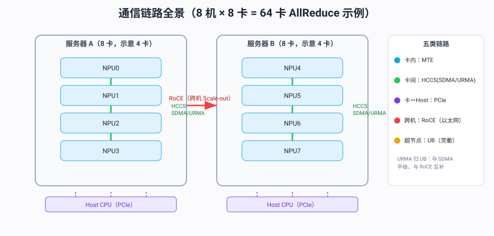

# 昇腾 AICPU / HCCL 通信架构技术总结

> 适用场景：昇腾 NPU 上集合通信（HCCL）的 AI CPU 执行模式（AI_CPU / AICPU_TS）。\
>     文档目标：把"SQE / CQE / WQE / Doorbell"、"Host 如何调 AICPU"、"通信链路（HCCS/PCIe/RoCE/UB/URMA）"串成一份可查阅的参考。

---

## 1. 核心心智模型：三层划分

整条通信栈最容易被绕晕，本质是按"通信距离 + 角色"分三层：

| 角色 | 是什么 | 例子 |
| --- | --- | --- |
| **路（互联介质）** | 数据物理上怎么走 | HCCS、PCIe、RoCE（以太网）、UB（灵衢） |
| **车（搬运引擎）** | 谁搬、同步还是异步 | MTE、SDMA、URMA、RoCE DMA Engine、UB 引擎、CCU |
| **调度器（谁派活）** | 通信算子展开在哪、任务发给谁 | Host CPU+TS、AI CPU+TS（默认 `AICPU_TS`）、CCU_SCHED |

> 关键结论：**SQE / CQE** 是"提交队列"层的闭环；**WQE + Doorbell + CQE** 这套"提交-门铃-收条"只在需要网卡/专用引擎做 DMA 的路径（RoCE 跨机、UB 引擎/CCU 模式）才出现；卡间 HCCS 直拷走 SDMA 任务，Host↔Device 走 PCIe 拷贝，都不下钻成 WQE。

<div align="center">
  
  <br/><span style="font-size:13px;color:#64748b">图1：核心心智模型——路 / 车 / 调度器三层划分</span>
</div>


---

## 2. AICPU 任务调度：SQE 与 CQE（成对队列）

在昇腾 NPU 上，Stream 背后绑定的是 **SQ（提交队列）和 CQ（完成队列）** 一对环形队列。

| 对象 | 全称 | 角色 | 由谁生产 | 承载内容 |
| --- | --- | --- | --- | --- |
| **SQE** | Submission Queue Entry | 任务**下发**（"做什么"） | Runtime / AICPU 调度侧 | kernel 二进制地址、输入/输出地址、执行参数、扩展信息 |
| **CQE** | Completion Queue Entry | 任务**完成回报**（"做完了/出错了"） | 设备侧执行引擎 / TS 固件 | 执行状态、返回值、错误码 |

> "能生成 SQE"只解决把任务派出去；**必须产出 CQE** 才让上层知道任务已结束、可回收资源、释放同步事件、上报错误。

### 一条 AICPU 任务的完整生命周期

  ```
  用户线程 → 生成 TaskInfo 挂到 Stream
          → 转成 SQE 写入 SQ 环形缓冲区（用户线程立即返回）
          → 驱动引擎搬运 SQ → 设备执行
          → 监听 CQ ← 执行完毕后写回 CQE
          → 回收任务资源（TaskRecycle）
  ```

<div align="center">
  
  <br/><span style="font-size:13px;color:#64748b">图2：一条 AICPU 任务的完整生命周期（SQE/CQE 环形缓冲闭环）</span>
</div>


### 相关结构（服务于 SQE/CQE 的解析与执行）

- **AicpuParamHead**：每个 AICPU kernel 的基础任务参数描述符（含 `ioAddrNum`、`extInfoLength`、`extInfoAddr`），由 SQE 解析而来。

- **AicpuSqeAdapter**：兼容 v0（`TsAicpuSqe`）和 v1（`TsAicpuMsgInfo`）两套 SQE 格式，屏蔽固件版本差异。

- **完成通知路径**：AICPU Schedule 通过**中断（interrupt）或消息队列（MSGQ）**模式把完成事件上报给 TSD/Host；MSGQ 模式下 `AicpuNotifyWait()` 提供可重写钩子。

- **错误上报**：用 `AicpuErrMsgInfo`（固定 256 字节）承载 AICPU 侧错误信息，随 CQE 回报。

---

## 3. HCCL AICPU 模式：队列套队列

AICPU 在 HCCL 里是**承上启下的中间调度层**，处在两级队列之间：

  ```
  Host (Runtime)
     │  下发 SQE（算子任务 / 控制面 kernel）
     ▼
   AICPU（Device 侧，通信算子在此展开执行）  ← HCCL_OP_EXPANSION_MODE = AI_CPU（默认）
     │  展开成数据面操作 → 构造 WQE → 敲 Doorbell
     ▼
   RoCE DMA Engine / SDMA（真正的 HBM↔HBM 搬运）
     │  执行完 → 写回 CQE
     ▼
   AICPU / Host 回收、通知完成
  ```

<div align="center">
  
  <br/><span style="font-size:13px;color:#64748b">图3：HCCL 队列套队列——Host 下发 SQE → AICPU 展开 WQE+Doorbell → 网卡/引擎回 CQE</span>
</div>


### 四件套角色对照

| 对象 | 全称 | 层级（谁↔谁） | 生产者 | 消费者 | 作用 |
| --- | --- | --- | --- | --- | --- |
| **SQE** | Submission Queue Entry | Runtime ↔ 执行引擎（AICPU/TS） | 上层 Runtime / 算子控制面 | AICPU 调度器 | 把通信算子作为任务**提交**给 Device 侧执行 |
| **WQE** | Work Queue Element | AICPU ↔ RoCE 网卡 | AICPU（数据面展开） | RoCE DMA Engine | 描述一次具体 RDMA 操作（src 物理地址+lkey、dst+rkey、长度、QP），**提交到网卡 SQ** |
| **Doorbell** | 门铃（MMIO 寄存器写） | AICPU → 网卡 | AICPU | 网卡硬件 | WQE 入 SQ 后**敲门铃**，通知网卡"有新 WQE，开始 DMA 执行" |
| **CQE** | Completion Queue Entry | 网卡 → AICPU/Host | 网卡硬件 | AICPU / Runtime | 任务**执行完毕**的回报，触发资源回收与完成通知 |

> Doorbell 不是队列条目，而是一次**寄存器写动作**——它把 SQ 的 tail 指针推进告诉网卡去取 WQE。它与 WQE 是一对"提交动作 + 提交内容"。

---

## 4. HCOMM 中 Host 如何调用 AICPU

Host 调 AICPU **不是普通函数调用**，而是"**Host 侧控制面异步下发 AICPU Kernel + Notify 握手同步**"。

### 调用链全景（分层）

  ```
  用户程序 (Host)
    └─ HcclAllReduce / HcclSend ...        ← 通信算子接口 (Host)
         └─ HCOMM(Host API)               ← 控制面，在 Host 执行
              ├─ 选算法 / 申请资源 / 序列化
              ├─ Host Thread ──notify──►  AICPU 控制 Thread
              └─ aclrtLaunchKernelWithConfig ──► 下发 AICPU Kernel 到 stream(任务队列)
         └─ Host Thread 等待 AICPU 完成 notify
                       │  (Device 侧)
                       ▼
            AICPU Kernel 启动
              └─ HCOMM(Device API) ExecOp   ← 数据面，在 AICPU 执行
                   ├─ 反序列化资源 Context
                   ├─ 编排 Thread/Channel 同步 + 数据搬运
                   └─ 真正 DMA：AICPU 构造 WQE + 敲 Doorbell 驱动 RoCE/SDMA
              └─ AICPU 控制 Thread ──notify──► Host Thread 完成
  ```

### 详细步骤

| 阶段 | 动作 | 关键接口 |
| --- | --- | --- |
| 1. 准备信息 | 构造算子参数，查 rank/拓扑/可用链路，按"算子+引擎+拓扑+数据量"选算法 | 拓扑查询接口 |
| 2. 取上下文 | 按 `(tag, engine)` 获取 Device Context；已存在则复用 | `HcclEngineCtxGet` |
| 3. 申请资源 | 申请并导出 Host / AICPU 控制 Thread；申请算法 Thread、Notify、Channel、CCL Buffer | `HcclThreadAcquire` / `HcclChannelAcquire` / `HcclGetHcclBuffer` / `aclrtCreateNotify` |
| 4. 传上下文 | 把资源句柄序列化，`aclrtMemcpy` 拷到 Device 显存 | 序列化 + `aclrtMemcpy` |
| 5. 握手+下发 | Host Thread 先 `RecordNotify`；再 `aclrtLaunchKernelWithConfig` 把 AICPU Kernel 推到 stream | `HcommThreadNotifyRecordOnThread` / `aclrtLaunchKernelWithConfig` |
| 6. 等完成 | Host Thread 阻塞等 AICPU 完成 notify（带超时保护，默认 1836 单位） | `HcommThreadNotifyWaitOnThread` / `aclrtWaitNotify` |

### 两个核心机制

- **资源上下文"Host 申请、Device 消费"**：Host 把 Thread/Channel/Notify/Buffer 全申请好，句柄打包序列化拷到 Device 显存；AICPU Kernel 启动即反序列化出 Context 才开始编排。这是"Host 调 AICPU"成立的前提。

- **Notify 握手保证流上严格串行**：`Host notify → 下发 Kernel → Host 等 Device 完成 notify`。同一 stream 上多个算子严格"前一个执行完、通知 Host，Host 再放下一个"。

### 下发 Kernel 的两种方式

- **默认 aclrt 方式**：`LaunchKernelWithAclrt` —— `LoadAICPUKernel` → `aclrtBinaryGetFunction`（如 `HcclLaunchP2PAicpuKernel`）→ `aclrtKernelArgsAppend` → `aclrtLaunchKernelWithConfig`。

- **ASC 方式**：设 `HCCL_CUSTOM_KERNEL_LAUNCH_ASC=1`，走 ASC 编译产物，用 `HcclLaunchXxxAicpuKernelAsc>>(&param, sizeof(OpParam)` 的 `>>` 语法下发。

---

## 5. 会生成哪些 SQE

SQE 分两层：一条"入口 Kernel SQE"把整个通信算子派给 AICPU，AICPU 再把算子展开成一堆子任务，每个子任务又是一条 SQE 交给 TS。

| 层级 | 谁生成 | 触发点 | 格式/内容 | 作用 |
| --- | --- | --- | --- | --- |
| **① AI CPU Kernel SQE**（入口） | **Runtime**（Host） | 通信算子接口下发 | `TsAicpuSqe`(v0)/`TsAicpuMsgInfo`(v1)，经 `AicpuSqeAdapter`；含 `AicpuParamHead` | 把"整个通信算子"作为任务派给 AI CPU 引擎 |
| **② 通信子任务 SQE**（展开后） | **AICPU 引擎** | Kernel 启动后逐个提交 | 按子任务类型不同（local copy / sync / RDMA read 等） | 把拆出的子操作提交给 TS，由 TS 调度到执行器 |

### 第②层具体子任务 SQE

- **本地拷贝任务 SQE**：`HcommLocalCopyOnThread` —— 用户 buffer 拷到 CCL 通信 buffer（HBM↔HBM，SDMA 引擎）。

- **Channel 同步/Notify 任务 SQE**：`HcommChannelNotifyRecordOnThread` / `HcommChannelNotifyWaitOnThread` —— 收发两端握手（ACK/SIGNAL）。

- **单边读任务 SQE**：`HcommReadOnThread` —— RoCE RDMA Read 直接拉对端 HBM 数据到本地。

- **ACL 完成 Notify 任务 SQE**：`HcommAclrtNotifyRecordOnThread` —— 收尾，通知 Host "执行完毕"。

  ```
  ① Host → aclrtLaunchKernelWithConfig → [AI CPU Kernel SQE] → AI CPU SQ
                                                │
           AICPU Kernel 启动，ExecOp 编排：      ▼
         ┌──────── 拆出子任务，逐个向 TS 提交（每条一条 SQE）： ────────┐
         │   · local copy SQE ──► SDMA 引擎                           │
         │   · notify SQE    ──► 事件/Channel 同步                    │
         │   · RDMA read SQE ──► RoCE DMA 引擎                        │
         │   · acl notify SQE ──► 通知 Host 完成                      │
         └────────────────────────────────────────────────────────────┘
  ```

---

## 6. 会生成哪些 WQE 和 Doorbell

WQE / Doorbell 是**网卡队列层**的东西。AICPU 不直接手写 WQE，而是"提交子任务 → 引擎填 WQE + 敲门铃"。

### WQE 类型 + 对应 Doorbell

| WQE 类型 | 触发动作 | Doorbell | 生成时/场景 |
| --- | --- | --- | --- |
| **Send WQE**（RDMA SEND，常带 immediate） | 把本卡 HBM 数据发往对端 | **SQ Doorbell**（推进 SQ tail） | 发送端主动推送（Send/Recv 原语、Ring 每一跳） |
| **Recv WQE**（post recv） | 预贴收包槽，等网卡 DMA 写本卡 HBM | **RQ Doorbell** | 接收端预先 post，与 Send 配对 |
| **Read WQE**（RDMA READ，单边读） | 主动从对端 HBM 拉数据写回本地 | **SQ Doorbell** | P2P 接收端"单边读"、部分集合算法 |
| **Write WQE**（RDMA WRITE，可带 imm） | 直接写对端内存并附信号 | **SQ Doorbell** | Write+immediate 替代 Send+Recv 省一次握手 |

> WQE 就是 RDMA verbs 那四类（Send / Recv / Read / Write）；Doorbell 就是"告诉网卡 SQ 或 RQ 有新条目、可以开工"的那次 MMIO 寄存器写。具体动词由 HCCL 算法/拓扑选择。

### 一个 P2P Send/Recv 跑一遍

  ```
  发送端 AICPU：
    ① HcommLocalCopyOnThread    → 用户 sendBuf 拷到本地 CCL Buffer（HBM 本地拷贝）
    ② HcommChannelNotifyRecord  → 发 ACK 信号（Channel 同步，非 RoCE WQE）
    ③ HcommChannelNotifyWait    → 等接收端 SIGNAL
    ④ RoCE Send WQE（src=cclIn 物理地址+lkey）→ 提交 RoCE SQ → 敲 SQ Doorbell
       → 网卡 DMA 读本卡 HBM、打包发对端、对端 DMA 写 cclOut

  接收端 AICPU：
    ① 先 post Recv WQE（→ 敲 RQ Doorbell），或
    ② HcommReadOnThread         → 直接发 RDMA Read WQE（→ 敲 SQ Doorbell）拉对端数据
    ③ HcommChannelNotifyRecord  → 发 SIGNAL 通知发送端"已读完"
    ④ HcommAclrtNotifyRecord    → 通知 Host 完成
  ```

> 同一次通信：发送端敲 **SQ Doorbell（Send WQE）**；接收端要么 post **Recv WQE（RQ Doorbell）**，要么发 **Read WQE（SQ Doorbell）**，二者二选一。

### 链路区分：卡间不走 RoCE WQE

卡内/卡间（HCCS、PCIe）走 **SDMA 引擎直拷**（`HcclD2DMemcpyAsync → rtMemcpyAsync`），本卡 HBM 直接 DMA 到对端 HBM，**不经过 RoCE 网卡的 WQE/Doorbell**；同步用 HCCS 的 Notify 硬件（落到 SDMA + Notify，不会下钻成 WQE）。

---

## 7. 通信链路全景（RoCE / HCCS / PCIe / UB / URMA）

按"通信距离"分层速查：

| 层级 | 互联/介质 | 搬运引擎 | 走不走 WQE/Doorbell | 典型场景 |
| --- | --- | --- | --- | --- |
| **卡内** | 片上总线（AI Core↔GM） | MTE（AIV 亲搬，经 UBuffer，同步） | 否（走 PTO 信号指令） | 单卡内 tile 级数据搬运 |
| **卡间（节点内）** | **HCCS**（华为自研片间互联） | SDMA 引擎 / URMA（UB） | 卡间直拷走 SDMA 任务；UB 路径走 UB 引擎 | 单机 8 卡 AllReduce、Ring 各跳 |
| **卡↔Host** | **PCIe** | SDMA / 驱动 DMA | 否（Host-Device 拷贝） | Host 把数据拷上/下 NPU |
| **跨机（节点间）** | **RoCE**（以太网 RDMA） | RoCE DMA 引擎 | **是**：Send/Recv/Read/Write WQE + SQ/RQ Doorbell → CQE | 多机多卡集合通信（Scale-out） |
| **超节点内** | **UB（灵衢）** | UB 引擎 / CCU / URMA | UB 路径走 UB WQE；CCU 模式走 UB WQE 任务 | 昇腾 384 超节点、Atlas 950PR/DT SuperPoD |

### 具体例子（8 机 × 8 卡 = 64 卡 AllReduce）

  ```
  同卡内：   GM ↔ 计算核       → MTE（UBuffer 中转，同步）
  同机内卡间： NPU0 ↔ NPU1      → HCCS 链路 + SDMA/URMA 引擎（HBM↔HBM 直传）
  同机卡↔Host： NPU ↔ CPU       → PCIe（上下数据）
  跨机卡间：  NodeA-NPU ↔ NodeB-NPU → RoCE 链路 + RoCE DMA 引擎（WQE+Doorbell+CQE）
  超节点内：  多机直连           → UB（灵衢）+ UB 引擎 / CCU（硬件 AllReduce 卸载）
  ```

<div align="center">
  
  <br/><span style="font-size:13px;color:#64748b">图4：通信链路全景拓扑（卡内 MTE / 卡间 HCCS / 卡↔Host PCIe / 跨机 RoCE / 超节点 UB）</span>
</div>


> HCCL 启动时查拓扑，自动给每一跳选最合适的链路+引擎；写 `HcclAllReduce` 时完全不用管这些——这就是它"复杂但对你透明"的原因。

---

## 8. URMA 属于哪块

**URMA 属于 UB（灵衢互联）这块** —— 全称 **UB Remote Memory Access**，是 UB 上提供的一种"远程内存访问"搬运引擎。

| 维度 | URMA 属于 |
| --- | --- |
| **路（互联介质）** | **UB（灵衢）**——卡间 / 超节点内的 Scale-up 域 |
| **车（搬运引擎）** | 异步 DMA 引擎，**与 SDMA 平级**（都是 GM↔GM 直传、后台搬运） |
| **语义** | 硬件用户态 RDMA（远程内存访问） |
| **代际** | Ascend **950 新增**（910 只有 MTE + SDMA） |
| **场景** | 卡间 / 超节点内的大块数据传输 |

### 关系网

- **URMA vs SDMA**：接口完全一样（建会话 → `tput_async`/`tget_async` → `wait`），区别只在底层"路"——SDMA 走 HCCS/内部总线，URMA 走灵衢 UB；编译器用 `if constexpr` 自动选路（910 走 SDMA、950 可选 URMA）。

- **URMA vs RoCE**：RoCE 走**以太网**（跨机 Scale-out），URMA 走**灵衢 UB**（卡间/超节点内 Scale-up）；都是 RDMA 语义但物理网络和引擎不同。

- **URMA vs UB 引擎/UB WQE**：UB 是互联统称，URMA 是 UB 上的"远程内存访问"能力；而 `CCU_SCHED` 模式里"CCU 向 **UB 引擎**调度 **UB WQE**"是 UB 上的另一条路径（CCU 硬件做集合通信卸载）。即 UB 上有两条道：**URMA（点对点 RDMA 直传）** 和 **UB 引擎/CCU（集合通信卸载）**。

---

## 9. 全局队列对照图

  ```
  SQE（提交队列）── AICPU 入口 Kernel SQE + 展开的子任务 SQE（拷/同步/读）
          │  RoCE/UB 子任务 SQE 被调度到对应 DMA 引擎
          ▼
  WQE（网卡/引擎队列）── Send / Recv / Read / Write（RoCE）
                        └─ UB WQE（UB 引擎 / CCU 模式）
          │  敲 Doorbell（MMIO 写）
          ▼
  引擎执行 → 写回 CQE（完成队列项，收条）
  ```

  ```
  跨机：    RoCE 链路  → RoCE DMA 引擎  → RoCE WQE + SQ/RQ Doorbell → CQE
  卡间/超节点：UB 灵衢  → URMA / UB 引擎 → UB WQE + Doorbell          → CQE
  卡间(老)：HCCS      → SDMA 引擎       → SDMA 任务（不下钻成 WQE）
  卡内：    片上总线   → MTE            → PTO 信号指令（无 WQE）
  ```

---

## 10. 术语表

| 缩写 | 全称 | 含义 |
| --- | --- | --- |
| **SQ / CQ** | Submission / Completion Queue | 提交队列 / 完成队列（环形，成对） |
| **SQE / CQE** | Submission / Completion Queue Entry | 提交队列项 / 完成队列项 |
| **WQE** | Work Queue Element | 网卡工作队列项（RDMA verbs 级） |
| **Doorbell** | 门铃 | WQE 入队后写 MMIO 寄存器通知硬件开工 |
| **HCCS** | Huawei Cache Coherence System | 华为自研片间互联（卡间 Scale-up） |
| **PCIe** | Peripheral Component Interconnect Express | 卡↔Host 传统总线 |
| **RoCE** | RDMA over Converged Ethernet | 以太网 RDMA（跨机 Scale-out） |
| **UB** | Unified Bus（灵衢互联） | 华为 950 超节点/卡间超带宽互联 |
| **URMA** | UB Remote Memory Access | UB 上的硬件用户态 RDMA 引擎 |
| **SDMA** | System DMA | 系统 DMA 引擎（HBM↔HBM 后台直传） |
| **MTE** | Memory Transfer Engine | AI Core 亲搬引擎（经 UBuffer，同步） |
| **CCU** | 集合通信卸载单元 | 950 新增，CCU_SCHED 模式向 UB 引擎调度 UB WQE |
| **TS** | Task Schedule | 任务调度器（AI CPU+TS 默认 AICPU_TS，即 STARS） |
| **AICPU** | AI CPU | Device 侧通信算子展开与调度的 CPU 引擎 |

---

## 11. 一句话速记

1. **SQE 提交、CQE 收尾**：缺 CQE 上层永远收不了尾。

1. **HCCL AICPU 模式是队列套队列**：SQE（入口）→ WQE+Doorbell（出口）→ CQE（回执）。

1. **Host 调 AICPU = 控制面下发 Kernel + Notify 握手**：Host 申请资源/Device 消费上下文。

1. **SQE 分两层**：Host 写 1 条入口 Kernel SQE，AICPU 展开 N 条子任务 SQE（拷/同步/读/完成通知）。

1. **WQE 四类**：Send/Recv/Read/Write；Doorbell 两类：SQ Doorbell / RQ Doorbell。

1. **链路按距离**：卡内 MTE / 卡间 HCCS(SDMA·URMA) / 卡↔Host PCIe / 跨机 RoCE / 超节点 UB。

1. **URMA 归 UB**：与 SDMA 平级、与 RoCE 互补（RoCE 管跨机，URMA 管卡间/超节点内）。
